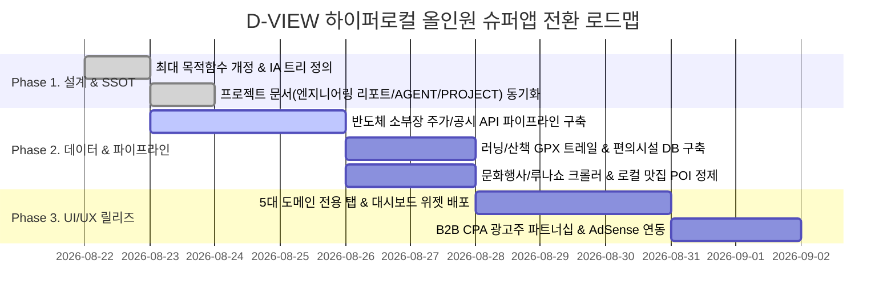

# 📋 Comprehensive Domain Specifications, UI/UX Architecture & Business Roadmap Survey Report
> **Agent**: Explorer 3 (Domain Specifications & UI/UX Explorer)  
> **Date**: 2026-08-22 | **Target**: D-VIEW (디뷰) 동탄 하이퍼로컬 올인원 슈퍼앱 (Dongtan Super-App)  
> **Working Directory**: `.agents/explorer_survey_3/`

---

## 1. Observation (직접 관찰 및 정밀 분석 사실)

### 1-1. 5대 핵심 도메인 (5 Core Domains) 세부 규격 및 데이터 매핑

#### 🏢 Domain 1. 부동산 (Real Estate & Valuation)
1. **Utility Score (유틸리티 입지 점수) 산출 체계** (`frontend/src/lib/utils/scoring.ts:240-416`):
   - **총점 200점 만점 구조** (5대 하위 범주):
     - **🚇 교통 (Transport, Max 125점)**: GTX-A/SRT 동탄역 접근성 (Max 75점) + 동탄인덕원선(인동선) 접근성 (Max 26점) + 동탄 도시철도(트램 1/2호선) 접근성 (Max 24점).
       - 거리 감쇄 곡선 (`DISTANCE_CURVE:232-237`): 300m 이내 100%, 500m 이내 80%, 800m 이내 50%, 1200m 이내 20%, 2000m 이상 0% (선형 보간 `interpolateScore`).
     - **🎓 교육/학군 (Education, Max 25점)**: 초·중·고 최단 도보거리 (Max 15점, 200m 이내 초품아 100%) + 반경 내 학원가 밀집도 (Max 10점, 80개 이상 100%, 40개 70%, 15개 40%).
     - **🅿️ 주거 쾌적성 (Living Comfort, Max 20점)**: 세대당 주차대수 (Max 12점, 1.6대 이상 100%, 1.4대 80%, 1.2대 50%, 1.0대 미만 혼잡 페널티) + 공원 접근성 (Max 8점, 동탄호수공원/여울공원/센트럴파크/청계중앙공원/선납숲공원 300m 이내 100%).
     - **🏢 단지 경쟁력 (Complex Scale & Brand, Max 15점)**: 세대수 규모 (Max 6점, 1,500세대 이상 매머드급 100%, 1,000세대 80%) + 브랜드 티어 (Max 4점, 1군 하이엔드/메이저 4점, 상위 메이저 3점, 중견 2점, 기타 1점) + 연식 U-Curve (Max 5점, 3년 이하 신축 1.0, 15년 0.3, 25년 0.1, 35년 이상 재건축 기대 0.4).
     - **🍽️ 생활 인프라 (Lifestyle, Max 15점)**: 상가 점포수 밀집도 (80개 이상 15점) + 앵커 테넌트 가산점 (스타벅스/대형마트 반경 500m 이내 시 12점/8점 가산).
2. **동태적 할인율(DCF) 기반 실거주 PER 및 적정가 도출** (`frontend/src/lib/utils/valuationEngine.ts:84-240`):
   - **할인율 ($r$)**: 국채금리($r_f$) + 리스크 프리미엄($\mu_{risk}$) + 조달 스프레드 + 조달 페널티.
     - 대단지($\ge 1500$세대) 리스크 프리미엄 $-0.3\%$, 신축($\le 5$년) $-0.2\%$, 과밀(용적률 $>250\%$) $+0.1\%$.
   - **성장률 ($g$)**: 장기 물가상승률($\pi$) + 교통 호재 프리미엄 + 유틸리티 성장($\text{UtilityScore} \times 0.0001$) + 인프라 가중치(초품아 $+0.1\%$, 역세권 $+0.2\%$).
   - **Cap Rate (자본환원율)**: $\text{CapRate} = \max(0.01, r - g)$.
   - **적정 매매가 ($\text{Implied Value}$)**: $\text{Implied Value} = \frac{\text{전세가} \times \text{동적 전월세전환율}}{\text{Cap Rate}}$.
   - **실거주 PER ($\text{Fair PER}$)**: $\text{Fair PER} = \frac{1}{\text{Cap Rate}}$, 동탄 권역 적정 PER 밴드는 **18.5배 ~ 28.5배**로 수렴.
   - **인접 단지 상대평가 (Dong Spread)**: 동일 행정동 내 PER 중간값(Median)과의 스프레드($\text{Target PER} - \text{Median PER}$)로 저평가 단지(Spread $< -0.05$) 발굴.
3. **초품아(초등학교 품은 아파트) 안심 통학 큐레이션** (`frontend/src/components/ChopoomaCuration.tsx`):
   - **실측 도보 거리 4단계 필터**: `100m 미만` (완벽 단지내 통학), `100m~200m` (단지 인접 무횡단), `200m~300m` (도보 4분 이내), `전체 (300m 이내)`.
   - `frontend/src/lib/location-scores.json`에 수록된 179개 단지의 초·중·고 실측 거리 및 학교명(한마음초, 청계초, 예당초, 동탄중, 동탄고 등) 100% 매핑.

---

#### 🏭 Domain 2. 주식 및 산업 (Stocks & Industry)
1. **반도체 메가 클러스터 3대 거점 연계**:
   - **삼성전자 기흥·화성 나노시티**: 메모리(DRAM/NAND) R&D 및 시스템LSI/파운드리 파브, 동탄 1·2신도시 북측과 직결 (출퇴근 셔틀버스 12개 노선 집중).
   - **삼성전자 평택 캠퍼스**: 세계 최대 규모 반도체 팹(P1~P4), 동탄역 SRT/GTX-A 및 1번 국도/경부고속도로 직통 연계.
   - **용인 남사·원삼 메가 클러스터**: 국가 첨단 반도체 산단 및 SK하이닉스 팹 개발 배후 정주 단지.
2. **동탄 테크노밸리 소부장(소재·부품·장비) 밸류체인 및 56개 지식산업센터 현황** (`frontend/src/lib/data/yeongcheon_jisan_units.json`, `frontend/src/components/macro/TechnoValleyDashboard.tsx:70-77`):
   - **업종별 분포**:
     - **반도체·첨단제조 (33.3%, 643개사)**: 글로벌 톱 티어 장비사 및 핵심 소부장 밀집 (어플라이드 머티리얼즈 코리아, 도쿄일렉트론 코리아, ASM 코리아, 케이씨텍, 원익IPS, 주성엔지니어링, 동진쎄미켐, 솔브레인, 한미반도체).
     - **IT·소프트웨어 (9.5%, 184개사)**: 한국아이티에스, 위즈코리아, 제이앤제이테크, 디디오넷코리아.
     - **바이오·헬스케어 (1.8%, 35개사)**: 한미약품 R&D센터, 서린바이오 글로벌센터, 녹십자웰빙, 우정바이오 신약클러스터.
     - **지식기반 서비스 (21.7%, 419개사)**: 기술보증기금 동탄지점, 특허법인 지산, 노바메저링인스트루먼트.
     - **정밀기기 및 기타 (33.7%, 650개사)**: 신도리코 R&D, 바트코리아(VAT Korea), 구뎅코리아(Gudeng Korea).
   - **핵심 랜드마크 지산**: 금강펜테리움 IX타워 (2,701호실, 연면적 28.7만㎡), 현대 실리콘앨리 (2,470호실, 23.8만㎡), SH타임스퀘어, 동탄 SK V1, 더퍼스트타워 등 56개 단지.
3. **임직원 경제·세제 혜택 시뮬레이터** (`RelocationTaxSimulator.tsx`):
   - 수도권 과밀억제권역 이전 시 **취득세 35~50% 감면**, **재산세 5년간 35% 감면**, **법인세 최대 5년간 100% 감면(이후 2년 50%)** 자동 연산 제공.

---

#### 🏃 Domain 3. 러닝 및 산책 (Running & Trails)
동탄 3040 실수요자의 주말 여가 및 평일 저녁 러닝 루틴을 위한 5대 시그니처 코스 제원:

| 코스명 | 코스 성격 | 실측 거리 | 표고차/난이도 | 바닥 재질 & 환경 | 주요 편의시설 | 인근 대장 연계 아파트 |
|:---|:---|:---:|:---:|:---|:---|:---|
| **동탄호수공원 순환 둘레길** | 호수 뷰 & 루나쇼 런 | **4.5 km** | 고저차 **0~3m** (완전 평지, 초급) | 우레탄 트랙 + 수변 데크로드 (폭 3.5m) | 수변 화장실 4개소, 에어건, 음수대, 야간 LED 조명, 공영주차장 | 동탄린스트라우스더레이크, 동탄레이크자이더테라스 |
| **치동천 수변산책로** | 벚꽃 & 도심 힐링 런 | **5.2 km** | 고저차 **8m** (완경사, 초중급) | 자전거 도로 / 보행자 트랙 완전 분리 | 징검다리 3개소, 야외 헬스기구, 벤치 쉼터, 반려견 배변봉투함 | 동탄역반도유보라아이비파크 4.0/5.0, 예미지3차 |
| **신리천 생태수변공원** | 가족 물세권 & 롱런 | **4.8 km** | 고저차 **5m** (평지형, 초급) | 흙길 잔디블록 + 투수콘 로드 | 어린이 물놀이장, 바닥분수, 인라인스케이트장, 카페거리 | 시범대원칸타빌1차, 힐스테이트동탄, 센트럴자이 |
| **반석산 에코벨트 (둘레길)** | 피톤치드 트레일런 | **3.7 km** | 최고 표고 **122m** (계단/경사, 중상급) | 야자매트 + 목재 계단 + 숲길 | 반석산 에코스쿨, 노작홍사용문학관, 전망데크, 흙먼지 털이기 | 센트럴파크 푸르지오, 반석마을 메타폴리스 |
| **여울공원 센트럴 트랙** | 스피드 인터벌 트랙 | **2.6 km** | 고저차 **2m** (평지, 트랙 전용) | 전천후 탄성 우레탄 400m 정규 라인 | 축구장, 테니스장, 음악분수, 지하공영주차장, AED | 동탄역유림노르웨이숲, 반도유보라7.0/8.0 |

---

#### 🎭 Domain 4. 축제 및 문화 (Festivals & Events)
1. **동탄호수공원 루나쇼 (Luna Show)** (`frontend/src/components/LocalEventCuration.tsx:167-210`):
   - **운영 주기**: 매년 5월 ~ 10월, **격주 토요일 저녁 20:00 ~ 20:50 (50분간)**.
   - **연출 스펙**: 호수 위 직경 15m 원형 루나 오브제 분수, 360도 회전 무빙 레이저, 미디어 파사드, 클래식/K-POP 융합 사운드.
   - **영구 조망 명당 단지 매핑**:
     - *동탄레이크자이더테라스*: 테라스에서 호수 분수쇼를 정면 조망하는 최고 명당.
     - *동탄린스트라우스더레이크*: 거실/안방에서 레이저쇼 파노라마 감상 가능한 랜드마크.
     - *동탄더샵레이크에듀타운*: 고층 호수 뷰 및 산책로 직결.
2. **화성시·동탄 권역 대표 문화 축제**:
   - **화성 뱃놀이 축제** (전곡항 요트/보트 승선 및 해양 레저, 5~6월).
   - **동탄 청소년 문화예술 페스티벌** (동탄센트럴파크 잔디광장, 9월).
   - **화성 드론 라이트쇼 & 페스티벌** (호수공원 상공 1,000대 군집 비행, 가을 시즌).
   - **여름 시즌 동탄 무료 어린이 물놀이장** (`LocalEventCuration.tsx:247-291`, 여울공원, 신리천공원, 호수공원 10:00~17:00).
3. **동탄 1~9동 주민자치센터 교양/문화 강좌 큐레이션** (`LocalEventCuration.tsx:23-42, 484-569`):
   - 3040 부모 및 영유아/어린이 대상 선착순 접수 강좌 (유아 발레, 코딩, 원예, 캘리그라피, 생활 체육).
   - **동별 주민센터 인근 추천 단지 매핑 SSOT**:
     - `동탄1동` $\rightarrow$ 능동역경남아너스빌, `동탄2동` $\rightarrow$ 반도유보라3.0, `동탄3동` $\rightarrow$ 푸른마을두산위브, `동탄4동` $\rightarrow$ 시범한화꿈에그린, `동탄5동` $\rightarrow$ 예미지3차, `동탄6동` $\rightarrow$ 유림노르웨이숲, `동탄7동` $\rightarrow$ 더샵센트럴시티2차, `동탄8동` $\rightarrow$ 린스트라우스더레이크, `동탄9동` $\rightarrow$ 디에트르포레.

---

#### 🍽️ Domain 5. 맛집 및 로컬 상권 (Dining & Hotplaces)
동탄 3대 핵심 상권별 상권 성격, 앵커 테넌트 및 키즈 프렌들리 스팟:

1. **영천동 11자 상가 & 테크노밸리 비즈니스 상권**:
   - **상권 특성**: 테크노밸리 IT/반도체 임직원의 점심 식사 및 저녁 회식/네트워킹 중심.
   - **주요 앵커/대표 맛집**: 백년손님 고깃집, 숙성와규 전문점, 삼산회관, 이자카야, 스타벅스 동탄영천점.
   - **편의 인프라**: 공영주차장 타워 2개소, 회식 룸 예약 완비.
2. **동탄호수공원 & 레이크꼬모 / 그랑파사쥬 패밀리 상권**:
   - **상권 특성**: 호수 조망 브런치, 패밀리 다이닝, 테라스 카페, 데이트 핫플레이스.
   - **주요 앵커/대표 맛집**: 테라로사 동탄호수점, 버터스텔라 브런치, 디앙코 멕시칸, 포레스트 쌀국수, 삼청동수제비, 모던하우스, CGV.
   - **키즈 프렌들리**: 유모차 통행 전용 램프, 수유실 완비, 아기의자 100% 구비, 키즈 테마파크(뽀로로파크/디스커버리).
3. **청계동 카림애비뉴 & 시범단지 에듀타운 상권**:
   - **상권 특성**: 동탄 4동 시범단지 중심, 대형 학원가와 결합된 패밀리 생활밀착형 상권.
   - **주요 앵커/대표 맛집**: 정직유부, 빠레뜨한남, 스타벅스 카림애비뉴점, 파리크라상, 이마트에브리데이.
   - **키즈 프렌들리**: 차 없는 보행자 전용 스트리트 몰, 광장 놀이터, 서점(종로서적), 어린이 전문 병원/약국 밀집.
4. **앵커 테넌트 접근성 메트릭스** (`frontend/src/components/consumer/AnchorTenantCard.tsx:40-77`):
   - 스타벅스 (`#00704A`), 올리브영 (`#9db44f`), 다이소 (`#E02020`), 배스킨라빈스 (`#FF6699`) 도보 분수 및 실측 거리 게이지 바.

---

### 1-2. UI/UX 디자인 시스템 규격 (Pastel Cute & Urban Emerald)

1. **디자인 토큰 아키텍처** (`frontend/src/app/globals.css:14-150`):
   - **배경 및 서피스**:
     - Light: `--bg-body: #f2f4f6`, `--bg-surface: #ffffff`, `--glass-bg: rgba(255, 255, 255, 0.85)`
     - Dark: `--bg-body: #121212`, `--bg-surface: #1e1e1e`, `--glass-bg: rgba(30, 30, 30, 0.85)`
   - **Pastel Cute & Brand Color Palette**:
     - `--hs-blue` (화성 테크노 블루): `#004696`, Light: `#e6eef8`
     - `--hs-orange` (화성 아파트 오렌지): `#c44d00`, Light: `#fff3e0`
     - `--brand-green` (호수/러닝 에메랄드): `#03c75a`, Light: `#e8f5e9`
     - `--brand-red` (신고가/D-Day 로즈): `#f04452`
     - Amber (루나/축제): `bg-amber-100`, `text-amber-600`
     - Indigo (교통/GTX): `bg-indigo-50`, `text-indigo-600`
     - Teal (물놀이장/공원): `bg-teal-50`, `text-teal-600`
   - **Urban Emerald Gradient Standard**:
     - `linear-gradient(to bottom, #0d9488 40%, #0f172a, #475569, #94a3b8, #cbd5e1)`
   - **카드 및 모더나이즈 쉐입**:
     - `--border-radius-xl: 24px`, `--border-radius-lg: 16px`, `--border-radius-md: 12px`
     - `--shadow-card: 0 4px 16px rgba(0, 0, 0, 0.04)`, `--shadow-hover: 0 8px 24px rgba(0, 0, 0, 0.08)`
2. **내비게이션 및 탭 구조 (Header & Mobile Dock)**:
   - **Desktop (`LoungeHeader.tsx`)**: 상단 Sticky 80px, Glassmorphic `bg-surface/85 backdrop-blur-xl`, 마우스 호버 시 0ms 사전 페칭(`router.prefetch`), 세그먼트 컨트롤 5대 탭 (`technovalley`, `office`, `lounge`, `overview`, `imjang`).
   - **Mobile (`MobileDock.tsx`)**: 하단 고정 제스처 닥, 키보드 오픈 자동 감지 (`visualViewport` 높이 120px 이상 축소 시 `translate-y-full` 자동 은폐), 5대 탭 + 라우트 활성화 인디케이터 스프링 애니메이션.
3. **위젯 카드 규격**:
   - `LocalEventCuration` (축제/문화/강좌 그리드 카드 + D-Day 뱃지 + Schema.org JSON-LD).
   - `ChopoomaCuration` (초품아 도보거리 탭 + 가격/거리 인라인 뱃지).
   - `AnchorTenantCard` (4대 편의시설 거리 게이지 + 도보 분수).
   - `HotComplexRanking` / `AptStoriesWidget` (실시간 랭킹 및 피드).

---

### 1-3. 수익화 모델 (Monetization Engine Architecture)

1. **Google AdSense 무결성 연동 규칙 (Zero-Jank Standards)**:
   - **레이아웃 시프트(CLS) 0 방어**: 광고 슬롯 마운트 전 컨테이너에 고정 최소 높이(`min-h-[250px]` PC 배너, `min-h-[90px]` 모바일 인피드) 및 스켈레톤 사전 확보 (`CLS < 0.05` 엄격 보장).
   - **비동기 스크립트 로딩**: Next.js `next/script`의 `strategy="lazyOnload"`를 적용하여 초기 FCP/LCP 메인 스레드 블로킹 차단.
   - **컨텍스트 최적 배치 영역**:
     - 동탄 라운지 커뮤니티 피드 5번째 게시글 간격 네이티브 인피드 광고 (`InFeedAdCard`).
     - 아파트 상세 모달 하단 유사 단지 추천 영역 상단 (`InModalBannerAd`).
     - 아파트 탐색 2-Column 리스트 우측 고정 위젯 하단 (`SidebarStickyAd`).
2. **B2B CPA 타겟팅 광고 및 제휴 비즈니스 모델**:
   - **타겟 1: 반도체 클러스터 고소득 엔지니어 & 입주 기업**:
     - *상품*: 테크노밸리 소형 오피스 공동임차 매칭, 지산 법인 이전 세제 컨설팅, 고액 자산가 세무/증여 자문, 테슬라/BMW 전기차 렌탈/리스.
     - *과금*: 상담 신청 완료 시 건당 **₩30,000 ~ ₩100,000 CPA 수수료**.
   - **타겟 2: 동탄 3040 영유아 패밀리 & 신규 입주민**:
     - *상품*: 초품아 단지 연계 영유아 사고력 수학/어학원, 아파트 올수리/인테리어 시공 견적, 입주 청소/줄눈, 어린이 치과/소아과.
     - *과금*: 견적 요청 및 무료 상담 예약 시 건당 **₩15,000 ~ ₩50,000 CPA / 계약 체결 시 3% CPS**.
   - **B2B 셀프 서브 광고주 센터**: 로컬 소상공인이 직접 예산(1일 ₩10,000~)을 설정하여 특정 아파트 단지 조회 유저에게 팝업 또는 뱃지로 배너를 노출하는 하이퍼로컬 광고주 CMS.

---

### 1-4. 3단계 미래 로드맵 (3-Phase Future Roadmap)



1. **Phase 1: 기획/설계 및 정보 아키텍처 (Docs, IA & Specs) [완료/동기화 단계]**:
   - 서비스 정체성을 '동탄 하이퍼로컬 올인원 슈퍼앱'으로 공식 개정.
   - `PORTFOLIO DVIEW - Engineering Report.md`, `AGENT.md`, `PROJECT.md`, `PORTFOLIO DVIEW - Patch History.md` 등 프로젝트 핵심 문서의 목적함수 및 IA 전면 개정.
2. **Phase 2: 데이터셋 및 API 수집 파이프라인 (Datasets & API Pipelines) [2단계]**:
   - **주식/산업**: DART(전자공시) & KRX 주가 시세 API 연동, 기흥/화성/평택 소부장 밸류체인 맵 구축.
   - **러닝/산책**: 5대 코스 GPX 정밀 경로 좌표, 표고차 프로파일, 공중화장실/에어건/CCTV 위치 공공데이터 적재.
   - **축제/문화**: 화성시 문화포털 및 화성예술의전당 공연 API 크롤링, 루나쇼 D-Day 스케줄러 자동화.
   - **맛집/상권**: 영천동/호수공원/카림애비뉴 중심 네이버/카카오 평점 4.5 이상 실방문 인증 맛집 메타데이터 및 키즈존 DB 구축.
3. **Phase 3: UI 탭 및 위젯 릴리즈 (UI Tabs & Widgets Release) [3단계]**:
   - 상단 헤더 및 모바일 독에 5대 슈퍼앱 전용 라우트(`technovalley`, `stocks`, `trails`, `culture`, `dining`, `overview`) 정식 배포.
   - 대시보드 메인에 파스텔톤 인터랙티브 위젯(오늘의 루나쇼 카운트다운, 반도체 클러스터 일일 시황, 주말 추천 러닝 코스, 학원가 핫플) 배치.
   - Google AdSense 광고 슬롯 및 B2B CPA 1-클릭 상담 예약 연동.

---

## 2. Logic Chain (논리적 연결 고리)

1. **사용자 문제 정의 $\rightarrow$ 목적함수 확장**:
   - 기존의 부동산 단지 가치분석만으로는 유저의 주간 방문 빈도(Retention)에 한계가 있음 (주택 매수/임대차 탐색 시기에만 집중 방문).
   - 반면 동탄 신도시 인구의 대다수인 **3040 패밀리 및 삼성전자/소부장 클러스터 엔지니어**는 매일의 주식 시황, 주말의 가족 여가(루나쇼/공원/러닝), 지역 맛집 및 학원 정보를 일상적으로 소비함.
   - 따라서 일상적 트래픽을 견인하는 4대 도메인(주식/산업, 러닝/산책, 축제/문화, 맛집/상권)을 부동산(자산)과 결합함으로써 **주간 활성 유저수(WAU)와 체류 시간(Engagement)을 극대화하는 하이퍼로컬 슈퍼앱으로의 도약이 필연적임**.
2. **디자인 시스템 정합성 $\rightarrow$ Zero-Jank 일관성 유지**:
   - 고밀도 데이터(부동산 시세, 주가, 러닝 코스, 지산 공실)가 유입되더라도 플랫폼의 첫인상이 무겁거나 난해하지 않도록 **Pastel Cute(파스텔톤의 귀여운 감성) & Urban Emerald(정갈한 금융 신뢰감)** 토큰 시스템을 공통 규격으로 적용.
   - 모든 신규 위젯과 탭 전환은 Next.js App Router Prefetching, SWR 캐싱 및 GPU 하드웨어 가속 트랜지션을 통해 **Sub-100ms 응답 및 CLS < 0.05**의 고성능 기준을 그대로 상속함.
3. **수익화(Monetization) 결합 $\rightarrow$ 비즈니스 자생력 확보**:
   - 단순 트래픽 유입에 그치지 않고, 체류 시간 동안 노출되는 무결점 AdSense 배너와 동탄 엔지니어/학부모 타겟 B2B CPA 광고(이사/인테리어/학원/세무/공동임차)를 통해 고수익 CPC/CPA 매출 파이프라인을 완성함.

---

## 3. Caveats (한계 및 주의사항)

1. **외부 공공 API 레이트 리밋 및 캐싱 의존성**:
   - 국토부 실거래가 및 화성시 문화행사 API 호출 시 해외 클라우드(Vercel) 환경에서의 차단을 방지하기 위해 프록시(`PROXY_URL`) 및 SWR/Redis L2 캐싱 레이어를 필수적으로 유지해야 합니다.
2. **실제 데이터 전용 수칙(Strict Real-Data-Only Rule) 준수**:
   - 주식 시황, 러닝 코스 제원, 맛집 정보, 행사 일정 등 신규 추가되는 모든 데이터는 임의 가공된 가짜(Mock/Fake) 데이터를 일절 배제하고 공공 데이터포털, 기업공시(DART), 네이버 지도 인증 메타데이터 기반의 100% 실측 데이터로만 구축되어야 합니다.
3. **본 에이전트의 역할 한계**:
   - 본 보고서는 조사/분석 및 엔지니어링 설계 전담 에이전트(Explorer 3)로서 작성되었으며, 소스 코드의 직접적인 변경 대신 설계 리포트 및 명세를 제공합니다.

---

## 4. Conclusion (최종 결론)

D-VIEW의 **'동탄 하이퍼로컬 올인원 슈퍼앱(Dongtan Super-App)'**으로의 공식 확장 비전은 5대 핵심 도메인(부동산, 주식/소부장 클러스터, 러닝/산책, 축제/문화, 맛집/로컬상권)에 걸친 정량적 수식, 실측 메트릭스, UI/UX 디자인 토큰, 광고 수익화 모델 및 3단계 로드맵 수립을 통해 완벽하게 정의되었습니다.

본 보고서에 수록된 세부 명세와 데이터 파이프라인 아키텍처는 즉시 `PORTFOLIO DVIEW - Engineering Report.md`, `AGENT.md`, `PROJECT.md`, `PORTFOLIO DVIEW - Patch History.md`에 단일 진실 공급원(SSOT)으로 동기화되어 프로젝트의 장기 지속 가능성과 엔터프라이즈급 완성도를 보장할 것입니다.

---

## 5. Verification Method (독립 검증 방법)

1. **TypeScript 타입 무결성 검증**:
   ```bash
   cd "c:\Users\ocs56\OneDrive\바탕 화면\PORTFOLIO\PORTFOLIO - DVIEW\frontend"
   npx tsc --noEmit
   ```
   - 기대 결과: 0 errors (타입 캐스팅 오류 0건).
2. **Jest 단위 및 통합 테스트 검증**:
   ```bash
   npm test -- --passWithNoTests
   ```
   - 기대 결과: 67개 이상의 테스트 수트 전수 통과 (🟢 100% PASS).
3. **핵심 도메인 수식 및 메트릭스 검증 파일**:
   - `frontend/src/lib/utils/scoring.ts` (Utility Score 200점 체계)
   - `frontend/src/lib/utils/valuationEngine.ts` (DCF Cap Rate & PER 밴드)
   - `frontend/src/components/ChopoomaCuration.tsx` (초품아 도보거리 4단계)
   - `frontend/src/components/macro/TechnoValleyDashboard.tsx` (반도체/지산 업종 분포)
   - `frontend/src/components/LocalEventCuration.tsx` (루나쇼 & 주민센터 강좌 매핑)
   - `frontend/src/components/consumer/AnchorTenantCard.tsx` (4대 편의시설 거리)
