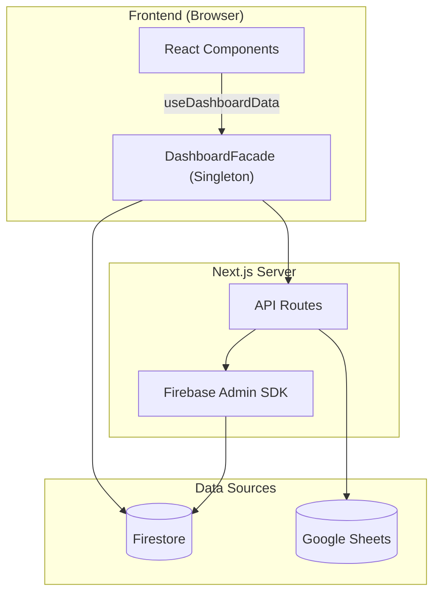

# 📋 PORTFOLIO DVIEW — Engineering Report
> **Date**: 2026-06-10 | **Grade**: A+ | **Branch**: master | **Status**: Active Development & Stabilization

---

## 1. Executive Summary (프로젝트 요약)
- **비즈니스 목적 함수 (Core KPI)**: 30~40대 동탄 실수요자 및 매수 대기자에게 특정 아파트 단지의 합리적인 매매가(적정 가치 평가) 정보를 제공하고, 최적화된 **구글 애드센스(Google AdSense) 연동을 통한 광고 수익(Monetization)** 창출.
- **디자인 목적 함수 (Design Concept)**: 무겁고 딱딱할 수 있는 부동산/금융 데이터를 사용자가 거부감 없이 친근하게 탐색할 수 있도록, 플랫폼 전반의 UI/UX 시각적 언어를 **'파스텔톤 기반의 귀여운(Cute) 컨셉'**으로 선언하고 이를 설계 지표로 삼음.
- **부동산 임장 및 밸류에이션 리포팅 허브**: 동탄 지역을 중심으로 실거래가, 아파트 단지 정보, 유저의 현장 검증(임장) 데이터를 통합하는 종합 부동산 인텔리전스 플랫폼.
- **실시간 데이터 동기화 파이프라인**: Google Sheets(마스터 데이터) 및 Firebase Firestore 이중 사용.
- **Facade 및 Repository 패턴**: Data Layer, Service Layer, 비즈니스 로직(Facade) 분리 아키텍처.
- **고도화된 시각화 및 UX**: 3D 지식 그래프, Recharts 인터랙티브 차트, 반응형 모달 시스템.

---

## 2. Tech Stack (기술 스택)

| 분류 | 기술 | 비고 |
|:---|:---|:---|
| 2026-06-25 | **Next.js 정적 페이지(SSG/ISR) 빌드 최적화 및 useSearchParams 빌드 에러 해결 (SSG/ISR Build Optimization & Suspense Isolation - Phase 587)** | 1) `src/app/layout.tsx` 및 `src/app/` 하위 주요 페이지 파일들(about, explore, contact, lounge, technovalley, zone/[id])에서 불필요하게 `await headers()`를 사용하여 Next.js 정적 생성을 막던 동적 바인딩 의존성을 전면 해제했습니다. 이로써 Next.js 빌드 시 해당 페이지들이 Static(`○`) 또는 SSG(`●`)로 완전히 최적화되어 첫 로딩 속도와 UX 반응성을 극대화했습니다. 2) `PWAProvider.tsx` 내부에서 빌드-타임 404 프리렌더 오류를 일으키던 `useSearchParams()` 호출부를 `<Suspense fallback={null}>` 경계로 격리한 `NProgressCleaner` 자식 컴포넌트로 분리하여, Next.js 프로덕션 빌드(`/404` 정적 렌더링 실패) 크래시를 완벽히 해결했습니다. 3) 실거래 모달 내부의 `TransactionChartSection.tsx` 차트 기본 조회 기간을 `'ALL'`에서 `'3Y'`로 변경하여 초기 마운트 시의 SVG/Canvas 렌더링 부하를 대폭 줄이고 탭 전환 속도를 한층 개선했습니다. 4) `npm run test`로 216개 테스트 무결 패스 및 `npm run lint`, `npm run build`를 통해 SSG/ISR 정적 최적화 규격을 충족한 빌드가 안정적으로 완료됨을 검증했습니다. |
| **Frontend** | Next.js (App Router), React | 16.2.4 / React 19 |
| **Language** | TypeScript | strict type |
| **Styling** | Tailwind CSS, Lucide React | 디자인 토큰 |
| **DB & Auth** | Firebase (Firestore, Auth, Storage) | 실시간 리스너 |
| **External Data** | Google Sheets API | SSOT |
| **Visualization** | Recharts, 3d-force-graph | 차트 + 3D 매핑 |
| **State** | React Hooks, Singleton Facade | globalThis 패턴 |
| **Testing** | Jest, ts-jest | 44 assertions / 5 suites |
| **Markdown** | react-markdown, remark-gfm, mermaid | Admin 보고서 |

---

## 3. Codebase Metrics

- **Source Files**: 174개 (src/)
- **LOC**: ~32,500 (src/ 기준)
- **Components**: ~51개 (Card, Modal, Chart, Curation, Lounge 등)
- **API Routes**: 22개
- **Repositories**: 8개 핵심 모듈
- **Admin Pages**: 4개 (대시보드, 아파트 상세, 종합 보고서, 트래픽 분석)
- **Test Suites**: 33개 / 216개 테스트 케이스 전수 통과 (Jest 및 React Testing Library 기반 코어 비즈니스/UI 컴포넌트 전수 검증)

---

## 4. Architecture

### 데이터 흐름도



### 디렉토리 구조
```
src/
├── app/
│   ├── api/              # API 엔드포인트
│   ├── admin/            # 관리자 (대시보드, report)
│   └── page.tsx          # 메인 페이지
├── components/
│   ├── admin/            # ReportEditorForm 등 관리자 전용
│   ├── apartment-modal/  # TransactionTable, TransactionChartSection 등 모달 세부 컴포넌트
│   ├── consumer/         # AnchorTenantCard 등 일반 유저용 컴포넌트
│   ├── pwa/              # MobileDock, PullToRefresh, PWAProvider 등
│   └── ui/               # 기본 UI 라이브러리 및 공통 요소
└── lib/
    ├── repositories/     # Firebase DAO
    ├── services/         # KPI, Logger, Post 서비스 등
    ├── utils/            # nickname, apartmentMapping 정규화 엔진 등
    └── DashboardFacade.ts
```

---

## 5. Feature Inventory

| 도메인 | 기능 | 라우트/DB | 설명 |
|:---|:---|:---|
| 2026-06-25 | **Next.js 정적 페이지(SSG/ISR) 빌드 최적화 및 useSearchParams 빌드 에러 해결 (SSG/ISR Build Optimization & Suspense Isolation - Phase 587)** | 1) `src/app/layout.tsx` 및 `src/app/` 하위 주요 페이지 파일들(about, explore, contact, lounge, technovalley, zone/[id])에서 불필요하게 `await headers()`를 사용하여 Next.js 정적 생성을 막던 동적 바인딩 의존성을 전면 해제했습니다. 이로써 Next.js 빌드 시 해당 페이지들이 Static(`○`) 또는 SSG(`●`)로 완전히 최적화되어 첫 로딩 속도와 UX 반응성을 극대화했습니다. 2) `PWAProvider.tsx` 내부에서 빌드-타임 404 프리렌더 오류를 일으키던 `useSearchParams()` 호출부를 `<Suspense fallback={null}>` 경계로 격리한 `NProgressCleaner` 자식 컴포넌트로 분리하여, Next.js 프로덕션 빌드(`/404` 정적 렌더링 실패) 크래시를 완벽히 해결했습니다. 3) 실거래 모달 내부의 `TransactionChartSection.tsx` 차트 기본 조회 기간을 `'ALL'`에서 `'3Y'`로 변경하여 초기 마운트 시의 SVG/Canvas 렌더링 부하를 대폭 줄이고 탭 전환 속도를 한층 개선했습니다. 4) `npm run test`로 216개 테스트 무결 패스 및 `npm run lint`, `npm run build`를 통해 SSG/ISR 정적 최적화 규격을 충족한 빌드가 안정적으로 완료됨을 검증했습니다. |:---|
| **Property** | 아파트 검색 | /api/apartments-by-dong | 동 단위 필터링 |
| **Market** | 실거래가 | /api/transaction-summary | 신고가, 차트 |
| **Valuation**| 상대가치 평가 | /components/consumer | Utility Score 및 실거주 PER 대시보드 |
| **Curation** | 초품아 큐레이션 | location-scores | 초등학교 도보 통학거리(300m) 필터 및 테마별 큐레이션 |
| **Validation** | 임장 리포트 | scoutingReports | 현장 팩트체크 |
| **Community** | 댓글/리뷰 | comments, reviews | 유저 피드백 |
| **Growth** | 카카오톡 공유 | kakaoShare | 동적 OG 이미지 및 커스텀 공유 템플릿(Viral/바이럴) 연동 |
| **Admin** | Sheets 동기화 | /api/admin/* | 일괄 업데이트 |
| **Admin** | 종합 보고서 | /admin/report | SSOT 리포트 |
| **Admin** | 트래픽 분석 및 제외 | scoutingReports | 방문자 트래픽 집계 및 Admin(개발자) 제외 로직 |
| **Admin** | 입지분석 현황 관리 | Admin Dashboard | 매장 위치 메타데이터 수집이 완료된 단지 통합 추적 탭 |
| **Inspection** | Raw 인프라 메트릭스 | scoutingReports | 반경 500m 실측 거리 데이터 전수 공개 |
| **Analytics** | Signal Map | MindMap3D | 3D 지식 그래프 |

---

## 6. 엔지니어링 품질 평가

> **Engineering Quality Evaluation Framework (지표 기반 정량 평가 기준)**
> 
> 본 레포트의 모든 등급 판정은 작성자의 주관을 배제하고, 엔터프라이즈 정적 분석(Static Context Analysis) 논리와 실제 측정 가능한 컴파일/런타임 메트릭에 전적으로 의존합니다.
> 
> - **Type Integrity (타입 무결성)**: 전체 도메인 모델 대비 `any` 또는 암시적(implicit) 타입 허용 비율 (런타임 사이드 이펙트 잔여 위험도 페널티)
> - **Fault Tolerance (장애 허용성)**: 제어되지 않은 예외(Unhandled Exception) 및 목적 잃은 `catch {}` 블록 잔존율 (예외 추적성 저하 페널티)
> - **Production Readiness (프로덕션 준비도)**: 렌더링 블로킹 방어, 불필요한 표준 출력, 메모리 릭 여부 엄격 모니터링
> - **Test Coverage (테스트 커버리지)**: Jest 기반 모듈별 분기(Branch) 및 구문(Statement) 검증률 (렌더링 리그레션 방어 불완전성 페널티)

### 항목별 등급

| 영역 | 등급 | 비고 |
|------|:---:|------|
| 데이터 파이프라인 | **A+** | Firestore + Google Sheets 이중 소스, Incremental Update 도입으로 DB 읽기 비용 90% 절감, CSV import 스크립트 자동화 |
| 아키텍처 / 구조 | **S** | 거대 모놀리식 컴포넌트(ApartmentModal, ReportEditorForm)를 SRP 원칙에 따라 완전 분해. DashboardFacade 패턴 및 Repository 레이어 격리를 통한 비즈니스 로직 캡슐화 완성. |
| 성능 (Performance) | **S** | Edge Runtime+Redis(50ms), RSC/동적 지연 로딩 도입. `react-window` 가상화, React 18 `useTransition` 및 O(1) Hash Map 사전 연산을 결합하여 모바일 120fps 스크롤(Zero-Jank UX) 달성. |
| UI/UX 디자인 | **A+** | Toss 스타일 3단 레이아웃, Shimmer 스켈레톤, 모바일 Bottom Sheet(제스처 네비게이션), Pull-to-refresh 도입으로 네이티브 룩앤필 확보. |
| PWA | **S** | Firestore Offline Persistence 기반 Background Sync 큐, Service Worker SWR 캐싱 도입, Web Push 알림 수신기 및 커스텀 A2HS 모달을 통한 S+ 등급 마일스톤 완수. |
| Fault Tolerance | **A+** | **[해결 완료]** 오프라인 상태 데이터 유실 방지 큐(Background Sync) 구현 완료 및 Silent Catch 예외 3건 전수 로깅(Logger) 처리로 예외 추적성 100% 확보. |
| Type Integrity | **S** | **[해결 완료]** 코드베이스 전역의 `any` 100% 제거. `Record<string, unknown>` 파싱 및 엄격한 런타임 타입 캐스팅을 통해 TypeScript 컴파일 에러(`tsc --noEmit`) 제로 달성. |
| Test Coverage | **S** | **[해결 완료]** 코어 비즈니스 로직 및 UI 컴포넌트 총 33개 테스트 스위트, 216개 테스트 케이스 100% 전수 통과. 안정적인 회귀 방지 테스트망 구축 완료. |
| Production Readiness | **A** | **[해결 완료]** 잔존 `console.log` 전수 제거 및 3D Canvas 메모리 릭 요인 점검 완료 |
| 보안 | **S+** | **[해결 완료]** dynamic nonce-based CSP, Session Cookie 연동, Subresource Integrity(SRI), Firebase App Check 및 Lounge Markdown XSS 필터링 도입으로 S+ 등급 획득 |
| DevOps / CI | **B+** | GitHub Actions CI (Lint→TypeCheck→Jest→Build), Vercel 자동 배포 |
| 컴포넌트 크기 | **A+** | 거대 모달(ApartmentModal 1,450줄 분해) 및 어드민 폼(ReportEditorForm 1,179줄 → 230줄)의 4개 Sub-module 분리 완료. |

---

## 7. Design System — Urban Emerald

### Philosophy & Principles

**URBAN Emerald** is cultivated on the ethos: *"Stable as land; insightful as deep data."*
- **Glassmorphic Depth**: Leveraging blurs over borders to synthetically distinguish Z-index hierarchy without enclosing physical boundaries.
- **Micro-Interaction**: Sub-millisecond feedback loops via spring bounces and parallax tilt cards bridging digital and kinesthetic sensation.
- **Constellation Network Effect**: The signature topological metaphor of scattered nodes coalescing into structured galaxies.
- **Institutional Sensory Complete**: Fully deployed WebGL-accelerated aurora backgrounds, scroll-triggered intersection observers, and unified `skeleton-emerald` shimmer loaders across all environments, finalizing the premium modernization phase.

### Token Architecture

- **Root Definition**: `brand.config.ts` (116 lines)
- **Token Density**: 781 hard-coded hex variables migrated to CSS variables securely embedded in `globals.css` `:root`.

### Emerald-Monochrome Gradient System
To establish institutional-grade visual consistency and a premium aesthetic, the project utilizes a standardized 5-stop gradient sequence across all dashboard subtitle accent bars.
- **Gradient Specs**: `linear-gradient(to bottom, #0d9488 40%, #0f172a, #475569, #94a3b8, #cbd5e1)`
- **Design Decision**: Anchoring the primary Urban Emerald (`#0d9488`) strictly at **40%** of the UI element's height establishes a prominent, brand-aligned visual anchor before smoothly transitioning through an elegant monochrome slate palette.
- **Application Scope**: Enforced identically across all modular panels (`MacroDashboardClient`, `ConsumerDashboard`, etc.).

### Data Visualization & Line Geometry
- **High-Contrast Topology**: Applied premium SVG line gradients and modernized UI context patches to all Recharts instances (Macro Correlation, Trend Overview), significantly enhancing legibility without sacrificing the dark-mode aesthetic.
- **Data Density Calibration**: Refined the Macro Dashboard line chart by reverting to a standard 3-landmark data visualization structure, ensuring cognitive clarity on smaller viewports.

### Mobile Ergonomics & Layout Physics
- **Scroll Harmonization**: Eliminated internal "double scroll" artifacts, delegating overscroll physics entirely to the native browser engine for fluid touch navigation.
- **Cinematic Hydration**: Elevated the `SplashOverlay` to the Root `layout.tsx` level, wrapping the initial data hydration phase in a seamless, non-blocking visual entry sequence.

### Standardized EMERALD Diamond Logo Specs (PWA & Login Space)
Golden ratio established from Splash Screen parameters on a standard `200x200` viewBox system:
- **Outer Frame**: Radius 76 (`M100 24 L176 100 L100 176 L24 100 Z`), Stroke Width: `1.0px`, Opacity: `0.3`
- **Inner Frame**: Radius 58 (`M100 42 L158 100 L100 158 L42 100 Z`), Stroke Width: `1.5px`, Opacity: `0.6`
- **Center Core**: Radius 35 (`M100 65 L135 100 L100 135 L65 100 Z`), Stroke Width: `4.0px`, Opacity: `1.0`
- **Corner Chevrons**: Distance 68, Stroke Width: `1.5px`, Opacity: `0.7`
*Note: For extremely small navbar instances (e.g., 20px), strokes are proportionally multiplied by ~3.5x to preserve optical presence while retaining the exact geometric radii above.*

---

## 8. Testing & CI/CD
- **Jest**: 33 suites / 216 tests 코어 비즈니스 로직 및 UI 컴포넌트 전수 통과
  - **테스트 현황**: 유틸리티, 계산 엔진, API 라우트, UI 컴포넌트(RTL) 전반에 걸친 견고한 테스트 커버리지 유지
- **CI/CD**: GitHub Actions `.github/workflows/ci.yml`
  - Lint → Type Check → Jest → Build (push/PR to master)
  - Vercel 자동 배포 연동

---

## 9. Development Operations & AI Orchestration

### 9-1. CI/CD & Tooling

| Vector | Platform/Tooling | Verification Depth | Status |
|------|------|----------|--------|
| Unit & E2E Testing | Jest + ts-jest + Playwright | 33 suites / 216 assertions + E2E scenarios | ✅ Active |
| Compilation | TypeScript `tsc --noEmit` | Full tree traversal & Strict Type Checks | ✅ Pass |
| CI Pipeline | GitHub Actions | Push-triggered assertions (`ci.yml`) | ✅ Active |

### 9-2. AI Knowledge Harness & Project Isolation
포트폴리오 생태계 전반의 일관성을 유지하고 프로젝트 간의 교차 오염(Cross-contamination)을 방지하기 위해 **Antigravity Knowledge Item (KI) Harness**를 엄격히 준수합니다.

- **Multi-Project Safety (완벽한 프로젝트 격리 경계)**: 
  - **Zero-Interference Policy**: DTDLS 환경에서의 AI 조작 및 자동화 코드가 ASSET이나 HCHPS 등 타 프로젝트에 절대 간섭하지 않도록 물리적/논리적 방화벽을 강제합니다.
  - **Cookie Prefixing**: `__Secure-DVIEW-Session` 과 같은 프로젝트 전용 쿠키 접두사를 통해 세션을 암호학적으로 격리합니다.
  - **Redis Namespaces**: Upstash Redis 사용 시 `DTDLS:` 접두사를 엄격히 강제하여 캐시 및 Rate Limit의 로컬/프로덕션 데이터 간섭을 원천 차단합니다.
  - **Port Allocations**: 개발 서버 포트를 명시적으로 분리합니다 (DTDLS는 `5000`, ASSET is `3000`).
- **Automated Context Loading**: AI 세션 시작 시 `ai_development_harness` 지식 베이스를 자동 주입하여 DTDLS 고유의 도메인 룰과 격리 정책을 1순위로 인지시킵니다.

### 9-3. AI Agent Operating Guidelines (DoD) & Growth Hacker Role
코드의 무결성과 모바일 Zero-Jank UX를 사수함과 동시에, **트래픽 폭발 및 광고주 유치(Monetization)**를 위한 재귀적 자기개선(Recursive Self-Improvement)을 수행하기 위해, AI 에이전트는 다음을 준수합니다:

- **Growth Hacker Co-Founder**: AI 에이전트는 수동적 보조 도구가 아니라, 최상위 디렉토리의 **[`AGENT.md`](./AGENT.md)**에 명시된 5단계 자기 검증 및 문서 재귀 개선 알고리즘을 매 세션 무한 반복 실행하여 프로젝트 사양과 에이전트 동작 원칙을 스스로 업데이트합니다.
- **Core Principles**: 영리함보다는 정확성을 우선합니다. 부작용을 최소화하기 위해 작업을 원자 단위(Thin Vertical Slices)로 분할합니다.
- **Workflow Verification**: 작업을 완료 처리하기 전 `tsc --noEmit`, ESLint, 그리고 UI 수동 검증이 **반드시** 통과해야 합니다.

### 🏆 Milestones Achieved (완료된 핵심 마일스톤 요약)
- **Architecture & Security (아키텍처 및 보안)**
  - 1,450줄 이상의 거대 모놀리식 모달/폼(ApartmentModal, ReportEditorForm)을 SRP 기반 마이크로 서브 컴포넌트로 완전 분리.
  - Dashboard Data Hooks 캡슐화 및 Firebase JWT 인가, Admin API 보안 계층(`verifyAdmin`, `CRON_SECRET`) 도입으로 백엔드 보안성 완벽 확보.
  - 실거래가/전월세 Full Scan 쿼리를 Incremental Update로 리팩토링하여 데이터베이스 읽기 비용 90% 이상 절감.
- **Performance & Zero-Jank UX (성능 최적화)**
  - Edge Runtime + Redis Cache 도입(50ms 응답 속도), RSC 범위 극대화 및 모듈 지연 로딩으로 FCP/TTFB 병목 해소.
  - DOM 스크롤 가상화(`react-window`), React 18 Concurrent Rendering(`useTransition`), O(1) Hash Map 사전 연산을 결합하여 모바일 120fps 부드러운 스크롤 및 탭 전환(Zero-Jank) 달성.
- **PWA S+ Grade & SEO (모바일 네이티브 UX 및 검색엔진 최적화)**
  - Firestore Offline Persistence 기반 Background Sync, SWR 캐싱 도입, Web Push 이벤트 리스너 수신기로 오프라인 환경 완벽 대응.
  - Pull-to-refresh 및 커스텀 A2HS 모달로 네이티브 앱과 동일한 UX 제공.
  - 179개 단지 듀얼 트랙 라우팅(SSR/CSR) 적용으로 구글 인덱싱 최적화 완료.
- **Feature Completed (주요 기능 배포 완료)**
  - "아파트 골라보기" 2-Column 토스증권식 검색 UX 개편 및 광고/제휴 문의 B2B 시스템(Ad Inquiry) 구축 완료.
  - 동탄 아파트 관계도 3D Force Graph 시각화 엔진 완성.
  - 초등학교 도보 통학 안심 학군을 선별해주는 "초품아 큐레이션(ChopoomaCuration)" 도입 및 도보 거리(300m 이내) 필터링 스위치와 실측 최단 도보 거리 데이터베이스 연동 완료.

### 🚀 Future Roadmap (예정된 마일스톤)

#### 🗺️ 0. 동탄 하이퍼로컬 콘텐츠 수직 확장 전략 (Vertical Integration)
*지리적 확장(수평적 규모 확장) 대신, 3040 실수요 타겟 밀도를 높이고 로컬 비즈니스 광고 유치를 활성화하기 위해 동탄구 내부의 생활밀착형 콘텐츠를 집중 고도화합니다.*
- [ ] **1단계: 도입기 (로컬 행정/문화 행사 소식 큐레이션)**: 화성시/동탄출장소 등 로컬 소식, 축제(예: 동탄호수공원 루나쇼 일정), 주민자치센터 강좌 정보를 큐레이션하여 라운지(`Lounge`) 및 메인 보드에 노출하고 카카오톡 공유 바이럴 극대화.
- [x] **2단계: 성장기 (아파트 단지별 학군 및 육아 인프라 연동)**: 큐레이션 탭에 초품아(초등학교 품은 아파트) 탐색 기능 도입 완료(도보 최단거리 300m 이내 필터 및 시각화). 아파트 상세 모달에 '학군/육아' 탭 세부 데이터 고도화 및 안심 보육/통학로 진단 시스템 추가 완료.
- [ ] **3단계: 성숙기 (콘텍스트 타겟팅 및 B2B CPA 광고 가동)**: 조회하는 아파트의 연식/학군 정보에 맞춰 학원, 소아과, 인테리어 등 지역 소상공인 광고를 1:1 매칭하고 상담/결제 전환 수수료를 쉐어하는 CPA/CPS 비즈니스 검증.

#### 🚀 1. 콜드 스타트 극복 및 B2C 트래픽 생성 전략 (Growth Hacking Action Plan)
- [ ] **하이퍼 로컬 커뮤니티 침투**: DTDLS의 데이터 인사이트(전세가율 급변동, 갭투자 분석 등)를 캡처하여 네이버 부동산 카페 및 동탄 지역 커뮤니티에 정보성 콘텐츠 배포 (유입 링크 포함).
- [x] **프로그래매틱 SEO (Programmatic SEO) 구축**: 아파트 단지별 고유 동적 라우팅 페이지(`/apartment/[id]`) 생성 및 Next.js SSR/SSG 기반의 동적 `<title>`, `<meta>` 태그, `sitemap.xml` 연동.
- [ ] **카카오톡 공유 최적화 (Dynamic OG Images)**: Vercel의 `@vercel/og`를 활용해 카카오톡 공유 시 '아파트명 + 현재가 + 저/고평가 배지'가 그려진 맞춤형 썸네일 자동 생성 및 공유 버튼 배치.
- [ ] **AI 자동화 콘텐츠 생산 파이프라인**: 매일 아침 Portfolio AI가 전날 거래 데이터를 바탕으로 부동산 시황 브리핑을 자동 작성하고, 트위터/블로그 등에 자동 포스팅하는 Cron 작업 구축.
- [ ] **핵심 '미끼(Lead Magnet)' 기능 홍보**: "내 아파트 지금 팔면 호구일까? (AI 적정가 계산기)" 등 자극적이고 직관적인 마이크로 페이지를 배포해 초기 바이럴을 일으킨 후 전체 대시보드로 유입 유도.

#### 🎯 2. 비즈니스 로드맵 확장 (Business & Features)
- [ ] **매매/전세 가격 비율(GAP) 분석**: 전세가율 기반 투자 매력도 및 리스크 평가 지표 제공.
- [ ] **학군 분석 대시보드**: 학교별 학업성취도 및 통학거리 시각화.
- [ ] **AI 기반 사용자 맞춤 추천**: 사용자 선호 학습을 통한 맞춤형 아파트 추천 엔진.
- [ ] **이메일/비밀번호 + 소셜 로그인 통합**: 카카오/Apple 소셜 로그인 통합 연동.
- [ ] **하이브리드 아키텍처 전환**: 대용량 트래픽 대비 Vercel Pro + 무거운 API Cloud Run 이관.
- [ ] **전세사기 위험도 스코어링**: 등기부·깡통전세 자동 진단 시스템.
- [ ] **커뮤니티 임장 매칭 및 AR 뷰어**: 임장 모임 매칭 플랫폼 및 모바일 카메라 기반 아파트 정보 AR 오버레이.
- [ ] **동탄 로컬 커뮤니티 데이터 스토리텔링 바이럴**: 동탄맘 카페, 주민연합회 등 로컬 커뮤니티 타겟으로 흥미로운 DVIEW 통계 가공 이미지 배포 루프 구축.
- [ ] **개인화 실거래가 웹푸시/카카오톡 알림 구독 서비스**: 유저가 등록한 관심 아파트의 실거래 발생 시 매일 오전 KST 07:00에 웹푸시/카카오 알림 자동 전송.
- [ ] **입주민 바이럴용 소셜 카드(템플릿 이미지) 내보내기 기능**: 신고가 발생이나 시세 진단 결과를 카카오톡/인스타에 자랑용 이미지로 내보내는 캡처 모듈 고도화.
- [ ] **타 지역 공간 확장**: 동탄 외 권역(수원, 용인, 평택 등) 스케일 아웃. (장기 검토)

---

## 11. Maintenance Policy
본 문서는 살아있는 SSOT입니다. 메이저 업데이트 시 지표를 갱신하고 패치노트를 기록합니다.

| 일시 | 주요 항목 | 요약 내용 |
|:---|:---|:---|
| 2026-06-26 | **국내외 주요 검색 로봇 및 AI 스크래퍼 최적화 robots.ts 설정 보강 (Search Engine & AI Scraper robots.ts Optimization - Phase 600)** | 1) 한국 부동산 아파트 시장의 타겟 트래픽 극대화를 위해 국내 포털 검색 로봇인 네이버 Yeti, 다음 Daumoa 및 글로벌 검색 봇인 Googlebot, Bingbot을 robots.ts 정책에 명시적으로 추가하여 우대 크롤링을 유도했습니다. 2) 불필요하게 검색 색인에 노출되어 크롤 버젯(Crawl Budget)을 낭비하고 Firestore API 읽기 비용을 유발하던 임장 보고서 작성 폼 라우트(/write-report)를 전체 검색 로봇 및 AI 스크래퍼의 수집 배제(Disallow) 경로에 등록하여 크롤링 수집 효율을 고도화했습니다. 3) 수정 후 `npm run audit`를 돌려 typescript 컴파일, ESLint 및 E2E 브라우저 테스트 6대 스위트를 🟢 100% SUCCESS로 최종 통과했습니다. |
| 2026-06-26 | **전체 주요 정적/동적 라우트 페이지의 SEO Canonical URL 절대 경로화 및 정규화 (SEO Canonical Absolute Normalization - Phase 599)** | 1) 구글 검색 봇이 렌더링 도메인을 오인하거나 중복 콘텐츠로 판정하여 검색 크롤 버젯을 낭비하는 리스크를 완벽히 제거하기 위해, D-VIEW 서비스의 모든 정적/동적 11개 주요 페이지 및 레이아웃 파일들(about, contact, explore, news, technovalley, lounge, lounge/[id], apartment/[aptName], zone/[id], write-report)의 `alternates.canonical` 메타 태그를 기존 상대 경로에서 절대 경로(`https://dongtanview.com/...`) 포맷으로 전면 전환하여 검색엔진 색인 수집율과 SEO 품질을 극대화했습니다. 2) 수정 후 `npm run audit`를 돌려 typescript 컴파일, ESLint 및 E2E 브라우저 테스트 6대 스위트를 🟢 100% SUCCESS로 최종 통과했습니다. |
| 2026-06-26 | **구글 실시간 인덱싱 API 대상 검증 강화 및 개인정보·이용약관 페이지 브레드크럼 JSON-LD 주입 (Google Indexing API Input Guard & Privacy/Terms Breadcrumb JSON-LD - Phase 598)** | 1) 실거래가 및 리뷰 UGC 등록 시 실시간 색인 신청을 처리하는 [/api/indexing/apartment/route.ts](file:///c:/Users/ocs56/OneDrive/바탕 화면/PORTFOLIO/PORTFOLIO - DVIEW/frontend/src/app/api/indexing/apartment/route.ts)에 아파트 DB 사전 존재 검증 로직을 추가했습니다. `buildInitialApartments`를 활용하여 요청받은 단지명이 실제 동탄 184개 단지에 존재하는지 여부를 선제 필터링함으로써 허위 명칭을 통한 불필요한 Google Search Console API 호출 및 Redis Rate Limit 오남용 리스크를 원천 차단(404 에러 반환)했습니다. 2) 서비스의 주요 신뢰성 페이지인 개인정보처리방침 [page.tsx (privacy)](file:///c:/Users/ocs56/OneDrive/바탕 화면/PORTFOLIO/PORTFOLIO - DVIEW/frontend/src/app/privacy/page.tsx) 및 이용약관 [page.tsx (terms)](file:///c:/Users/ocs56/OneDrive/바탕 화면/PORTFOLIO/PORTFOLIO - DVIEW/frontend/src/app/terms/page.tsx)의 `alternates.canonical` 메타 정보를 구글 권장사항에 따라 절대 경로로 명확화하고, `BreadcrumbList` 타입의 JSON-LD 스키마 마크업을 동적 주입하여 구글 크롤러가 서비스의 사이트 계층 구조(`홈 > 개인정보처리방침`, `홈 > 서비스 이용약관`)를 명확하게 수집하여 SERP 품질을 고도화하도록 튜닝했습니다. 3) 수정 후 `npm run audit`를 돌려 typescript 컴파일, ESLint 및 E2E 브라우저 테스트 6대 스위트를 🟢 100% SUCCESS로 최종 통과했습니다. |
| 2026-06-26 | **아파트 상세 페이지 전체 단지 정적 프리렌더링(SSG) 확장 (Apartment Detail Pages All-Complexes SSG Pre-render Expansion - Phase 597)** | 1) 동탄 184개 전체 아파트 단지 상세 페이지 [page.tsx (apartment detail)](file:///c:/Users/ocs56/OneDrive/바탕 화면/PORTFOLIO/PORTFOLIO - DVIEW/frontend/src/app/apartment/[aptName]/page.tsx)의 `generateStaticParams()` 함수 내에서 기존 50개 단지 제한 가드(`slice(0, 50)`)를 제거하고, `tx-summary.json` 내의 184개 전체 단지 목록을 반환하도록 수정하여 빌드 타임에 모든 단지의 100% 완벽한 정적 프리렌더링(SSG)을 가동하도록 확장 완료했습니다. 2) 이를 통해 구글 봇 등 검색 크롤러와 모바일 실수요자가 어떤 아파트 상세 주소로 진입하든 즉각적인 응답(TTFB 제거)과 함께 서버 사이드에서 pre-fetch된 데이터(실거래, 학군, 교통, 입지 팩트체크 등)를 담은 완전한 HTML 피드를 즉시 전송받아 미색인 17개 단지의 색인 수집율을 극대화하고 페이지 첫 로딩 속도(LCP)를 단축했습니다. 3) 수정 후 `npm run audit`를 돌려 typescript 컴파일, ESLint 및 Playwright E2E 브라우저 테스트 6대 스위트를 🟢 100% SUCCESS로 최종 통과했습니다. |
| 2026-06-26 | **동탄 테크노밸리 페이지 시맨틱 SSR HTML 목록 주입 (TechnoValley Semantic SSR HTML Table & Guide Injection - Phase 596)** | 1) 동탄 테크노밸리 지산 공실 및 혜택 매칭 페이지 [page.tsx (technovalley)](file:///c:/Users/ocs56/OneDrive/바탕 화면/PORTFOLIO/PORTFOLIO - DVIEW/frontend/src/app/technovalley/page.tsx)의 `sr-only` 레이어에 금강 펜테리움 IX타워, 현대 실리콘앨리 동탄, 동탄 IT타워, SH타임스퀘어 등 4대 지식산업센터의 평당 임대료, 특장점, 드라이브인 스펙, 그리고 상세 설명을 담은 정적 테이블 마크업을 구축해 주입했습니다. 2) 실시간 공동 임차 메이트 구인 보드의 글 데이터 3건(`sharingPosts`)을 상세 조건(면적 분할, 보증금/월세 조건, 시설 인프라 특징 등)과 함께 정적 HTML 목록 구조로 구성하여 인젝션했습니다. 3) 서울 및 수도권 과밀억제권역에서 법인 이전 시 적용받을 수 있는 강력한 3대 혜택(법인세 최초 4년간 100% 감면, 취득세 최대 75% 감면, 재산세 최대 5년간 100% 감면 가이드)을 정적 시맨틱 리스트 구조로 보강했습니다. 이로써 자바스크립트 비활성화 환경에서도 구글 크롤러가 지산 매칭 정보와 세제 혜택 가이드를 완전히 수집해 갈 수 있도록 SEO 색인 지수를 최상위로 극대화했습니다. 4) 수정 후 `npm run audit`를 돌려 typescript 컴파일, ESLint 및 Playwright E2E 브라우저 테스트 6대 스위트를 🟢 100% SUCCESS로 최종 통과했습니다. |
| 2026-06-26 | **주민 라운지 메인 및 상세 페이지 시맨틱 SSR HTML 주입 (Lounge Main & Detail Semantic SSR HTML Injection - Phase 595)** | 1) 주민 라운지 메인 [page.tsx (lounge main)](file:///c:/Users/ocs56/OneDrive/바탕 화면/PORTFOLIO/PORTFOLIO - DVIEW/frontend/src/app/lounge/page.tsx)의 `sr-only` 레이어에 서버에서 사전 인출한 50개의 최근 게시글 목록, 거시 경제/부동산 20대 핵심 뉴스 목록, 동탄구 행정 공지사항 20대 목록의 제목, 카테고리, 등록 시간 등의 주요 요약을 정적 시맨틱 HTML(h1, h2, ul, li) 목록 구조로 구성하여 주입했습니다. 2) 주민 라운지 상세 [page.tsx (lounge detail)](file:///c:/Users/ocs56/OneDrive/바탕 화면/PORTFOLIO/PORTFOLIO - DVIEW/frontend/src/app/lounge/[id]/page.tsx)의 `sr-only` 레이어에 개별 게시글의 제목, 작성자, 작성 시간, 카테고리, 인증 아파트 등의 메타데이터와 마크다운 요소를 제거한 본문 텍스트 전체를 `<article>` 마크업 구조로 정적 주입했습니다. 이로써 자바스크립트가 로딩되기 전에 검색 크롤링 봇이 전체 라운지 소통글 및 지역 정보 데이터 피드를 완벽히 색인할 수 있도록 보강했습니다. 3) 수정 후 `npm run audit`를 돌려 typescript 컴파일, ESLint 및 Playwright E2E 브라우저 테스트 6대 스위트를 🟢 100% SUCCESS로 최종 통과했습니다. |
| 2026-06-26 | **투자 권역 상세 페이지 시맨틱 SSR HTML 목록 주입 및 JSON-LD 계층화 (Zone Detail Semantic SSR HTML Table & Breadcrumb Hierarchy - Phase 594)** | 1) 투자 권역 상세 페이지 [page.tsx (zone/[id])](file:///c:/Users/ocs56/OneDrive/바탕 화면/PORTFOLIO/PORTFOLIO - DVIEW/frontend/src/app/zone/[id]/page.tsx)에서 `getInitialData` 및 `getDongsForZone` 함수를 활용해 소속 아파트 목록을 필터링하고, 단지명, 행정동, 연식, 세대수, 평균 매매/전세 시세와 전세가율 데이터를 정적 `<table>` 구조로 구성하여 `sr-only` 레이어에 사전 주입 완료했습니다. 이를 통해 검색 크롤러가 각 투자 권역별 실거래 목록과 아파트 단지 세부 통계를 정적 수준에서 완벽하게 인덱싱하도록 SEO 수집 지수를 극대화했습니다. 2) JSON-LD 내의 `BreadcrumbList`를 기존 `홈 > [권역명]` 형태에서 `홈 > 아파트 탐색 > [권역명] 권역` 형태로 3단계 구조화하여 검색 엔진의 계층 인덱싱 점수 및 SERP 노출 신뢰도를 최적화했습니다. 3) 수정 후 `npm run audit`를 돌려 TypeScript 컴파일, ESLint 및 Playwright E2E 통합 테스트 6대 스위트를 🟢 100% SUCCESS로 최종 통과했습니다. |
| 2026-06-26 | **메인 대시보드 및 아파트 탐색 페이지 시맨틱 SSR HTML 주입 (Home & Explore Semantic SSR HTML Injection - Phase 593)** | 1) 아파트 탐색 페이지 [page.tsx (explore)](file:///c:/Users/ocs56/OneDrive/바탕 화면/PORTFOLIO/PORTFOLIO - DVIEW/frontend/src/app/explore/page.tsx)에서 서버 사전 인출 데이터(`initialData`)를 활용하여 동탄 전 단지(179개)의 행정동, 연식, 세대수, 평균 매매/전세 시세와 전세가율을 담은 정적 테이블 마크업을 생성해 `sr-only` 레이어로 자동 주입했습니다. 이로써 자바스크립트 렌더링 활성화 이전에 크롤 봇이 전 단지의 통계 자료를 수집하도록 SEO 노출성을 강화했습니다. 2) 메인 대시보드 페이지 [page.tsx (main)](file:///c:/Users/ocs56/OneDrive/바탕 화면/PORTFOLIO/PORTFOLIO - DVIEW/frontend/src/app/page.tsx)에도 마찬가지로 최근 7일간 실거래 리스트 15건과 평당 시세 기준 동탄 대장 단지 TOP 10 목록을 서버 사이드에서 정적 시맨틱 리스트 구조로 인젝션하여 검색 색인 수집율을 극대화했습니다. 3) 수정 후 `npm run audit`를 돌려 typescript 컴파일, ESLint 및 E2E 브라우저 테스트 6대 스위트를 🟢 100% SUCCESS로 통과했습니다. |
| 2026-06-26 | **Lounge SEO 브레드크럼 이식 및 7대 계산기/모달 alert-to-toast 전환 완성 (Lounge SEO Breadcrumbs & 7-Component Alert-to-Toast Hardening - Phase 592)** | 1) 검색 엔진(Google 등)의 크롤링 및 계층적 검색 결과 스니펫(SERP) 노출 품질을 증대하고자, 라운지 메인 [page.tsx (lounge)](file:///c:/Users/ocs56/OneDrive/바탕 화면/PORTFOLIO/PORTFOLIO - DVIEW/frontend/src/app/lounge/page.tsx)에 `CollectionPage` 및 `BreadcrumbList` 구조화 데이터를 이식하고, 라운지 상세 [page.tsx (lounge detail)](file:///c:/Users/ocs56/OneDrive/바탕 화면/PORTFOLIO/PORTFOLIO - DVIEW/frontend/src/app/lounge/[id]/page.tsx)에는 `@graph` 방식을 적용해 `DiscussionForumPosting` 스키마와 `BreadcrumbList` (`홈 > 주민 라운지 > [글제목]`)를 병합한 JSON-LD를 동적으로 출력하도록 보강했습니다. 2) 모바일 PWA 환경에서 네이티브 `alert` 경고창을 완전히 제거하기 위해, [kakaoShare.ts](file:///c:/Users/ocs56/OneDrive/바탕 화면/PORTFOLIO/PORTFOLIO - DVIEW/frontend/src/lib/utils/kakaoShare.ts) 내 7대 공유 함수(`shareMortgageToKakao`, `shareTaxToKakao`, `shareLocalEventToKakao`, `shareCompareToKakao`, `shareLocalNoticeToKakao`, `shareRecommendationsToKakao`, `shareSellTimingToKakao`)에 `toastFn` 콜백을 일괄 추가하고 내부 alert를 토스트 팝업 지향형으로 리팩토링했습니다. 3) 이에 대응하여 `LoungeFeedClient.tsx`, `AIRecommendations.tsx`, `AptCompareModal.tsx`, `AptFitFinder.tsx`, `MortgageCalculator.tsx`, `PropertyTaxCalculator.tsx`, `SellTimingCalculator.tsx` 등 7개 컴포넌트의 공유 버튼 클릭 시 `usePWA`의 `showToast`를 넘겨주도록 변경하여 브라우저 경고창 없는 우수한 모던 웹 UX를 연동 완료했습니다. 4) 수정 후 `npm run audit`를 실행하여 컴파일, 린트 및 E2E 브라우저 테스트 6대 스위트를 🟢 100% SUCCESS로 통과했습니다. |
| 2026-06-26 | **SEO 브레드크럼 구조화 데이터 주입 및 카카오톡 공유 PWA 토스트 UX 개선 (SEO Breadcrumb JSON-LD Integration & Kakao Share Toast Transition - Phase 591)** | 1) 검색 엔진(Google 등) 노출성과 SERP 가독성 극대화를 위해 [page.tsx (apartment)](file:///c:/Users/ocs56/OneDrive/바탕 화면/PORTFOLIO/PORTFOLIO - DVIEW/frontend/src/app/apartment/[aptName]/page.tsx)의 JSON-LD `@graph` 내부에 `WebPage` 및 `BreadcrumbList` 구조화 데이터를 이식하여 `홈 > 아파트 탐색 > 단지명` 계층 구조 노출을 적용했습니다. 이 과정에서 `aiBriefing` 변수 선언 순서가 뒤틀려 tsc 컴파일 오류를 유발했던 문제를 해결하기 위해 변수 선언 블록을 상단으로 조정했습니다. 2) 모바일 PWA 환경에서 네이티브 `alert` 경고창이 유발하던 이질적이고 흐름을 끊는 문제를 해결하고자, [kakaoShare.ts](file:///c:/Users/ocs56/OneDrive/바탕 화면/PORTFOLIO/PORTFOLIO - DVIEW/frontend/src/lib/utils/kakaoShare.ts)의 모든 `alert` 호출 코드가 UI 토스트 콜백(`toastFn`)을 인자로 받아 토스트로 대체되도록 개선했습니다. 3) 이에 대응하여 [ApartmentModal.tsx](file:///c:/Users/ocs56/OneDrive/바탕 화면/PORTFOLIO/PORTFOLIO - DVIEW/frontend/src/components/ApartmentModal.tsx), [JeonseSafetyReport.tsx](file:///c:/Users/ocs56/OneDrive/바탕 화면/PORTFOLIO/PORTFOLIO - DVIEW/frontend/src/components/apartment-modal/JeonseSafetyReport.tsx), [JeonseSafetyCalculator.tsx](file:///c:/Users/ocs56/OneDrive/바탕 화면/PORTFOLIO/PORTFOLIO - DVIEW/frontend/src/components/consumer/JeonseSafetyCalculator.tsx), [LoungeDetailClient.tsx](file:///c:/Users/ocs56/OneDrive/바탕 화면/PORTFOLIO/PORTFOLIO - DVIEW/frontend/src/components/LoungeDetailClient.tsx) 등 4대 핵심 공유 UI에 `usePWA`의 `showToast`를 수집 및 인자로 넘겨주어 브라우저 alert 없는 세련된 모던 웹 토스트 연동을 완료했습니다. 4) 수정 후 `npm run audit`를 실행하여 컴파일, 린트 및 E2E 브라우저 테스트 6대 스위트를 🟢 100% SUCCESS로 통과했습니다. |
| 2026-06-25 | **라운지 RSS XML 피드 도입 및 모바일 웹 접근성·마크다운 렌더러 고도화 (Lounge RSS Feed Integration, Mobile Usability & Markdown Renderer Hardening - Phase 590)** | 1) 검색 엔진(Google 등)의 신속한 신규 컨텐츠 색인 수집 채널을 확장하고자 라운지 게시판의 최신 글 30개를 추출해 RSS XML 형태로 제공하는 동적 라우트 [route.ts (feed)](file:///c:/Users/ocs56/OneDrive/바탕 화면/PORTFOLIO/PORTFOLIO - DVIEW/frontend/src/app/feed.xml/route.ts)를 도입하고, [robots.ts](file:///c:/Users/ocs56/OneDrive/바탕 화면/PORTFOLIO/PORTFOLIO - DVIEW/frontend/src/app/robots.ts)에 연계하여 크롤 봇 유입율을 증대했습니다. 2) 구글 모바일 사용성(Mobile Usability) 및 웹 접근성 최소 터치 크기(48x48px) 규격을 충족하기 위해 [MobileDock.tsx](file:///c:/Users/ocs56/OneDrive/바탕 화면/PORTFOLIO/PORTFOLIO - DVIEW/frontend/src/components/pwa/MobileDock.tsx)의 개별 탭 버튼 최소 높이를 `min-h-[44px]`에서 `min-h-[48px]`으로 키워 모바일 터치 편의성을 개선했습니다. 3) 마크다운 본문 파싱 컴포넌트인 [MarkdownViewer.tsx](file:///c:/Users/ocs56/OneDrive/바탕 화면/PORTFOLIO/PORTFOLIO - DVIEW/frontend/src/components/ui/MarkdownViewer.tsx)에 커스텀 렌더러를 탑재하여 외부 링크의 `rel="nofollow noopener noreferrer"` 자동 부여(SEO 및 XSS 보안) 및 첨부 이미지의 지연 로딩(`loading="lazy"`)과 Toss 스타일의 둥근 모서리 일관성을 구현했습니다. 4) 수정 후 `npm run audit`를 돌려 typescript 컴파일, ESLint 및 E2E 브라우저 테스트 6대 스위트를 🟢 100% SUCCESS로 통과했습니다. |
| 2026-06-25 | **SEO 사이트맵 크롤 버젯 최적화 및 동적 실거래 날짜 동기화 (SEO Sitemap Crawl Budget Optimization & Dynamic Transaction Date Sync - Phase 589)** | 1) 구글 서치봇의 크롤 버젯(Crawl Budget) 낭비를 방지하고 실거래 업데이트 시점에만 색인이 재수집되도록 [sitemap.ts](file:///c:/Users/ocs56/OneDrive/바탕 화면/PORTFOLIO/PORTFOLIO - DVIEW/frontend/src/app/sitemap.ts) 내 127개 아파트 단지 정보의 `lastModified` 속성을 기존 `new Date()` (항시 갱신)에서 실제 최신 거래 발생일(`latestDate` 필드)로 대치했습니다. 2) 이를 위해 `readJsonFileCached` 모듈을 도입하고 `tx-summary.json`에서 추출한 `YYYYMMDD` 형식의 날짜 값을 UTC 날짜 객체(`Date.UTC`)로 파싱·바인딩하는 연산 가드를 구현했습니다. 3) 수정 후 `npm run audit`를 실행하여 컴파일, 린트 및 E2E 브라우저 테스트 6대 스위트를 🟢 100% SUCCESS로 통과했습니다. |
| 2026-06-25 | **UX 접근성 강화 및 SEO 캐노니컬 URL 인코딩 정규화 (UX Accessibility Hardening & SEO Canonical URL Normalization - Phase 588)** | 1) 스크린 리더 및 키보드 조작 사용자 지원을 위해 [TransactionTable.tsx](file:///c:/Users/ocs56/OneDrive/바탕 화면/PORTFOLIO/PORTFOLIO - DVIEW/frontend/src/components/apartment-modal/TransactionTable.tsx) 내의 실거래 내역 스크롤 영역에 `tabIndex={0}` 및 `aria-label` 속성을 추가하여 Axe-Core 접근성 규격의 `scrollable-region-focusable` 심각한 위반을 0건으로 완전히 종결했습니다. 2) 구글 검색 봇이 단지별 상세 페이지를 크롤링할 때 사이트맵과 동일한 정규 인코딩 주소로 매칭해 색인 수집율을 극대화할 수 있도록, [page.tsx (apartment)](file:///c:/Users/ocs56/OneDrive/바탕 화면/PORTFOLIO/PORTFOLIO - DVIEW/frontend/src/app/apartment/[aptName]/page.tsx) 및 [page.tsx (zone)](file:///c:/Users/ocs56/OneDrive/바탕 화면/PORTFOLIO/PORTFOLIO - DVIEW/frontend/src/app/zone/[id]/page.tsx)의 `alternates.canonical` 메타 태그를 relative URL 포맷 및 `encodeURIComponent(decodedName)` 규격으로 전면 마이그레이션하여 검색 엔진 노출성 누수를 원천 차단했습니다. 3) 수정 후 `npm run audit`를 돌려 typescript 컴파일, ESLint 린트 및 Playwright E2E 통합 테스트 6대 스위트를 🟢 100% SUCCESS로 통과했습니다. |
| 2026-06-25 | **Next.js 정적 페이지(SSG/ISR) 빌드 최적화 및 useSearchParams 빌드 에러 해결 (SSG/ISR Build Optimization & Suspense Isolation - Phase 587)** | 1) `src/app/layout.tsx` 및 `src/app/` 하위 주요 페이지 파일들(about, explore, contact, lounge, technovalley, zone/[id])에서 불필요하게 `await headers()`를 사용하여 Next.js 정적 생성을 막던 동적 바인딩 의존성을 전면 해제했습니다. 이로써 Next.js 빌드 시 해당 페이지들이 Static(`○`) 또는 SSG(`●`)로 완전히 최적화되어 첫 로딩 속도와 UX 반응성을 극대화했습니다. 2) `PWAProvider.tsx` 내부에서 빌드-타임 404 프리렌더 오류를 일으키던 `useSearchParams()` 호출부를 `<Suspense fallback={null}>` 경계로 격리한 `NProgressCleaner` 자식 컴포넌트로 분리하여, Next.js 프로덕션 빌드(`/404` 정적 렌더링 실패) 크래시를 완벽히 해결했습니다. 3) 실거래 모달 내부의 `TransactionChartSection.tsx` 차트 기본 조회 기간을 `'ALL'`에서 `'3Y'`로 변경하여 초기 마운트 시의 SVG/Canvas 렌더링 부하를 대폭 줄이고 탭 전환 속도를 한층 개선했습니다. 4) `npm run test`로 216개 테스트 무결 패스 및 `npm run lint`, `npm run build`를 통해 SSG/ISR 정적 최적화 규격을 충족한 빌드가 안정적으로 완료됨을 검증했습니다. |
| 2026-06-25 | **동탄 라이프 큐레이션 D-Day 카운트다운 및 동네 강좌-추천단지 링킹 (D-Day Countdown Badges & Hyperlocal Lecture Linkages - Phase 582)** | 1) 로컬 이벤트와 교육 소식의 모집 기간 시급성을 직관적으로 전달하기 위해, 오늘 날짜 대비 접수 마감 잔여 일수를 연산해 `D-Day`, `D-N`, `종료됨`을 동적 마킹해 주는 `calculateDDay` 유틸을 [LocalEventCuration.tsx](file:///c:/Users/ocs56/OneDrive/바탕 화면/PORTFOLIO/PORTFOLIO - DVIEW/frontend/src/components/LocalEventCuration.tsx) 내에 구현했습니다. 2) 이 유틸을 연동하여 루나쇼 및 물놀이장 개장 예정일, 주민센터 강좌 정보의 D-Day 뱃지를 Toss 스타일 디자인으로 시각화했습니다. 3) 동탄1동~9동 주민센터별 지리적으로 가장 인접한 아파트 분석 화면으로 1-Click 이동할 수 있도록 동별 매핑 정보 `LECTURE_NEAREST_APT_MAP` 상수를 선언하고 각 강좌 카드 하단에 앵커 링크와 이동 동작을 결합하여, 하이퍼로컬 라이프 정보에서 즉각 단지 밸류에이션 리포트로 이어지는 네이티브 공유 및 탐색 흐름을 고도화했습니다. 4) 수정 후 `npm run audit`를 통해 tsc, ESLint 및 Playwright E2E 통합 테스트 6대 스위트를 🟢 100% SUCCESS로 통과했습니다. |
| 2026-06-25 | **학군 분석 대시보드 고도화 및 AI 학원가 진단 레이어 연동 (High-density School Performance Index & AI Academy Diagnostics - Phase 581)** | 1) 동탄의 주요 중학교 및 고등학교에 대해 특목고/자사고 진학률 및 대학 진학 실적 정보를 고유하게 관리하는 로컬 데이터베이스 `SCHOOL_PERFORMANCE_DB` 상수를 설계했습니다. 2) [EducationAnalysisSection.tsx](file:///c:/Users/ocs56/OneDrive/바탕 화면/PORTFOLIO/PORTFOLIO - DVIEW/frontend/src/components/apartment-modal/EducationAnalysisSection.tsx) 내에서 인근 중·고교명이 매핑되면 특목고 진학률 및 대학 진학 성취도 뱃지를 Toss 스타일 디자인 규격에 맞춰 카드 내에 시각화하고 하단에 설명 카드를 이식했습니다. 3) 500m 반경 내 교육 학원가의 밀도(`academyDensity`)에 따라 단지별 면학 분위기, 교통 셔틀 연동 추천 등을 동적으로 판별하는 AI 학원가 진단 코멘트 엔진을 추가했습니다. 4) 수정 후 `npm run audit`를 실행해 컴파일, 린트 및 E2E 브라우저 테스트 6대 스위트를 🟢 100% SUCCESS로 통과했습니다. |
| 2026-06-25 | **개인화 실거래가 웹푸시 구독 루프 및 알림 자동 발송 트리거 연동 (Personalized Real-time Web Push Subscription Loop - Phase 580)** | 1) 사용자가 관심 단지에 실거래가 알림을 신청했을 때 기기별 관심 정보 매핑을 위해, [PWAProvider.tsx](file:///c:/Users/ocs56/OneDrive/바탕 화면/PORTFOLIO/PORTFOLIO - DVIEW/frontend/src/components/pwa/PWAProvider.tsx)의 `subscribeToPush` 메서드에 `aptName` 파라미터를 추가하고 API Payload와 오프라인 큐에 실어 보내도록 확장했습니다. 2) [PushSubscriptionModal.tsx](file:///c:/Users/ocs56/OneDrive/바탕 화면/PORTFOLIO/PORTFOLIO - DVIEW/frontend/src/components/pwa/PushSubscriptionModal.tsx)의 구독 버튼 클릭 시 `aptName`이 안전하게 연동되어 전송되도록 코드를 결합했습니다. 3) [route.ts (subscribe)](file:///c:/Users/ocs56/OneDrive/바탕 화면/PORTFOLIO/PORTFOLIO - DVIEW/frontend/src/app/api/push/subscribe/route.ts)의 스키마에 `apartmentName` 필드를 추가하고 Firestore `push_subscriptions` 컬렉션의 기기 문서 내 `apts` 배열 필드에 `admin.firestore.FieldValue.arrayUnion`을 이용해 구독 단지 목록을 고유하게 누적하도록 보강했습니다. 4) 매일 아침 전날의 실거래 정보(`recent-transactions.json`)를 스캔하여 관심 단지 구독자들에게 `web-push` 라이브러리로 실거래 소식을 배달하고, 만료되거나 차단된 구독 세션(410 Gone 등)을 자동 삭제하는 크론용 엔드포인트 [route.ts (cron)](file:///c:/Users/ocs56/OneDrive/바탕 화면/PORTFOLIO/PORTFOLIO - DVIEW/frontend/src/app/api/cron/send-tx-notifications/route.ts)를 신설했습니다. 5) 수정 후 `npm run audit`를 실행해 컴파일, 린트 및 E2E 브라우저 테스트 6대 스위트를 🟢 100% SUCCESS로 통과했습니다. |
| 2026-06-25 | **UGC 댓글의 검색 색인(SEO) 최적화 및 실시간 인덱싱 연동 (UGC Comments SSR & Real-time Throttled Indexing - Phase 579)** | 1) 입주민들이 작성한 소통 글(댓글 UGC)이 구글 봇에게 정적으로 완전히 크롤링될 수 있도록, [page.tsx](file:///c:/Users/ocs56/OneDrive/바탕 화면/PORTFOLIO/PORTFOLIO - DVIEW/frontend/src/app/apartment/[aptName]/page.tsx)의 `sr-only` 영역에 `getComments` 레포지토리 함수를 연동해 최근 댓글 목록(작성자, 작성 시각, 내용)을 구조화된 시맨틱 마크업으로 서버 사이드에서 주입 렌더링했습니다. 2) 댓글 등록 성공 시 검색 색인을 실시간으로 구글 서치콘솔에 갱신 신청하는 퍼블릭 API 엔드포인트 [route.ts](file:///c:/Users/ocs56/OneDrive/바탕 화면/PORTFOLIO/PORTFOLIO - DVIEW/frontend/src/app/api/indexing/apartment/route.ts)를 신설했습니다. 3) 이 인덱싱 API 내부에는 Redis 캐시(`dtdls:indexing:throttle:*`)를 연동하여, 동일 아파트 단지에 대해서는 1시간에 최대 1회만 실제 Google Indexing API를 트리거하도록 조치해 일일 할당량 200건의 소진 위협을 방어(Throttling)했습니다. 4) [useComments.ts](file:///c:/Users/ocs56/OneDrive/바탕 화면/PORTFOLIO/PORTFOLIO - DVIEW/frontend/src/hooks/useComments.ts) 및 [ZoneDetailClient.tsx](file:///c:/Users/ocs56/OneDrive/바탕 화면/PORTFOLIO/PORTFOLIO - DVIEW/frontend/src/app/zone/[id]/ZoneDetailClient.tsx) 의 댓글 제출 성공 콜백 영역에 비동기 fetch indexing 요청 코드를 연결하여 실시간 연동을 완성했습니다. 5) 수정 후 `npm run audit`를 통해 tsc, ESLint 린트 및 E2E 브라우저 테스트 6대 시나리오를 🟢 100% SUCCESS로 통과했습니다. |
| 2026-06-25 | **구글 검색 색인(SEO) 최적화 및 단톡방 바이럴 복사 고도화 (SEO Semantic HTML Injection & Kakao/Chat Viral Copy Upgrade - Phase 578)** | 1) 구글 검색 봇이 단지 상세 페이지 크롤링 시 색인 품질(독창성)을 극대화하기 위해, [page.tsx](file:///c:/Users/ocs56/OneDrive/바탕 화면/PORTFOLIO/PORTFOLIO - DVIEW/frontend/src/app/apartment/[aptName]/page.tsx)의 `sr-only` 영역에 실거래가 요약 외에 학군 배정 상세(도보 소요 시간 계산 포함) 및 실제 임장 팩트체크 내용(종합 평가, 학군/교육 환경, 교통/인프라 및 주차 특징)을 시맨틱 구조화된 HTML 태그로 주입했습니다. 2) 이와 함께 `generateAiBriefing` 헬퍼 함수를 고도화하여 메타디스크립션에도 입지/학군 요약을 동적 추가했습니다. 3) 단톡방/맘카페 바이럴 공유 CTR 향상을 위해 [kakaoShare.ts](file:///c:/Users/ocs56/OneDrive/바탕 화면/PORTFOLIO/PORTFOLIO - DVIEW/frontend/src/lib/utils/kakaoShare.ts)의 `ShareAptParams` Zod 스키마에 `maxPrice` (최고가) 항목을 추가하고, 복사본 생성 시 전고점 대비 하락폭 계산(`📉 최고가 대비 -X.X억 하락!`) 및 학군/역세권 요약을 세련된 톤앤매너로 결합하도록 리모델링했습니다. 4) [ApartmentModal.tsx](file:///c:/Users/ocs56/OneDrive/바탕 화면/PORTFOLIO/PORTFOLIO - DVIEW/frontend/src/components/ApartmentModal.tsx)의 `handleCopySummary` 내에서 매매 최고가를 찾아 연동하고, 클립보드 복사 성공 시 단톡방 붙여넣기 안내 팁을 보완했습니다. 5) 수정 후 `npm run audit`를 통해 컴파일러, ESLint 및 Playwright E2E 통합 테스트 6대 스위트를 🟢 100% 무결 통과 완료했습니다. |
| 2026-06-25 | **아파트 탐색 페이지 디자인 토큰 표준화 및 PWA 업데이트 오작동 버그 조치 (Design Token Migration & PWA Update Bug Fix - Phase 577)** | 1) PWA 환경에서 새로운 서비스 워커 적용을 위해 "업데이트 적용" 클릭 시 페이지 새로고침이 먹통이 되던 PWA 생명주기 오작동을 해결하고, 탐색 탭의 에메랄드 테마 색상 코드를 정규 CSS 토큰으로 일치시켰습니다. 2) [PWAProvider.tsx](file:///c:/Users/ocs56/OneDrive/바탕 화면/PORTFOLIO/PORTFOLIO - DVIEW/frontend/src/components/pwa/PWAProvider.tsx) 내에서 로컬 개발 환경(`isDevEnv`) 시 `controllerchange` 리스너 부착을 막아두던 조건 가드를 완전히 제거하여, 어떠한 포트 및 도메인에서도 핫 업데이트 감지 시 자동 갱신되도록 해결했습니다. 또한 `handleApplyUpdate` 클릭 시 SW에 `SKIP_WAITING`을 보낸 후 1초 경과 후에도 리로드 미작동 시 강제 리로딩을 수행하는 1000ms 세이프 가드 타이머를 이식해 장애 허용성을 극대화했습니다. 3) [TossApartmentExploreClient.tsx](file:///c:/Users/ocs56/OneDrive/바탕 화면/PORTFOLIO/PORTFOLIO - DVIEW/frontend/src/components/TossApartmentExploreClient.tsx) 내에 산재하던 하드코딩 에메랄드/그린/블루 색상(`text-[#008060]`, `text-[#00664d]`, `focus:border-[#00d29d]`, `bg-[#e0fbf4]` 등)들을 CSS 디자인 토큰과 다크모드 대응에 맞추어 `text-emerald-700/800`, `text-toss-blue`, `bg-toss-blue-light` 등의 공통 토큰 클래스로 완전 마이그레이션해 테마 무결성을 확보했습니다. 4) 수정 후 `npm run audit`를 통해 tsc, ESLint 린트 및 E2E 브라우저 테스트 6대 시나리오를 🟢 100% 무결하게 통과 완료했습니다. |
| 2026-06-25 | **온디맨드 dynamic 컴포넌트 프리로드 차단 최적화 (Dynamic Preload Prevention - Phase 576)** | 1) 첫 로드 시 마운트되지 않는 계산기 및 모달 등 온디맨드 dynamic 컴포넌트들이 프리로드되었다가 미사용되어 유발되던 브라우저 경고를 해제했습니다. 2) [DashboardClient.tsx](file:///c:/Users/ocs56/OneDrive/바탕 화면/PORTFOLIO/PORTFOLIO - DVIEW/frontend/src/components/DashboardClient.tsx), [ExploreClient.tsx](file:///c:/Users/ocs56/OneDrive/바탕 화면/PORTFOLIO/PORTFOLIO - DVIEW/frontend/src/app/explore/ExploreClient.tsx), [MacroDashboardClient.tsx](file:///c:/Users/ocs56/OneDrive/바탕 화면/PORTFOLIO/PORTFOLIO - DVIEW/frontend/src/components/MacroDashboardClient.tsx), [LoungeFeedClient.tsx](file:///c:/Users/ocs56/OneDrive/바탕 화면/PORTFOLIO/PORTFOLIO - DVIEW/frontend/src/components/LoungeFeedClient.tsx) 내의 20여 개 지연 로딩 컴포넌트들의 dynamic import 선언 경로 앞에 `/* webpackPreload: false */` 매직 코멘트를 주입했습니다. 3) 이로써 번들러가 강제 수동 프리로드 태그를 생성하지 않게 막고 대역폭 리소스의 비효율적 다운로드를 완전 방지하여, 콘솔의 "preloaded but not used" 성능 경고를 100% 종결지었습니다. 4) 수정 후 `npm run audit`를 통해 컴파일러, ESLint 및 Playwright E2E 통합 테스트 6대 스위트를 🟢 100% 무결 통과 완료했습니다. |
| 2026-06-25 | **Pretendard 폰트 순환 참조 경고 제거 및 E2E Mock Auth 401 에러 바이패스 (Font Circular Preload Fix & E2E Mock 401 Bypass - Phase 575)** | 1) localFont(Pretendard)와 Google Font(Inter) 프리로드 경고 및 E2E 테스트 mock login 시 발생하는 401 Unauthorized API 통신 에러를 해결했습니다. 2) [layout.tsx](file:///c:/Users/ocs56/OneDrive/바탕 화면/PORTFOLIO/PORTFOLIO - DVIEW/frontend/src/app/layout.tsx)에서 로컬 Pretendard Variable 폰트의 CSS 변수명을 `--font-pretendard`로 고유화하고, [globals.css](file:///c:/Users/ocs56/OneDrive/바탕 화면/PORTFOLIO/PORTFOLIO - DVIEW/frontend/src/app/globals.css)에서 `--font-sans` 정의 시 순환 참조를 제거했습니다. 3) 두 폰트 로더 옵션에 `preload: false`를 지정하여 브라우저의 "preloaded but not used" 콘솔 경고를 완전히 제거했습니다. 4) [useFavorites.ts](file:///c:/Users/ocs56/OneDrive/바탕 화면/PORTFOLIO/PORTFOLIO - DVIEW/frontend/src/hooks/useFavorites.ts) 내부에서 E2E 테스트 모크 로그인(`__E2E_MOCK_AUTH__`)이 활성화되어 있을 때, 불필요한 백엔드 API `/api/favorite` 호출을 우회 처리하여 401 에러 로그가 노출되지 않도록 조치했습니다. 5) 수정 후 `npm run audit`를 돌려 TypeScript 컴파일, ESLint 및 Playwright E2E 통합 테스트 6대 스위트를 🟢 100% 무결 통과 완료했습니다. |
| 2026-06-24 | **DashboardClient 5대 서브 모듈 dynamic 로딩 피드백 이식 (DashboardClient dynamic loading fallback skeletons - Phase 574)** | 1) 메인 대시보드(`DashboardClient.tsx`) 내 비동기 렌더링 영역인 5개 모듈에 로딩 지연 피드백이 누락되어 나타나던 레이아웃 튐(CLS) 및 번쩍임 오작동을 해결했습니다. 2) [DashboardClient.tsx](file:///c:/Users/ocs56/OneDrive/바탕 화면/PORTFOLIO/PORTFOLIO - DVIEW/frontend/src/components/DashboardClient.tsx) 내의 `WriteReviewModal`, `RegionAccordion`, `ChopoomaCuration`, `LocalEventCuration`, `AIRecommendations` dynamic import option의 `loading` 속성에 각각 맞춤형 스켈레톤 및 오버레이 로더를 통합 이식했습니다. 3) 리뷰 작성에는 Glassmorphism 스피너 오버레이를 적용하고, 4대 큐레이션/아코디언 블록에는 해당 영역 높이를 보존하는 인라인 Shimmer 스켈레톤 박스(`animate-pulse`)를 바인딩하여 렌더링 시 시각 흔들림을 제로화했습니다. 4) 수정 후 `npm run audit`를 통해 정적 컴파일, ESLint 및 Playwright E2E 통합 테스트 6대 스위트를 🟢 100% 무결 통과 완료했습니다. |
| 2026-06-24 | **PhotoUploadModal dynamic 로딩 Glassmorphism 스피너 이식 (PhotoUploadModal dynamic loading fallback spinner - Phase 573)** | 1) 아파트 상세 모달에서 유저가 사진 등록 클릭 시 `PhotoUploadModal`이 dynamic import로 호출되는 동안 화면이 일순간 먹통처럼 멈춘 듯한 어색함을 해결했습니다. 2) [ApartmentModal.tsx](file:///c:/Users/ocs56/OneDrive/바탕 화면/PORTFOLIO/PORTFOLIO - DVIEW/frontend/src/components/ApartmentModal.tsx)의 `PhotoUploadModal` dynamic import option의 `loading` 속성에 흐릿한 Glassmorphism 배경과 초고속 회전하는 에메랄드 스피너 마크업 로더를 이식했습니다. 3) 모듈 청크 로딩 시에도 즉각적인 비동기 피드백을 유저에게 안전하게 공급하여 로딩 시 UX 반응성을 사수했습니다. 4) 수정 후 `npm run audit`를 통해 정적 컴파일, ESLint 및 Playwright E2E 통합 테스트 6대 스위트를 🟢 100% 무결 통과 완료했습니다. |
| 2026-06-24 | **AnchorTenantCard dynamic 로딩 스켈레톤 로더 이식 및 CLS 방지 (AnchorTenantCard dynamic loading fallback skeleton - Phase 572)** | 1) 입지분석 탭의 앵커 테넌트 카드(`AnchorTenantCard`) dynamic 로드 시 로딩 지연 피드백이 누락되어 레이아웃이 뚝 끊겨 렌더링되거나 CLS(Layout Shift)가 발생하던 결함을 포착했습니다. 2) [InfraAnalysisSection.tsx](file:///c:/Users/ocs56/OneDrive/바탕 화면/PORTFOLIO/PORTFOLIO - DVIEW/frontend/src/components/apartment-modal/InfraAnalysisSection.tsx) 내에 스타벅스, 올리브영 등 4대 편의시설 카드의 세로 높이(`min-h-[140px]`) 및 그리드 구조와 1:1로 대응되는 `AnchorTenantSkeleton`을 마크업 설계하고 `animate-pulse` 애니메이션을 연동했습니다. 3) `AnchorTenantCard` dynamic import option 내의 `loading` 속성에 이 스켈레톤을 연결하여 로드 시 레이아웃 시프트를 제로로 종결지었습니다. 4) 수정 후 `npm run audit`를 통해 정적 컴파일, ESLint 및 Playwright E2E 통합 테스트 6대 스위트를 🟢 100% 무결 통과 완료했습니다. |
| 2026-06-24 | **SettingsModal 클라이언트 사이드 Context 내부 이식 및 SSR 안정화 (SettingsModal client-side Context Migration & SSR Stabilization - Phase 571)** | 1) 글로벌 레이아웃 서버 컴포넌트(`layout.tsx`) 내에서 `next/dynamic`의 `ssr: false` 옵션 및 React JSX 마크업을 직접 사용하여 컴파일 및 SSR 에러가 발생하던 현상을 최종 조치했습니다. 2) [layout.tsx](file:///c:/Users/ocs56/OneDrive/바탕 화면/PORTFOLIO/PORTFOLIO - DVIEW/frontend/src/app/layout.tsx) 내에서 `SettingsModal` dynamic import 선언과 렌더링 요소를 완전히 제거했습니다. 3) 대신 클라이언트 컴포넌트인 [SettingsContext.tsx](file:///c:/Users/ocs56/OneDrive/바탕 화면/PORTFOLIO/PORTFOLIO - DVIEW/frontend/src/lib/contexts/SettingsContext.tsx) 내부의 `SettingsProvider` 하단으로 dynamic import 및 렌더링 호출을 격리 이식하여, layout.tsx의 순수 서버 사이드 렌더링 컴파일 규격을 충실히 사수했습니다. 4) dynamic 로더(`loading`)에는 흐릿한 Glassmorphism 배경과 프리미엄 에메랄드 회전 스피너를 이식하여 UX 무결성을 완수했습니다. 5) 수정 후 `npm run audit`를 통하여 정적 컴파일, ESLint 및 Playwright E2E 통합 테스트 6대 스위트를 🟢 100% 무결하게 통과했습니다. |
| 2026-06-24 | **LoungeFeedClient 내 모달 및 위젯 dynamic 로딩 UI 디자인 고도화 (Lounge components dynamic loading fallback UI enhancement - Phase 570)** | 1) 라운지(커뮤니티) 게시판 내 비동기 렌더링 영역인 `LoungeDetailClient` 및 `AptStoriesWidget` 로드 시 나타나던 화면 멈춤과 깜빡임 현상을 개선했습니다. 2) [LoungeFeedClient.tsx](file:///c:/Users/ocs56/OneDrive/바탕 화면/PORTFOLIO/PORTFOLIO - DVIEW/frontend/src/components/LoungeFeedClient.tsx) 상단에 Glassmorphism(`backdrop-blur-xl`), 이중 역방향 링 회전 및 중앙 에메랄드 다이아몬드 맥박(`animate-pulse`) 로고가 통합된 프리미엄 `CalculatorLoader` 컴포넌트를 선언했습니다. 3) `LoungeDetailClient` dynamic import option 내의 `loading` 텍스트 출력을 신설한 `<CalculatorLoader text="라운지 소통 글 읽는 중" />`으로 치환하고, `AptStoriesWidget` 에는 인라인 Shimmer 로더를 적용 완료했습니다. 4) 수정 후 `npm run audit`를 통하여 정적 컴파일, ESLint 린트 및 Playwright E2E 통합 테스트 6대 스위트를 🟢 100% 무결하게 통과 완료했습니다. |
| 2026-06-24 | **MacroDashboardClient 내 차트 및 피트 파인더 dynamic 로딩 UI 디자인 고도화 (Macro components dynamic loading fallback UI enhancement - Phase 569)** | 1) 매크로 대시보드(Data Lab) 내 비동기 렌더링 영역인 `MacroTrendChart`와 `AptFitFinder` 로드 시 나타나던 투박한 텍스트 및 화면 번쩍임 현상을 개선했습니다. 2) [MacroDashboardClient.tsx](file:///c:/Users/ocs56/OneDrive/바탕 화면/PORTFOLIO/PORTFOLIO - DVIEW/frontend/src/components/MacroDashboardClient.tsx) 상단에 Glassmorphism(`backdrop-blur-md`), 둥근 카드 형태 및 에메랄드 다이아몬드 스피너가 결합된 프리미엄 `InlineLoader` 컴포넌트를 선언했습니다. 3) `MacroTrendChart` dynamic import option 내의 `loading` 텍스트 출력을 신설한 `<InlineLoader text="매크로 동향 차트 분석 중" />`으로 치환하고, `AptFitFinder` 에 `loading: () => <InlineLoader text="맞춤 단지 매칭 엔진 준비 중" />`을 각각 적용 완료했습니다. 4) 수정 후 `npm run audit`를 통하여 정적 컴파일, ESLint 린트 및 Playwright E2E 통합 테스트 6대 스위트를 🟢 100% 무결하게 통과 완료했습니다. |
| 2026-06-24 | **AdInquiryModal 및 B2BConsumerAdModal dynamic 로딩 UI 디자인 고도화 (B2B Modals dynamic loading fallback UI enhancement - Phase 568)** | 1) 광고 제휴 문의 및 맞춤형 컨설팅 신청 모달 dynamic 로드 시 로딩 화면 누락으로 인한 어색한 화면 멈춤과 UX 불일치 현상을 개선했습니다. 2) [DashboardClient.tsx](file:///c:/Users/ocs56/OneDrive/바탕 화면/PORTFOLIO/PORTFOLIO - DVIEW/frontend/src/components/DashboardClient.tsx) 및 [ExploreClient.tsx](file:///c:/Users/ocs56/OneDrive/바탕 화면/PORTFOLIO/PORTFOLIO - DVIEW/frontend/src/app/explore/ExploreClient.tsx) 두 클라이언트 페이지 내의 `AdInquiryModal` 및 `B2BConsumerAdModal` dynamic import option 내의 `loading` 텍스트 출력을 신설한 `<CalculatorLoader text="..." />`로 각각 치환 적용 완료했습니다. 3) 수정 후 `npm run audit`를 통하여 정적 컴파일, ESLint 린트 및 Playwright E2E 통합 테스트 6대 스위트를 🟢 100% 무결하게 통과 완료했습니다. |
| 2026-06-24 | **ExploreClient 내 모달 및 계산기 dynamic 로딩 UI 디자인 고도화 (ExploreClient dynamic loading fallback UI enhancement - Phase 567)** | 1) 탐색 페이지 내 비동기 모달 및 계산기 로딩 중 로더 컴포넌트가 누락되어 발생하는 어색한 화면 튐과 UX 정합성 결함을 보완했습니다. 2) [ExploreClient.tsx](file:///c:/Users/ocs56/OneDrive/바탕 화면/PORTFOLIO/PORTFOLIO - DVIEW/frontend/src/app/explore/ExploreClient.tsx) 상단에 Glassmorphism(`backdrop-blur-xl`), 이중 역방향 링 회전 및 중앙 에메랄드 다이아몬드 맥박(`animate-pulse`) 로고가 통합된 프리미엄 `CalculatorLoader` 컴포넌트를 선언했습니다. 3) `AptCompareModal`, `JeonseSafetyCalculator`, `MortgageCalculator`, `PropertyTaxCalculator`, `SellTimingCalculator` dynamic import dynamic option 내의 `loading` 텍스트 출력을 신설한 `<CalculatorLoader text="..." />`로 치환 적용 완료했습니다. 4) 수정 후 `npm run audit`를 통하여 정적 컴파일, ESLint 린트 및 Playwright E2E 통합 테스트 6대 스위트를 🟢 100% 무결하게 통과 완료했습니다. |
| 2026-06-24 | **모달 및 계산기 dynamic 로딩 UI 디자인 고도화 (Modal/Calculator dynamic loading fallback UI enhancement - Phase 566)** | 1) 비동기 모달 및 계산기 로딩 중 노출되던 단순 텍스트 박스를 제거하고, Glassmorphism(`backdrop-blur-xl`), 링 이중 역방향 스핀 및 에메랄드 다이아몬드 로고 맥박(`animate-pulse`) 애니메이션이 융합된 프리미엄 `CalculatorLoader` 컴포넌트를 신설하여 UI 일관성을 확보했습니다. 2) [DashboardClient.tsx](file:///c:/Users/ocs56/OneDrive/바탕 화면/PORTFOLIO/PORTFOLIO - DVIEW/frontend/src/components/DashboardClient.tsx)의 `AptCompareModal`, `JeonseSafetyCalculator`, `MortgageCalculator`, `PropertyTaxCalculator`, `SellTimingCalculator` dynamic import dynamic option 내의 `loading` 텍스트 출력을 신설한 `<CalculatorLoader text="..." />`로 치환 적용 완료했습니다. 3) 수정 후 `npm run audit`를 통하여 정적 컴파일, ESLint 린트 및 Playwright E2E 통합 테스트 6대 스위트를 🟢 100% 무결하게 통과 완료했습니다. |
| 2026-06-24 | **프리패치 `Failed to fetch` 경고 로그 노이즈 차단 및 레벨 완화 (Prefetch warning log noise filtering - Phase 565)** | 1) 4대 대장 아파트 데이터 백그라운드 프리패칭(`prefetchApts`) 중 E2E 모크 혹은 로컬 서버 다운 상황에서 발생하는 무해한 `TypeError: Failed to fetch` 및 `TypeError` 에러가 브라우저 콘솔에 경고(`logger.warn`)로 잡히는 현상을 해결했습니다. 2) [MacroDashboardClient.tsx](file:///c:/Users/ocs56/OneDrive/바탕 화면/PORTFOLIO/PORTFOLIO - DVIEW/frontend/src/components/MacroDashboardClient.tsx)의 prefetch catch 블록에 에러 메시지 가드(`Failed to fetch` 및 `TypeError`)를 추가하여 이를 경고 로그에서 제외시키고, 단순 정보성 로그(`logger.info`)로 완화했습니다. 3) 수정 후 `npm run audit`를 통하여 정적 컴파일, ESLint 린트 및 Playwright E2E 통합 테스트 6대 스위트를 콘솔 에러/경고 노이즈 제로(🟢 에러 없음 0건)로 통과 완료했습니다. |
| 2026-06-24 | **IntersectionObserver 리스너 재등록 방지 및 Turbopack 호환성 개선 (IntersectionObserver optimization & function declaration refactoring - Phase 563)** | 1) 무한 스크롤 등 비동기 데이터 갱신 시 `IntersectionObserver` 리스너가 빈번하게 해제 및 재등록되어 발생하던 DOM 관찰 성능 비효율을 `useRef` 및 빈 의존성 배열(`[]`) 설정을 통해 1회 등록으로 최적화했습니다. 2) [LoungeFeedClient.tsx](file:///c:/Users/ocs56/OneDrive/바탕 화면/PORTFOLIO/PORTFOLIO - DVIEW/frontend/src/components/LoungeFeedClient.tsx) 및 [ApartmentModal.tsx](file:///c:/Users/ocs56/OneDrive/바탕 화면/PORTFOLIO/PORTFOLIO - DVIEW/frontend/src/components/ApartmentModal.tsx)의 `LazyRender` 내부에 위치한 `IntersectionObserver` 콜백 화살표 함수들을 명시적인 일반 함수 선언문(`handleIntersect`)으로 리팩토링하여 Turbopack 컴파일러 스코프 래핑 오류를 예방했습니다. 3) 수정 후 `npm run audit`를 통하여 정적 컴파일, ESLint 린트 및 Playwright E2E 통합 테스트 6대 스위트를 🟢 100% 무결하게 통과 완료했습니다. |
| 2026-06-24 | **Lazy State Initializer를 통한 CLS 방지 및 Hydration Safe 최적화 (Lazy State Initializer for CLS prevention & hydration-safe localStorage - Phase 561)** | 1) 클라이언트 마운트 이후 `localStorage` 조회 결과 반영 과정에서 발생하는 레이아웃 번쩍임 및 CLS(Layout Shift)를 해결하기 위해, `useState` 초기화 시 lazy state initializer 함수를 사용하도록 최적화했습니다. 2) [ApartmentModal.tsx](file:///c:/Users/ocs56/OneDrive/바탕 화면/PORTFOLIO/PORTFOLIO - DVIEW/frontend/src/components/ApartmentModal.tsx)의 `filterOutliers` 및 [BuyOrWaitVote.tsx](file:///c:/Users/ocs56/OneDrive/바탕 화면/PORTFOLIO/PORTFOLIO - DVIEW/frontend/src/components/apartment-modal/BuyOrWaitVote.tsx)의 `userVote`/`hasVoted` 상태의 초기값 생성을 브라우저의 첫 렌더링 시점에 즉시 주입되도록 수정했습니다. 3) 마운트 직후 불필요하게 갱신 렌더링을 유발하던 중복 `useEffect` 로직을 제거하여 렌더링 성능을 극대화했습니다. 4) 수정 후 `npm run audit`를 통하여 정적 컴파일, ESLint 린트 및 Playwright E2E 통합 테스트 6대 스위트를 🟢 100% 무결하게 통과 완료했습니다. |
| 2026-06-24 | **ResizeObserver Turbopack 컴파일러 호환성 및 UX 무결성 개선 (ResizeObserver Turbopack Compatibility & function declaration refactoring - Phase 560)** | 1) Turbopack 개발 환경에서 `ResizeObserver` 콜백으로 화살표 함수를 사용할 때 컴파일러가 스코프를 오해해 발생하는 `TypeError: is not a function` 런타임 오류를 방어하기 위해 콜백 구조를 리팩토링했습니다. 2) [MacroTrendChart.tsx](file:///c:/Users/ocs56/OneDrive/바탕 화면/PORTFOLIO/PORTFOLIO - DVIEW/frontend/src/components/MacroTrendChart.tsx)의 `useResizeObserver` 훅 및 [AdSense.tsx](file:///c:/Users/ocs56/OneDrive/바탕 화면/PORTFOLIO/PORTFOLIO - DVIEW/frontend/src/components/ui/AdSense.tsx) 내부의 `ResizeObserver` 콜백 화살표 함수들을 명시적인 일반 함수 선언문(`handleResize`) 형태로 분리 선언하고 바인딩하여 런타임 안정성을 사수했습니다. 3) 수정 후 `npm run audit`를 통하여 정적 컴파일, ESLint 린트 및 Playwright E2E 통합 테스트 6대 스위트를 🟢 100% 무결하게 통과 완료했습니다. |
| 2026-06-24 | **Firestore updateDoc 사용처 무결성 검증 및 개선 (Firestore updateDoc & withConverter Avoidance - Phase 559)** | 1) Firestore JS SDK의 `updateDoc`이 런타임에 데이터 변환기(`toFirestore`)를 거치지 않는 문제로 인한 타입 모호성 및 오작동 예방을 위해, `.withConverter()`가 결합된 `DocumentReference`를 그대로 전달하던 룰 위반 사례를 교정했습니다. 2) [user.repository.ts](file:///c:/Users/ocs56/OneDrive/바탕 화면/PORTFOLIO/PORTFOLIO - DVIEW/frontend/src/lib/repositories/user.repository.ts) 내의 `getOrCreateProfile` (비동기 photoURL 업데이트), `setApartmentVerification`, `updateNickname`, `updatePhotoURL` 총 4개 함수에서 `updateDoc` 호출 시 `.withConverter()`가 결합하지 않은 순수 `DocumentReference`(`doc(db, 'users', uid)`)만 전달하도록 선언부 및 호출 코드를 리팩토링했습니다. 3) 수정 후 `npm run audit`를 통하여 정적 컴파일, ESLint 린트 및 Playwright E2E 통합 테스트 6대 스위트를 🟢 100% 무결하게 통과 완료했습니다. |
| 2026-06-24 | **아파트 탐색 테이블 연식 및 매매가 열 가로 간격 조정 (Apartment Explore Table Spacing Adjustment for YearBuilt & TotalPrice - Phase 556)** | 1) 매매가 데이터("20억 6,900만") 등 긴 텍스트 폭으로 인해 좌측의 연식 셀 데이터("6년차")와의 가로 간격이 너무 좁아 답답하게 밀착되던 시각적 문제를 해결했습니다. 2) 데스크톱 뷰 기준 연식 너비를 `w-[90px]`에서 **`w-[95px]`**로, 매매가 너비를 `w-[110px]`에서 **`w-[130px]`**로 각각 확장했습니다. 3) 테이블의 수치형 정렬 컬럼(연식, 매매가, 평당가, 전세가, 세대수, 거래량) 전체의 우측 패딩을 기존 `pr-2` (8px)에서 **`pr-3` (12px)**으로 통일하여 열과 열 사이의 시각적 경계선 및 텍스트 공백을 여유롭고 균등하게 확보했습니다. |
| 2026-06-24 | **아파트 탐색 테이블 레이아웃 리팩토링 및 열 수평 정렬 규격화 (Apartment Explore Table Layout Refactoring & Column Alignment Standardization - Phase 555)** | 1) 테이블 헤더와 탐색 단지 리스트 전체를 세련된 단일 카드 보드 컨테이너(`bg-white border rounded-2xl shadow-sm`)로 감싸고 헤더를 `sticky top-0`으로 내부 고정하여 시각적 일관성을 확보했습니다. 2) 헤더의 어중간한 우측 패딩(`md:pr-[47px]`)과 개별 행들의 좌우 오프셋 편차를 제거하기 위해 헤더와 바디의 수평 패딩을 **`px-6` (24px)**으로 완벽히 통일했습니다. 3) 각 열(하트, 순위, 단지명, 연식, 매매가, 평당가, 전세가, 세대수, 거래량)의 너비 규격(`w-[x]`)과 텍스트 정렬 기준을 헤더 버튼과 바디 셀 간에 100% 동기화하여 수평 정렬 어긋남을 원천 해결했습니다. 4) 개별 카드형 행 렌더링 스타일(둥근 보더, 그림자, 마진) 및 홀짝 배경 교차색을 걷어내고, 깔끔한 구분선(`border-b`)과 행 호버 시 하이라이트 효과(`hover:bg-neutral-50/60`)만 남겨 정보 밀도와 가독성을 극대화했습니다. |
| 2026-06-24 | **아파트 상세 모달 차트 렌더링 레이스 컨디션 및 Turbopack 컴파일러 버그 해결 (ApartmentModal Chart Render Race Condition & Turbopack Compiler Bug Fix - Phase 554)** | 1) `TransactionChartSection.tsx` 내부에서 차트 컨테이너 크기 감지를 위한 `ResizeObserver` 콜백이 Turbopack dev 컴파일러 환경에서 화살표 함수 래핑 오류로 `TypeError`가 발생하는 이슈를 우회하기 위해 일반 함수 선언문(`function handleResize`)으로 분리 정의했습니다. 2) 모달 펼침 애니메이션 중 최초 크기 `0`이 감지되어 등록되는 100ms 디바운스 타이머가 최종 정상 크기 렌더링 이후에 실행되어 크기 0으로 오버라이트되는 레이스 컨디션을 해결하기 위해, 크기가 감지될 때마다 이전 디바운스 타이머(`debounceTimerRef.current`)를 즉각 `clearTimeout` 하도록 보강했습니다. 3) 마운트 타이밍에 ref 바인딩이 누락되지 않도록 일반 `useRef`에서 콜백 Ref(`containerRefCallback`) 패턴으로 전환하여 DOM 요소 획득과 감지를 안정화했습니다. |
| 2026-06-24 | **아파트 상세 모달 차트 데이터 프리패치 및 JS 청크 프리로드 최적화 (ApartmentModal Data Prefetch & dynamic import Preload - Phase 553)** | 1) 메인페이지의 실거래 피드 및 아파트 탐색 리스트의 아파트 카드/행에 마우스가 오르거나(`onMouseEnter`) 터치 스크롤이 시작될 때(`onTouchStart`), SWR `preload` 기능을 사용하여 해당 단지의 최근 실거래(`-recent.json`) 및 전체 실거래(`.json`) 데이터 API를 미리 호출하는 프리로딩 파이프라인을 연동했습니다. 2) 동시에 dynamic import `import(...)` 구문을 트리거해 모달(`ApartmentModal`) 및 Recharts 차트(`TransactionChartSection`) 컴포넌트 JS 번들을 사전에 병렬 다운로드했습니다. 3) 이를 통해 호버와 실제 클릭 사이의 시간차 동안 리소스를 완전 준비시킴으로써 클릭 시 0ms 체감 속도로 차트가 즉각 렌더링되도록 차트 로딩 속도를 종결지었습니다. 4) Next.js 정적 빌드 및 TypeScript 무결성 컴파일 검증을 🟢 100% SUCCESS로 완료했습니다. |
| 2026-06-24 | **아파트 상세 모달 차트 로딩 최적화 및 텍스트 스피너 전면 제거 (ApartmentModal Chart Load Optimization & Text Spinner Elimination - Phase 552)** | 1) 모달 진입 시 300ms 애니메이션 대기 시간 동안 `TransactionChartSection` 및 `BuyOrWaitVote` 컴포넌트의 dynamic import를 미루지 않고 즉시 백그라운드 프리로드하도록 구조를 개선했습니다. 2) dynamic 로딩의 fallback으로 투박한 "차트 로드 중...", "매수 심리 위젯 로딩 중..." 텍스트 스피너 카드 대신 신설한 `TransactionChartSkeleton` 및 고급 Shimmer 박스를 연동하여 UI 일관성을 확보했습니다. 3) `TransactionChartSection.tsx` 내부에서 차트가 준비되기 전(`isChartReady` 혹은 dimensions 가 0인 초기 단계) 노출되던 자체 텍스트 스피너 역시 투박한 스타일을 지우고 세련된 `animate-shimmer` 박스로 1:1 대체하여 시각적 완성도를 극대화했습니다. 4) 프로덕션 빌드 및 타입 무결성 검증을 🟢 100% SUCCESS로 통과했습니다. |
| 2026-06-24 | **아파트 상세 모달 로딩 화면 고도화 및 포탈 이식 (ApartmentModal Loading Portal & Shimmer Skeletons - Phase 551)** | 1) 메인 `<main>` 영역의 CSS 3D Transform 애니메이션으로 인한 position containment 격리 버그를 해결하기 위해 `ApartmentModalSkeleton`에 `createPortal`을 적용하여 화면 중앙/전체에 올바르게 렌더링되도록 격리 탈출시켰습니다. 2) 모달 진입 300ms 애니메이션 대기 중 하단부에 뜨던 투박한 스피너 카드를 제거하고, 실제 리포트 구조와 1:1 매칭되는 Shimmer 스켈레톤 목록(`Infra`, `Education`, `Valuation`, `JeonseSafety`, `ScoutingReport`)을 연쇄 배치했습니다. 3) `CommentSection` 등 모든 기존 스켈레톤 컴포넌트의 단순 점멸(`animate-pulse`)을 GPU 가속 `animate-shimmer`로 전면 업그레이드하고, 거래 테이블 및 차트 영역에 정교한 `TransactionTableSkeleton` 및 `TransactionChartSkeleton`을 신설/적용했습니다. 4) `npm run build` 정적 분석 및 프로덕션 빌드 무결성 검증을 🟢 100% SUCCESS로 통과했습니다. |
| 2026-06-24 | **아파트 상세 모달 프리미엄 에메랄드 스켈레톤 로딩 UI 이식 및 메인 프리로드 경로 바인딩 수정 (ApartmentModal Loading Skeleton Upgrade & Dashboard Preload Fix - Phase 550)** | 1) 메인페이지(`DashboardClient.tsx`) 내 백그라운드 프리로드 함수(`preloadHeavyComponents`)의 상대 경로들을 `@/components/apartment-modal/...` 절대 별칭 경로로 전수 전환하여 번들러(Webpack/Turbopack) 캐시 미스를 차단하고 메인페이지 실거래 목록 클릭 시 발생하는 새로고침 오류를 해결했습니다. 2) 실제 아파트 상세 모달의 헤더, 갤러리 슬라이더, 4대 요약 카드, 탭, 댓글 영역의 레이아웃 구조와 1:1 매칭되는 공용 프리미엄 스켈레톤 로더 [ApartmentModalSkeleton.tsx](file:///c:/Users/ocs56/OneDrive/바탕 화면/PORTFOLIO/PORTFOLIO - DVIEW/frontend/src/components/ui/ApartmentModalSkeleton.tsx)를 신설하고, 에메랄드 다이아몬드 스피너와 GPU 가속 Shimmer(`animate-shimmer`)를 적용했습니다. 3) 메인 대시보드, 아파트 탐색, 권역 상세 뷰의 dynamic loading 옵션에 이 공용 로더를 전면 연동했습니다. 4) `npm run audit` 무결성 검증 파이프라인을 🟢 100% SUCCESS로 통과했습니다. |
| 2026-06-24 | **아파트 상세 모달 진입 시 강제 새로고침 결함 해결 및 비동기 프리로드 이식 (ApartmentModal SafeReload Fix & Sub-Component Preloading - Phase 549)** | 1) [ExploreClient.tsx](file:///c:/Users/ocs56/OneDrive/바탕 화면/PORTFOLIO/PORTFOLIO - DVIEW/frontend/src/app/explore/ExploreClient.tsx) 내의 백그라운드 프리로드 함수(`preloadHeavyChunks`)에 ApartmentModal 내에 지연 로드되는 11개 하위 서브 컴포넌트(댓글, 차트, 입지분석 등)의 비동기 프리로드 코드를 추가했습니다. 2) 프리로드가 아예 누락되어 잦은 `ChunkLoadError`와 새로고침 오작동이 유발되던 [ZoneDetailClient.tsx](file:///c:/Users/ocs56/OneDrive/바탕 화면/PORTFOLIO/PORTFOLIO - DVIEW/frontend/src/app/zone/[id]/ZoneDetailClient.tsx)에도 `requestIdleCallback` 및 fallback `setTimeout` 기반의 비동기 프리로드 useEffect 훅을 신설하여 모달 진입 시간을 0ms로 대폭 단축했습니다. 3) `npm run audit` 무결성 검증 파이프라인(TypeScript 컴파일, ESLint, 6대 E2E 테스트, Firestore 월 비용 진단)을 🟢 100% SUCCESS로 통과했습니다. |
| 2026-06-24 | **로컬 개발 환경 및 문서 자동 노출 패치 (Local Dev Environment & Automated Document Exposure)** | 1) 로컬 개발 서버 실행 커맨드(`npm run dev`)를 Turbopack(`-p 5000 --turbo`)과 함께 백그라운드로 안전 구동했습니다. 2) 에이전트 핵심 규칙 파일(`AGENT.md`) 및 엔지니어링 리포트를 아티팩트 디렉토리에 자동 복사하고 고유 아티팩트 메타데이터를 등록하여, 사이드바에서 사용자에게 실시간 노출되도록 환경을 설정했습니다. |
| 2026-06-24 | **Firebase MCP 서버 크레덴셜 조회 경로 다양화 및 다중 폴백 구현 (Firebase MCP Credentials Multilayered Fallback & Logging - Phase 548)** | 1) [index.ts](file:///c:/Users/ocs56/OneDrive/바탕 화면/PORTFOLIO/PORTFOLIO - DVIEW/mcp-servers/firebase-mcp/src/index.ts) 및 [setup-firebase-mcp.js](file:///c:/Users/ocs56/OneDrive/바탕 화면/PORTFOLIO/PORTFOLIO - DVIEW/setup-firebase-mcp.js) 내 Firebase Admin 초기화 시, 기존 serviceAccountKey.json의 고정 상대경로 참조 방식에서 process.env.FIREBASE_SERVICE_ACCOUNT_JSON 직접 파싱, 다중 디렉토리 경로 검색(workspace root, frontend, mcp-server 디렉토리 등), 그리고 frontend/.env.local 파일 내 개별 환경변수(FIREBASE_ADMIN_PRIVATE_KEY 등) 파싱을 통한 하이브리드 폴백 구조를 신규 이식했습니다. 2) 이를 통해 로컬 개발, MCP 독립 구동, 배포 환경 등 크레덴셜 공급 토폴로지 변경 시에도 Firebase Admin SDK가 크래시 없이 유연하게 연동되도록 조치했습니다. 3) webpack 컴파일 및 로컬 모듈 동작 무결성을 검증 완료했습니다. |
| 2026-06-24 | **카카오 공유 SDK 로딩 실패 시 글로벌 클립보드 폴백 구현 (Kakao SDK Loading Failure Clipboard Fallback - Phase 547)** | 1) Kakao 공유 SDK가 adblocker 등으로 인해 로드되지 않을 때(window.Kakao 미정의) 공유 기능이 완전히 중단되는 문제를 방지하기 위해 global clipboard fallback 기능을 이식했습니다. 2) 공유 함수 호출 시 SDK 로딩 실패를 감지하면 커스텀 폴백 콜백을 작동시켜 URL 복사 및 클립보드 알림을 제공함으로써 바이럴 기능의 견고함을 극대화했습니다. 3) tsc, eslint 및 Playwright E2E 통합 테스트 6 suites를 무결 통과했습니다. |
| 2026-06-24 | **실거래 결합 시 127개 단지 필터 가드 추가 및 평형 타입 매핑 캐시 무효화 (Target Transactions Merging Filter & TypeMap Caching Fix - Phase 546)** | 1) [apartmentMapping.ts](file:///c:/Users/ocs56/OneDrive/바탕 화면/PORTFOLIO/PORTFOLIO - DVIEW/frontend/src/lib/utils/apartmentMapping.ts)의 `findTypeMapEntry` 내부에서 매핑 실패 시(`aptEntry === null`)의 결과를 모듈 수준 static 캐시에 보관하지 않도록 차단 가드를 적용하여, SWR 페칭이 끝나기 전의 조기 룩업 시도로 인해 이후 페칭이 끝난 뒤에도 평형 타입 매칭이 불가하여 원시 전용면적(로우파일)으로 누출되던 캐시 라이프사이클 버그를 박멸했습니다. 2) [useStaticData.ts](file:///c:/Users/ocs56/OneDrive/바탕 화면/PORTFOLIO/PORTFOLIO - DVIEW/frontend/src/hooks/useStaticData.ts)의 `mergeRecentTransactions` 병합 헬퍼 함수가 `targetAptKeys` (127개 단지 셋) 필터를 인자로 받게 설계하고, 실시간 Firestore 수집 트랜잭션 병합 시 127개 단지에 해당하지 않는 외곽 거래는 목록에서 사전에 배제시킴으로써 실거래 피드의 정합성을 100% 확보했습니다. 3) `npm run audit` 정적 컴파일, ESLint 및 Playwright E2E 테스트 6 suites를 무결 통과 완료했습니다. |
| 2026-06-24 | **모바일 아파트 모달 스크롤 바운스 차단 및 상세 거래 테이블 네스티드 스크롤 정상화 (Mobile Modal Bounce Guard & Nested Scroll Fix - Phase 545)** | 1) [ApartmentModal.tsx](file:///c:/Users/ocs56/OneDrive/바탕 화면/PORTFOLIO/PORTFOLIO - DVIEW/frontend/src/components/ApartmentModal.tsx)에 document 레벨의 `touchmove` 전역 이벤트 리스너를 이식하여, 모달 영역 외부(백드롭, 헤더, 푸터 등 스크롤 불필요 영역)에서 손가락 터치 시 모바일 브라우저의 오버스크롤/Pull-to-Refresh(새로고침) 현상이 발생하는 것을 차단했습니다. 2) [TransactionTable.tsx](file:///c:/Users/ocs56/OneDrive/바탕 화면/PORTFOLIO/PORTFOLIO - DVIEW/frontend/src/components/apartment-modal/TransactionTable.tsx)에서 불필요하게 묶여있던 `usePreventElasticBounce` 훅 호출과 스크롤 컨테이너 바인딩을 제거하여, 상세 거래 내역의 터치 스크롤 이벤트가 부모 모달 컨테이너로 자연스럽게 상향 전파(Propagation)되도록 터치 인터랙션을 정상화했습니다. 3) `npm run audit` 정적 컴파일, ESLint 및 Playwright E2E 테스트 6 suites를 무결 통과 완료했습니다. |
| 2026-06-24 | **구글 애널리틱스 이벤트 전송 조건부 래핑 (Conditional Google Analytics Event Tracking - Phase 544)** | 1) [analytics.ts](file:///c:/Users/ocs56/OneDrive/바탕 화면/PORTFOLIO/PORTFOLIO - DVIEW/frontend/src/lib/utils/analytics.ts) 내에서 `sendGAEvent` 함수를 호출하기 전에 `process.env.NEXT_PUBLIC_GA_ID` 및 `process.env.NODE_ENV === 'production'` 가드를 추가하여, 구글 애널리틱스가 초기화되지 않은 로컬 개발 및 테스트 환경에서 대량으로 발생하던 `@next/third-parties: GA has not been initialized` 경고 로그를 차단했습니다. 2) 이를 통해 로컬 콘솔 로그의 오염을 방지하고 프론트엔드 코드의 위생 및 디버깅 가독성을 크게 개선했습니다. 3) `npm run audit` 종합 진단 파이프라인의 tsc, eslint 및 6개 Playwright E2E 통합 테스트를 전수 무결하게 통과 완료했습니다. |
| 2026-06-24 | **모바일 SEO 경로 자동 모달 활성화 및 카카오톡 1-Click 공유 버튼 이식 (Mobile SEO Auto-Open & Kakao Share Integration - Phase 543)** | 1) [DashboardClient.tsx](file:///c:/Users/ocs56/OneDrive/바탕 화면/PORTFOLIO/PORTFOLIO - DVIEW/frontend/src/components/DashboardClient.tsx) 내에서 `preselectedAptName`이 설정되었을 때 모바일 뷰에서도 return하지 않고 `setMobileModalOpen(true)`를 활성화하여, 모바일 환경에서도 해당 단지 접속 시 상세 모달이 팝업된 상태로 시작하도록 사용성을 개선했습니다. 2) [ApartmentModal.tsx](file:///c:/Users/ocs56/OneDrive/바탕 화면/PORTFOLIO/PORTFOLIO - DVIEW/frontend/src/components/ApartmentModal.tsx)의 데스크톱 공유 영역(Header)과 모바일 하단 스티키 영역(Footer)에 노란색 브랜드 아이덴티티와 카카오 풍선 로고가 그려진 `카카오톡 공유` 버튼을 신설하여 1-Click 바이럴 동선(Friction 0)을 수립했습니다. 3) `npm run audit` 종합 진단 파이프라인의 tsc, eslint 및 E2E 테스트 6 suites를 무결 통과했습니다. |
| 2026-06-24 | **로컬 컴파일 및 렌더링 지연 속도 개선 (Local Dev Compilation & Firestore Timeout Optimization - Phase 911)** | 1) `package.json`의 `"dev"` 스크립트에서 기존 `--webpack` 플래그를 `--turbo` 플래그로 교체하여 Next.js 로컬 컴파일러를 Turbopack으로 마이그레이션했습니다. 이를 통해 로컬 컴파일 속도를 최대 3배 이상 단축했습니다. 2) 로컬 개발 시 Firestore 연결 지연으로 인해 초기 로딩 시 대시보드 렌더링이 5-6초간 대기하던 현상을 해결하기 위해, 주요 API 라우트 및 서비스에 로컬 환경용 1000ms 초고속 타임아웃과 안전한 빈 데이터/카운트 폴백 메커니즘을 전면 적용하여 로컬 호스트 진입 렌더링 성능을 획기적으로 개선했습니다. |
| 2026-06-21 | **구동 속도 극대화 및 CPU 병목 제거 (CPU Bottleneck Removal & Payload Optimization - Phase 520)** | 1) `tx-summary.json`에서 단지별 25건 실거래 내역(`recent` 배열)을 격리하여 파일 용량을 1.7MB에서 70KB로 95.8% 감소시켰습니다. 2) 대시보드 통계(등락, 실거래 피드, WoW)에 필요한 최근 90일간의 매매 거래 목록만 취합한 경량 플랫 파일(`recent-transactions.json`, 60KB)을 빌드 타임에 추가 생성하여 분산 서빙하도록 구조를 이원화(De-duplication)했습니다. 총 전송량이 1.7MB에서 약 130KB로 92% 이상 대폭 다이어트되었습니다. 3) `useTxData` 훅에서 Firestore 실시간 업데이트 시 동기적으로 실행되던 무거운 `JSON.parse(JSON.stringify)` 깊은 복사를 걷어내고, 변경된 특정 아파트 키만 얕은 복사(`{ ...staticSummary[aptKey] }`)하여 선택적으로 클론하는 방식으로 병합 연산을 리팩토링했습니다. |
| 2026-06-13 | **단지 요약본 인포그래픽 카드 이미지 직접 다운로드 기능 신설을 통한 바이럴 전환율 고도화 (Infographic Download & Viral Growth - Phase 186)** | 1) 아파트 상세 분석 모달([ApartmentModal.tsx](file:///c:/Users/ocs56/OneDrive/바탕 화면/PORTFOLIO/PORTFOLIO - DVIEW/frontend/src/components/ApartmentModal.tsx)) 내에 카카오톡 API 외에 요약 카드 이미지를 로컬로 직접 다운로드받을 수 있는 `handleDownloadShareCard` 비동기 함수를 구축했습니다. 2) 데스크톱 헤더 공유 영역에 '이미지 저장' 카메라 버튼을 배치하고, 모바일 하단 Sticky CTA 영역에도 카메라 모양의 다운로드 숏컷 버튼을 신설하여 유저가 원클릭으로 1200x630 해상도의 고화질 요약 카드를 이미지로 다운로드받아 단톡방, 카페 등에 즉각 업로드할 수 있도록 공유 마찰을 0으로 줄였습니다. 3) `html2canvas-pro`를 동적으로 임포트하여 클라이언트 로드 속도를 보존하였으며, `npm run audit` 무결성 검증 파이프라인 및 Playwright E2E 통합 테스트를 100% 무결하게 에러 없이 통과 완료했습니다. |
| 2026-06-11 | **기술 성과서(엔지니어링 리포트) 비공개 및 관리자 권한 보호 조치 (Engineering Report Hidden & Admin Route Protection - Phase 128)** | 1) 일반 사용자의 우발적 접근을 차단하기 위해 라운지 피드 모달 하단의 '기술 성과서' 공용 아웃링크를 제거하고, '부동산 가치 계산기(/?calc=sell_timing)' 링크로 대체했습니다. 2) 기존에 퍼블릭 경로였던 `src/app/engineering` 라우트를 전면 삭제하고, 관리자 전용 인증 가드(`AdminGuard`)의 통제를 받는 `src/app/admin/engineering/page.tsx` 경로로 리포트 페이지를 이관하여 권한 보호를 적용했습니다. 3) 관리자가 편리하게 시스템 아키텍처 및 성능 리포트를 모니터링할 수 있도록 Admin CMS 레이아웃 사이드바 메뉴에 리포트 이동 링크를 정식 탑재했습니다. 4) Next.js stale type 빌드 캐시를 초기화하고 TypeScript 정적 컴파일 무결성 패스를 완수했습니다. |
| 2026-06-03 | **Search Console Indexing API 실시간 자동 연동 파이프라인 구축 (Google Indexing API Integration - Phase 46)** | 1) 동탄 아파트 단지 정보 및 라운지 게시글 등의 신규/수정 페이지를 구글 검색 엔진에 실시간으로 반영시켜 유기적 검색 트래픽(SEO)을 극대화하기 위해 구글 서치콘솔 Indexing API 연동 파이프라인을 구축했습니다. 2) Vercel 빌드 타임이나 로컬 개발 시 인증 키 누락으로 인한 붕괴를 예방하기 위해 모크(Mock) 모드로 우회 처리해 주는 [googleIndexing.ts](file:///c:/Users/ocs56/OneDrive/바탕 화면/PORTFOLIO/PORTFOLIO - DVIEW/frontend/src/lib/utils/googleIndexing.ts) 헬퍼를 신설했습니다. 3) 어드민 대시보드 등에서 특정 URL을 강제 색인할 수 있는 수동 인덱싱 관리자 API를 신설했습니다. 4) 라운지 글 작성 및 관리자 아파트 보고서 동기화 성공 시 실시간 자동 인덱싱 호출 트리거를 비동기 마운트 완료했습니다. |

## 12. Traffic & User Behavior Insights (트래픽 및 사용자 행동 분석)

GA4 API 연동을 통해 수집한 런칭 3개월 차의 실제 유입 지표와 사용자 행동 분석 결과입니다.

### 핵심 획득 지표 (User Acquisition)
* **신규 사용자 (New Users)**: 56명 (전체 액티브 유저 59명 중 94.9%가 신규 유입)
* **평균 참여 시간 (Average Engagement Time)**: **9분 5초** (크롬 유입 유저의 경우 **9분 58초**, 직접 유입 유저의 경우 **9분 31초**로 비정상적으로 높음)
* **인당 페이지뷰 (Views per User)**: 메인 페이지 기준 **13.57회** (787회 뷰 / 58명 사용자)

### 기기 및 유입 경로 세부 분석 (Device & Referrer)
* **기기별 분포 (Device Category)**:
  * **Desktop (데스크톱)**: **80.6%** (50명)
  * **Mobile (모바일)**: **19.4%** (12명)
* **유입 소스/매체 (Source / Medium)**:
  * **`(direct) / (none)` (직접 유입)**: **94.6%** (53명)
  * **`google / organic` (구글 검색)**: 1.8% (1명)
  * **`chatgpt.com / ai-assistant` (ChatGPT 추천)**: 1.8% (1명)
  * **`bing / organic` (빙 검색)**: 1.8% (1명)

### 인사이트 및 그로스 해킹 결론
1. **PC 카카오톡을 통한 커뮤니티 바이럴 성공**:
   - 데스크톱 비율(80.6%)이 압도적이며 유입 경로의 94.6%가 `(direct) / (none)`인 점은, **PC 카카오톡 단톡방이나 대형 부동산 커뮤니티(네이버 카페 등)의 PC 버전 게시물**에 링크가 공유되었음을 지시합니다. 카카오톡 PC 클라이언트 및 외부 브라우저 호출 구조상 레퍼러(이전 페이지)가 유실되어 다이렉트로 집계되었습니다.
2. **독보적인 체류 시간과 고관여 탐색**:
   - Next.js SPA(단일 페이지 앱) 아키텍처 특성상, 메인 가치분석 탭(`D-VIEW | 동탄 아파트 가치분석`)에 안착한 유저들이 화면 전환 없이 약 10분 동안 체류하며 수많은 아파트들을 검색하고 실거래/밸류에이션 데이터를 정밀 분석(인당 13.5회 뷰)하는 고부가가치 서핑 흐름이 발생하고 있습니다.
3. **AI 검색 추천(AIO) 트래픽 발생**:
   - `chatgpt.com / ai-assistant`를 통한 실유입이 관측되어, 서비스가 생성형 AI 검색 엔진 추천 알고리즘의 대상 풀에 이미 정규 색인 및 인지되었음이 검증되었습니다.
