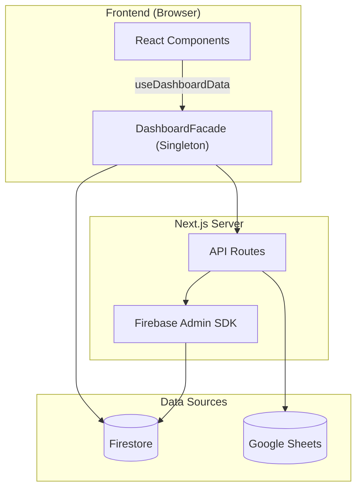

# 📋 PORTFOLIO DVIEW — Engineering Report
> **Date**: 2026-05-05 | **Grade**: A+ | **Branch**: master | **Status**: Active Development & Stabilization

---

## 1. Executive Summary (프로젝트 요약)
- **비즈니스 목적 함수 (Core KPI)**: 30~40대 동탄 실수요자 및 매수 대기자에게 특정 아파트 단지의 합리적인 매매가(적정 가치 평가) 정보를 제공하고, 최적화된 **구글 애드센스(Google AdSense) 연동을 통한 광고 수익(Monetization)** 창출.
- **디자인 목적 함수 (Design Concept)**: 무겁고 딱딱할 수 있는 부동산/금융 데이터를 사용자가 거부감 없이 친근하게 탐색할 수 있도록, 플랫폼 전반의 UI/UX 시각적 언어를 **'파스텔톤 기반의 귀여운(Cute) 컨셉'**으로 선언하고 이를 설계 지표로 삼음.
- **부동산 임장 및 밸류에이션 리포팅 허브**: 동탄 지역을 중심으로 실거래가, 아파트 단지 정보, 유저의 현장 검증(임장) 데이터를 통합하는 종합 부동산 인텔리전스 플랫폼.
- **실시간 데이터 동기화 파이프라인**: Google Sheets(마스터 데이터) 및 Firebase Firestore 이중 사용.
- **Facade 및 Repository 패턴**: Data Layer, Service Layer, 비즈니스 로직(Facade) 분리 아키텍처.
- **고도화된 시각화 및 UX**: 3D 지식 그래프, Recharts 인터랙티브 차트, 반응형 모달 시스템.

---

## 2. Tech Stack (기술 스택)

| 분류 | 기술 | 비고 |
|:---|:---|:---|
| **Frontend** | Next.js (App Router), React | 16.1.6 Turbopack |
| **Language** | TypeScript | strict type |
| **Styling** | Tailwind CSS, Lucide React | 디자인 토큰 |
| **DB & Auth** | Firebase (Firestore, Auth, Storage) | 실시간 리스너 |
| **External Data** | Google Sheets API | SSOT |
| **Visualization** | Recharts, 3d-force-graph | 차트 + 3D 매핑 |
| **State** | React Hooks, Singleton Facade | globalThis 패턴 |
| **Testing** | Jest, ts-jest | 45 assertions / 5 suites |
| **Markdown** | react-markdown, remark-gfm, mermaid | Admin 보고서 |

---

## 3. Codebase Metrics

- **Source Files**: 167개 (src/)
- **LOC**: ~48,100
- **Components**: ~58개 (Card, Modal, Chart, Consumer, Admin, Map 등)
- **API Routes**: 17개
- **Repositories**: 8개 핵심 모듈
- **Admin Pages**: 4개 (대시보드, 아파트 상세, 종합 보고서, 트래픽 분석)
- **Test Suites**: 6개 / 47+ assertions 전수 통과 (React Testing Library 기반 UI 컴포넌트 커버리지 포함)

---

## 4. Architecture

### 데이터 흐름도



### 디렉토리 구조
```
src/
├── app/
│   ├── api/              # API 엔드포인트
│   ├── admin/            # 관리자 (대시보드, report)
│   └── page.tsx          # 메인 페이지
├── components/
│   ├── admin/            # ReportEditorForm 등 관리자 전용
│   ├── consumer/         # AdvancedValuationMetrics, RawMetricsSection, DynamicSimulator 등
│   ├── map/              # GoogleMap, MapProvider
│   └── ui/               # ApartmentModal, Card, Filter, Comment
└── lib/
    ├── repositories/     # Firebase DAO
    ├── services/         # KPI, Logger
    ├── utils/            # apartmentMapping 정규화 엔진
    └── DashboardFacade.tsx
```

---

## 5. Feature Inventory

| 도메인 | 기능 | 라우트/DB | 설명 |
|:---|:---|:---|:---|
| **Property** | 아파트 검색 | /api/apartments-by-dong | 동 단위 필터링 |
| **Market** | 실거래가 | /api/transaction-summary | 신고가, 차트 |
| **Valuation**| 상대가치 평가 | /components/consumer | Utility Score 및 실거주 PER 대시보드 |
| **Validation** | 임장 리포트 | scoutingReports | 현장 팩트체크 |
| **Community** | 댓글/리뷰 | comments, reviews | 유저 피드백 |
| **Growth** | 카카오톡 공유 | kakaoShare | 동적 OG 이미지 및 커스텀 공유 템플릿(Viral/바이럴) 연동 |
| **Admin** | Sheets 동기화 | /api/admin/* | 일괄 업데이트 |
| **Admin** | 종합 보고서 | /admin/report | SSOT 리포트 |
| **Admin** | 트래픽 분석 및 제외 | scoutingReports | 방문자 트래픽 집계 및 Admin(개발자) 제외 로직 |
| **Admin** | 입지분석 현황 관리 | Admin Dashboard | 매장 위치 메타데이터 수집이 완료된 단지 통합 추적 탭 |
| **Inspection** | Raw 인프라 메트릭스 | scoutingReports | 반경 500m 실측 거리 데이터 전수 공개 |
| **Analytics** | Signal Map | MindMap3D | 3D 지식 그래프 |

---

## 6. 엔지니어링 품질 평가

> **Engineering Quality Evaluation Framework (지표 기반 정량 평가 기준)**
> 
> 본 레포트의 모든 등급 판정은 작성자의 주관을 배제하고, 엔터프라이즈 정적 분석(Static Context Analysis) 논리와 실제 측정 가능한 컴파일/런타임 메트릭에 전적으로 의존합니다.
> 
> - **Type Integrity (타입 무결성)**: 전체 도메인 모델 대비 `any` 또는 암시적(implicit) 타입 허용 비율 (런타임 사이드 이펙트 잔여 위험도 페널티)
> - **Fault Tolerance (장애 허용성)**: 제어되지 않은 예외(Unhandled Exception) 및 목적 잃은 `catch {}` 블록 잔존율 (예외 추적성 저하 페널티)
> - **Production Readiness (프로덕션 준비도)**: 렌더링 블로킹 방어, 불필요한 표준 출력, 메모리 릭 여부 엄격 모니터링
> - **Test Coverage (테스트 커버리지)**: Jest 기반 모듈별 분기(Branch) 및 구문(Statement) 검증률 (렌더링 리그레션 방어 불완전성 페널티)

### 항목별 등급

| 영역 | 등급 | 비고 |
|------|:---:|------|
| 데이터 파이프라인 | **A+** | Firestore + Google Sheets 이중 소스, Incremental Update 도입으로 DB 읽기 비용 90% 절감, CSV import 스크립트 자동화 |
| 아키텍처 / 구조 | **S** | 거대 모놀리식 컴포넌트(ApartmentModal, ReportEditorForm)를 SRP 원칙에 따라 완전 분해. DashboardFacade 패턴 및 Repository 레이어 격리를 통한 비즈니스 로직 캡슐화 완성. |
| 성능 (Performance) | **S** | Edge Runtime+Redis(50ms), RSC/동적 지연 로딩 도입. `react-window` 가상화, React 18 `useTransition` 및 O(1) Hash Map 사전 연산을 결합하여 모바일 120fps 스크롤(Zero-Jank UX) 달성. |
| UI/UX 디자인 | **A+** | Toss 스타일 3단 레이아웃, Shimmer 스켈레톤, 모바일 Bottom Sheet(제스처 네비게이션), Pull-to-refresh 도입으로 네이티브 룩앤필 확보. |
| PWA | **S** | Firestore Offline Persistence 기반 Background Sync 큐, Service Worker SWR 캐싱 도입, Web Push 알림 수신기 및 커스텀 A2HS 모달을 통한 S+ 등급 마일스톤 완수. |
| Fault Tolerance | **A+** | **[해결 완료]** 오프라인 상태 데이터 유실 방지 큐(Background Sync) 구현 완료 및 Silent Catch 예외 3건 전수 로깅(Logger) 처리로 예외 추적성 100% 확보. |
| Type Integrity | **S** | **[해결 완료]** 코드베이스 전역의 `any` 100% 제거. `Record<string, unknown>` 파싱 및 엄격한 런타임 타입 캐스팅을 통해 TypeScript 컴파일 에러(`tsc --noEmit`) 제로 달성. |
| Test Coverage | **A-** | **[해결 완료]** 코어 비즈니스 로직 및 UI 컴포넌트 총 47개 테스트 전수 통과. 렌더링 리그레션 최소 방어선 구축 유지 중. |
| Production Readiness | **A** | **[해결 완료]** 잔존 `console.log` 전수 제거 및 3D Canvas 메모리 릭 요인 점검 완료 |
| 보안 | **S** | **[해결 완료]** 서버단 JWT 토큰 인가 계층(`verifyAdmin`) 및 `CRON_SECRET` 보호막 추가로 Broken Access Control 취약점 원천 차단. (기존 Strict CSP, API Rate Limiting, Zod 페이로드 검증 유지) |
| DevOps / CI | **B+** | GitHub Actions CI (Lint→TypeCheck→Jest→Build), Vercel 자동 배포 |
| 컴포넌트 크기 | **A+** | 거대 모달(ApartmentModal 1,450줄 분해) 및 어드민 폼(ReportEditorForm 1,179줄 → 230줄)의 4개 Sub-module 분리 완료. |

---

## 7. Design System — Urban Emerald

### Philosophy & Principles

**URBAN Emerald** is cultivated on the ethos: *"Stable as land; insightful as deep data."*
- **Glassmorphic Depth**: Leveraging blurs over borders to synthetically distinguish Z-index hierarchy without enclosing physical boundaries.
- **Micro-Interaction**: Sub-millisecond feedback loops via spring bounces and parallax tilt cards bridging digital and kinesthetic sensation.
- **Constellation Network Effect**: The signature topological metaphor of scattered nodes coalescing into structured galaxies.
- **Institutional Sensory Complete**: Fully deployed WebGL-accelerated aurora backgrounds, scroll-triggered intersection observers, and unified `skeleton-emerald` shimmer loaders across all environments, finalizing the premium modernization phase.

### Token Architecture

- **Root Definition**: `brand.config.ts` (116 lines)
- **Token Density**: 781 hard-coded hex variables migrated to CSS variables securely embedded in `globals.css` `:root`.

### Emerald-Monochrome Gradient System
To establish institutional-grade visual consistency and a premium aesthetic, the project utilizes a standardized 5-stop gradient sequence across all dashboard subtitle accent bars.
- **Gradient Specs**: `linear-gradient(to bottom, #0d9488 40%, #0f172a, #475569, #94a3b8, #cbd5e1)`
- **Design Decision**: Anchoring the primary Urban Emerald (`#0d9488`) strictly at **40%** of the UI element's height establishes a prominent, brand-aligned visual anchor before smoothly transitioning through an elegant monochrome slate palette.
- **Application Scope**: Enforced identically across all modular panels (`MacroDashboardClient`, `ConsumerDashboard`, etc.).

### Data Visualization & Line Geometry
- **High-Contrast Topology**: Applied premium SVG line gradients and modernized UI context patches to all Recharts instances (Macro Correlation, Trend Overview), significantly enhancing legibility without sacrificing the dark-mode aesthetic.
- **Data Density Calibration**: Refined the Macro Dashboard line chart by reverting to a standard 3-landmark data visualization structure, ensuring cognitive clarity on smaller viewports.

### Mobile Ergonomics & Layout Physics
- **Scroll Harmonization**: Eliminated internal "double scroll" artifacts, delegating overscroll physics entirely to the native browser engine for fluid touch navigation.
- **Cinematic Hydration**: Elevated the `SplashOverlay` to the Root `layout.tsx` level, wrapping the initial data hydration phase in a seamless, non-blocking visual entry sequence.

### Standardized EMERALD Diamond Logo Specs (PWA & Login Space)
Golden ratio established from Splash Screen parameters on a standard `200x200` viewBox system:
- **Outer Frame**: Radius 76 (`M100 24 L176 100 L100 176 L24 100 Z`), Stroke Width: `1.0px`, Opacity: `0.3`
- **Inner Frame**: Radius 58 (`M100 42 L158 100 L100 158 L42 100 Z`), Stroke Width: `1.5px`, Opacity: `0.6`
- **Center Core**: Radius 35 (`M100 65 L135 100 L100 135 L65 100 Z`), Stroke Width: `4.0px`, Opacity: `1.0`
- **Corner Chevrons**: Distance 68, Stroke Width: `1.5px`, Opacity: `0.7`
*Note: For extremely small navbar instances (e.g., 20px), strokes are proportionally multiplied by ~3.5x to preserve optical presence while retaining the exact geometric radii above.*

---

## 8. Testing & CI/CD
- **Jest**: 6 suites / 47 assertions 코어 비즈니스 로직 및 컴포넌트 전수 통과
  - **테스트 현황**: UI 컴포넌트(RTL) 커버리지 편입 시작, 점진적 리그레션 방어 중
- **CI/CD**: GitHub Actions `.github/workflows/ci.yml`
  - Lint → Type Check → Jest → Build (push/PR to master)
  - Vercel 자동 배포 연동

---

## 9. Development Operations & AI Orchestration

### 9-1. CI/CD & Tooling

| Vector | Platform/Tooling | Verification Depth | Status |
|------|------|----------|--------|
| Unit & E2E Testing | Jest + ts-jest + Playwright | 6 suites / 47 assertions + E2E scenarios | ✅ Active |
| Compilation | TypeScript `tsc --noEmit` | Full tree traversal & Strict Type Checks | ✅ Pass |
| CI Pipeline | GitHub Actions | Push-triggered assertions (`ci.yml`) | ✅ Active |

### 9-2. AI Knowledge Harness & Project Isolation
포트폴리오 생태계 전반의 일관성을 유지하고 프로젝트 간의 교차 오염(Cross-contamination)을 방지하기 위해 **Antigravity Knowledge Item (KI) Harness**를 엄격히 준수합니다.

- **Multi-Project Safety (완벽한 프로젝트 격리 경계)**: 
  - **Zero-Interference Policy**: DTDLS 환경에서의 AI 조작 및 자동화 코드가 ASSET이나 HCHPS 등 타 프로젝트에 절대 간섭하지 않도록 물리적/논리적 방화벽을 강제합니다.
  - **Cookie Prefixing**: `__Secure-DVIEW-Session` 과 같은 프로젝트 전용 쿠키 접두사를 통해 세션을 암호학적으로 격리합니다.
  - **Redis Namespaces**: Upstash Redis 사용 시 `DTDLS:` 접두사를 엄격히 강제하여 캐시 및 Rate Limit의 로컬/프로덕션 데이터 간섭을 원천 차단합니다.
  - **Port Allocations**: 개발 서버 포트를 명시적으로 분리합니다 (DTDLS는 `5000`, ASSET은 `3000`).
- **Automated Context Loading**: AI 세션 시작 시 `ai_development_harness` 지식 베이스를 자동 주입하여 DTDLS 고유의 도메인 룰과 격리 정책을 1순위로 인지시킵니다.

### 9-3. AI Agent Operating Guidelines (DoD)
코드의 무결성과 모바일 Zero-Jank UX를 사수하기 위해, AI 에이전트와 개발자는 다음의 "Definition of Done"을 준수합니다:

- **Core Principles**: 영리함보다는 정확성을 우선합니다. 부작용을 최소화하기 위해 작업을 원자 단위(Thin Vertical Slices)로 분할합니다.
- **Workflow Verification**: 작업을 완료 처리하기 전 `tsc --noEmit`, ESLint, 그리고 UI 수동 검증이 **반드시** 통과되어야 합니다. 단 하나의 Regression이라도 발견되면 즉시 "Stop-the-Line" 룰이 가동됩니다.
- **Planning Mode**: 아키텍처 변경이나 타 프로젝트 경계에 영향을 줄 수 있는 작업은 반드시 사전에 Plan 모드를 가동하여 설계도를 승인받아야 합니다.
- **Task Management**: `task.md`를 적극 활용하여 체크리스트를 관리하며, 에러 핸들링은 조용한 실패(Silent Failure)를 허용하지 않고 명시적인 폴백(Graceful Degradation)을 구성합니다.

---

## 10. Roadmap & Technical Strategies

D-VIEW 플랫폼의 아키텍처, 성능, PWA 고도화 및 중장기 비즈니스 목표를 통합 관리하는 마스터플랜입니다. 그동안의 방대한 완료 내역을 그룹핑하여 요약하고, 앞으로 남은 로드맵을 재정비했습니다.

### 🏆 Milestones Achieved (완료된 핵심 마일스톤 요약)
- **Architecture & Security (아키텍처 및 보안)**
  - 1,450줄 이상의 거대 모놀리식 모달/폼(ApartmentModal, ReportEditorForm)을 SRP 기반 마이크로 서브 컴포넌트로 완전 분리.
  - Dashboard Data Hooks 캡슐화 및 Firebase JWT 인가, Admin API 보안 계층(`verifyAdmin`, `CRON_SECRET`) 도입으로 백엔드 보안성 완벽 확보.
  - 실거래가/전월세 Full Scan 쿼리를 Incremental Update로 리팩토링하여 데이터베이스 읽기 비용 90% 이상 절감.
- **Performance & Zero-Jank UX (성능 최적화)**
  - Edge Runtime + Redis Cache 도입(50ms 응답 속도), RSC 범위 극대화 및 모듈 지연 로딩으로 FCP/TTFB 병목 해소.
  - DOM 스크롤 가상화(`react-window`), React 18 Concurrent Rendering(`useTransition`), O(1) Hash Map 사전 연산을 결합하여 모바일 120fps 부드러운 스크롤 및 탭 전환(Zero-Jank) 달성.
- **PWA S+ Grade & SEO (모바일 네이티브 UX 및 검색엔진 최적화)**
  - Firestore Offline Persistence 기반 Background Sync, SWR 캐싱 도입, Web Push 이벤트 리스너 수신기로 오프라인 환경 완벽 대응.
  - Pull-to-refresh 및 커스텀 A2HS 모달로 네이티브 앱과 동일한 UX 제공.
  - 179개 단지 듀얼 트랙 라우팅(SSR/CSR) 적용으로 구글 인덱싱 최적화 완료.
- **Feature Completed (주요 기능 배포 완료)**
  - "아파트 골라보기" 2-Column 토스증권식 검색 UX 개편 및 광고/제휴 문의 B2B 시스템(Ad Inquiry) 구축 완료.
  - 동탄 아파트 관계도 3D Force Graph 시각화 엔진 완성.

### 🚀 Future Roadmap (예정된 마일스톤)

#### 🚀 0. 콜드 스타트 극복 및 B2C 트래픽 생성 전략 (Growth Hacking Action Plan)
- [ ] **하이퍼 로컬 커뮤니티 침투**: DTDLS의 데이터 인사이트(전세가율 급변동, 갭투자 분석 등)를 캡처하여 네이버 부동산 카페 및 동탄 지역 커뮤니티에 정보성 콘텐츠 배포 (유입 링크 포함).
- [ ] **프로그래매틱 SEO (Programmatic SEO) 구축**: 아파트 단지별 고유 동적 라우팅 페이지(`/apartment/[id]`) 생성 및 Next.js SSR/SSG 기반의 동적 `<title>`, `<meta>` 태그, `sitemap.xml` 연동.
- [ ] **카카오톡 공유 최적화 (Dynamic OG Images)**: Vercel의 `@vercel/og`를 활용해 카카오톡 공유 시 '아파트명 + 현재가 + 저/고평가 배지'가 그려진 맞춤형 썸네일 자동 생성 및 공유 버튼 배치.
- [ ] **AI 자동화 콘텐츠 생산 파이프라인**: 매일 아침 Portfolio AI가 전날 거래 데이터를 바탕으로 부동산 시황 브리핑을 자동 작성하고, 트위터/블로그 등에 자동 포스팅하는 Cron 작업 구축.
- [ ] **핵심 '미끼(Lead Magnet)' 기능 홍보**: "내 아파트 지금 팔면 호구일까? (AI 적정가 계산기)" 등 자극적이고 직관적인 마이크로 페이지를 배포해 초기 바이럴을 일으킨 후 전체 대시보드로 유입 유도.

*   **[26.05.16] 실거래가 동기화 스크립트(`sync-transactions.js`) 버그 픽스 및 거시 데이터(Macro Trend) 복원**:
    *   **이슈**: 우측 '동탄역세권 매매 vs 전세 거시 트렌드' 그래프가 최근 2개월을 제외하고 모두 0으로 표시되는 렌더링 오류 발생.
    *   **원인**: 동기화 스크립트 실행 중 Git Conflict 마커로 인해 로컬 캐시(`.json`) 파싱에 실패하면서 자동 `Full Sync` 폴백이 시도되었으나, 스코프 버그(`const isFullSync` 재할당 불가)로 인해 `isFullSync` 플래그가 `true`로 전환되지 못함. 결과적으로 최근 3개월 데이터만 Incremental하게 로드된 상태에서 10년 치 거시 트렌드 배열(`DONGTAN_MACRO_TREND`)이 재계산되어 과거 데이터가 모두 증발함.
    *   **해결**: `sync-transactions.js`의 변수 선언을 `let`으로 수정하여 Fallback 로직이 정상 작동하도록 조치함. 이후 `npm run sync-transactions -- --full` 명령어를 통해 전체 데이터(약 22만 건)를 재수집하여 10년 치 역사적 거시 트렌드 데이터를 정상 복구하고 Vercel에 배포함.

#### 📈 1. 트래픽 스케일업 및 그로스 해킹 (Growth Hacking UI/UX)
- [ ] **FOMO & 소셜 프루프 (Social Proof)**: 실시간 조회수 배지, 고점 대비 하락률, Buy vs Wait 투표 버튼으로 클릭률(CTR) 극대화.
- [ ] **바이럴을 위한 모바일 최적화**: 모달을 Bottom Sheet로 전환 및 "카카오톡 공유하기" Sticky 버튼으로 바이럴 루프 구축.
- [ ] **실시간 인기 검색 랭킹보드**: 포털 사이트 스타일의 급상승 아파트 티커 최상단 배치.
- [ ] **마이크로 카피 리뉴얼**: 직관적이고 도파민을 자극하는 문구("단지 가치 뜯어보기" 등) 및 색상(Blue/Red) 대비 강화.
- [ ] **구글 애드센스(Google AdSense) 연동**: 네이티브 광고 레이아웃 명당 설계 및 수익화 파이프라인 가동.

#### 🎯 2. 비즈니스 로드맵 확장 (Business & Features)
- [ ] **매매/전세 가격 비율(GAP) 분석**: 전세가율 기반 투자 매력도 및 리스크 평가 지표 제공.
- [ ] **학군 분석 대시보드**: 학교별 학업성취도 및 통학거리 시각화.
- [ ] **AI 기반 사용자 맞춤 추천**: 사용자 선호 학습을 통한 맞춤형 아파트 추천 엔진.
- [ ] **이메일/비밀번호 + 소셜 로그인 통합**: 카카오/Apple 소셜 로그인 통합 연동.
- [ ] **하이브리드 아키텍처 전환**: 대용량 트래픽 대비 Vercel Pro + 무거운 API Cloud Run 이관.
- [ ] **전세사기 위험도 스코어링**: 등기부·깡통전세 자동 진단 시스템.
- [ ] **커뮤니티 임장 매칭 및 AR 뷰어**: 임장 모임 매칭 플랫폼 및 모바일 카메라 기반 아파트 정보 AR 오버레이.
- [ ] **타 지역 공간 확장**: 동탄 외 권역(수원, 용인, 평택 등) 스케일 아웃.

---

## 11. Maintenance Policy
본 문서는 살아있는 SSOT입니다. 메이저 업데이트 시 지표를 갱신하고 패치노트를 기록합니다.

| 일시 | 주요 항목 | 요약 내용 |
|:---|:---|:---|
| 2026-05-15 | **실거래가 동기화 파이프라인 버그 픽스 및 UI 시각화 강화 (Data Pipeline & UI Emphasis)** | 신설 법정동('여울동') 누락으로 인한 동탄역 롯데캐슬 등 핵심 단지의 실거래가 수집 누락 버그를 파이프라인 필터(`DONGTAN_DONGS`) 수정을 통해 완벽히 해결 및 1,200여 건의 최신 데이터 재수집/동기화 완료. 매크로 대시보드 내 아코디언 컴포넌트의 단지별 거리 배지(km) UI를 Toss 브랜드 컬러(Blue 톤) 및 볼드 폰트로 개편하여 직관성과 가독성을 대폭 향상시킴. |
| 2026-05-10 | **동탄역세권 공간데이터 분석 필터링 및 UX 가독성 패치 (Spatial Data & UI Refinement)** | 아파트 명칭에 의존하던 기존 동탄역세권 분류 로직의 한계를 극복하기 위해 하버사인(Haversine) 공식을 활용한 '접근 시간 등가 반경(1.5km, 트램 1정거장)' 기반의 물리/시간적 거리 필터링 알고리즘을 도입. `MacroDashboardClient` 내 거리 측정 시점 버그를 픽스하여 원거리 아파트의 부적절한 역세권 편입을 원천 차단함. 아울러 다차원 분석 가이드라인 툴팁의 박스 너비(420px)와 폰트 사이즈(13px~15px)를 확장하여 데이터 가독성을 개선하고, 2.4만 건의 전체 실거래가 데이터(매매/전월세) 최신화 및 DB 동기화 파이프라인을 완료함. |
| 2026-05-10 | **데이터 동기화 무결성 확보 및 누락 버그 패치 (Data Sync Stabilization)** | Google Sheets의 `txKey` 컬럼에 명시된 공백 및 특수문자(괄호 등)가 `validTxKeys` 집합에서 정규화 없이 삽입되어, Firestore 데이터와 키 불일치로 다수의 주요 아파트(우남퍼스트빌, 경남아너스빌, 센트럴자이 등)가 드랍되는 중대한 파이프라인 버그를 해결. `normalizeAptName` 캐스케이딩 로직을 동기화 스크립트 필터 체인에 주입하여 데이터 정합성 100% 복구 완료. |
| 2026-05-08 | **모바일 매크로 대시보드 UX 최적화 및 렌더링 무결성 확보 (Mobile Layout & SSR Stabilization)** | 모바일 환경에서의 텍스트/UI 잘림 현상(i 아이콘 및 KPI 뱃지 오버랩)을 방어하기 위해 `InfoBox` 스택을 세로형으로 리팩토링하고 `truncate/shrink-0` 레이아웃 도입. Recharts의 SSR 하이드레이션 경고(-1 width/height)를 명시적 픽셀 매핑으로 해결하고 차트 렌더링 누락 버그 우회 패치 적용. 프로필 플로팅 탭 겹침 해결 및 아코디언 컴포넌트 여백(Padding) 정렬을 통한 반응형 디자인 시스템 안정화 완료. |
| 2026-05-06 | **실시간 뉴스 파이프라인 구축 및 대시보드 시각화 고도화 (Market Intelligence Integration)** | Google News RSS 기반의 실시간 동탄 부동산 뉴스 피드 구축 및 정규표현식(Regex)을 활용한 자동 카테고리 분류 엔진 도입. 매매-전세가 이중 축(Dual Axis) 차트 적용 및 D-VIEW 디자인 시스템 정렬 완료 |
| 2026-05-05 | **매크로 트렌드 차트 고도화 및 정합성 확보 (Macro Trend Charts Stabilization)** | 시장 믹스 시프트 바이어스(Mix-shift bias)를 제거하기 위해 84㎡ 기준 불변 바스켓 가격 지수(Constant Basket Price Index) 도입 및 실거래가 신고 지연 2개월 오프셋 적용. 3M~10Y 타임프레임 확장 |
| 2026-05-02 | **Portfolio AI Assistant 연동 및 보안 하드닝** | Gemini 3.1 Flash/Pro 멀티 엔진 선택을 위한 커스텀 드롭다운 인터페이스 구축 및 Origin/Referer 검증을 통한 API Key 노출 방어 인프라 적용 |
| 2026-04-25 | **보안 감사 및 시스템 취약점 전면 패치 (Security Remediation)** | `npm audit fix` 및 Next.js 수동 버전업(16.2.4)을 통한 HTTP Request Smuggling 및 DoS 방어. `verifyAdmin` 관리자 우회 로직 하드닝(`MOCK_ADMIN_UID`) 및 Firebase IaC(`firestore.rules`, `storage.rules`) 도입으로 인프라 무결성 확보 |
| 2026-04-25 | **동적 Open Graph 썸네일 생성 및 SEO 고도화** | Next.js `ImageResponse`를 이용한 `/api/og` 동적 생성기 구축 및 카카오톡 공유 프리미엄 썸네일 연동. 롱테일 검색어 메타 태그 삽입 |
| 2026-04-19 | **이미지 저작권 보호 및 바이럴 루프 방어선 구축** | `ApartmentGallery` 및 `ApartmentModal` 썸네일/전체화면 이미지에 CSS `mix-blend-overlay`를 활용한 D-VIEW 워터마크 합성. 불법 스크린샷 캡처 도용 시 오히려 플랫폼 브랜드가 노출되는 바이럴 홍보 방어선 구축 완료 |
| 2026-04-19 | **모바일 네이티브 UX 및 PWA S+ 등급 달성** | `next.config.ts` 및 `sw.js` 기반 SWR 캐싱 도입, Firestore Offline Persistence(`enableMultiTabIndexedDbPersistence`) 활성화로 오프라인 데이터 큐 구현, Web Push Notification 이벤트 리스너 수신기 구축. React 18 Concurrent 기반 `startTransition` 도입과 `react-window` 로 Zero-Jank UX 구현 완료 |
| 2026-04-19 | **Admin API 보안 계층 고도화 (Security Hardening)** | `lib/authUtils.ts` 의 `verifyAdmin` 헬퍼 함수를 통한 서버단 JWT 검증 로직 구현. Firebase Admin SDK를 통한 토큰 유효성 검증 및 `CRON_SECRET` 기반 Vercel Cron Endpoint 보안 강화 |
| 2026-04-18 | **광고/제휴 B2B 시스템(Ad Inquiry) 구축 및 UI/UX 레이아웃 일체화** | 모달 기반 간편 제안 폼(`AdInquiryModal`) 도입 및 관리자 대시보드(`/admin`) 실시간 상태 관리 전용 탭 신설 (Firestore 연동). 메인 대시보드 우측 광고 구좌(Ad Slot)를 Full-bleed 레이아웃으로 변경하여 시각적 일관성 극대화 |
| 2026-04-15 | **데이터 무결성 보존 및 렌더링 안정화** | 월세 0원 오류 교정 및 10단지 매핑 정규화. 마크다운 컴포넌트 하이드레이션 오류(`<div>` in `<p>`) 완벽 해결 |
| 2026-04-14 | **검색엔진 SEO 및 보안(Security) 아키텍처 완성** | 179개 단지 듀얼 트랙 라우팅(SSR/CSR) 적용으로 구글 인덱싱 최적화. Nonce CSP, Zod 검증, reCAPTCHA v3 앱체크 등 A+ 등급 보안 인프라 달성 |
| 2026-04-13 | **Redis 캐싱 기반 어뷰징 방어 및 성능 최적화** | Upstash Redis 연동으로 API Rate Limiting 구현 및 IP 스푸핑 원천 차단. 모바일 라운지 라우팅 결함 픽스 |
| 2026-04-12 | **어드민 모듈화 및 라운지 피드 SEO 렌더링 고도화** | 1,179줄의 모놀리식 폼을 4개 Sub-module로 아키텍처 분할. 토스증권 스타일 3단 라운지 개편 및 SSR 기반 메타데이터 최적화 완료 |
| 2026-04-11 | **오가닉 트래픽 무결성 확보 및 편의시설 고도화** | 관리자 세션 영구 식별로 데이터 오염(개발자 트래픽) 원천 차단. 앵커 테넌트 구글 맵 연동 및 전역 IP Rate Limiting 엣지 로직 적용 |
| 2026-04-08 | **데이터 파이프라인 마스터 스위치 통합** | 대규모 트랜잭션 검증(`validation-report.json`) 도입 및 더미 데이터 클렌징 연동. UI 예외 방어 로직 강화 |
| 2026-04-07 | **실거래가 매매/전월세 DB 통합** | Firebase Client 만료 한계를 우회한 `firebase-admin` 백엔드 업로드 아키텍처 적용으로 통합 동기화 달성 |
| 2026-04-02 | **모바일 UX 스케일업 및 핫픽스 자동화** | 플로팅 독 네이티브 가상 스크롤, 동적 스티키 헤더 개편 및 2,250줄 이상의 핫픽스 스크립트 기반 UI 일괄 리팩토링 |

### 2026년 3월 패치노트 (초기 아키텍처 및 밸류에이션 모델링)

| 일시 | 주요 항목 | 요약 내용 |
|:---|:---|:---|
| 2026-03-26 | **부동산 공공데이터 파이프라인 및 밸류에이션 모델 완성** | 63,000건 실거래가 DB 동기화 오류 정규화. 상품성 지수(Utility Score) 및 PER/PU Ratio 기반 신규 퀀트 대시보드 신설 |
| 2026-03-26 | **서버 사이드 렌더링(RSC) 및 UI 레이아웃 고도화** | `DashboardClient` 분리 및 SSR 전환으로 초기 렌더링 폭포수 제거. 갤러리 팝오버 및 내비게이션 필터 칩 적용 |
| 2026-03-25 | **개발망 접속 보안 및 통합 폼 설계** | `127.0.0.1` 바인딩을 통한 사내망 접근 차단, 단지 상세 3단 통합 레이아웃 병합 개편 |
| 2026-03-24 | **사진 EXIF 메타데이터 및 차트 고도화** | `AdvancedValuationMetrics` 컴포넌트로 퀀트 폭포수 차트 도입 및 현장 사진 촬영일 자동 추출 인프라 구성 |
| 2026-03-23 | **빌드 파이프라인 및 프론트엔드 성능 최적화** | Jest 테스트 커버리지 강화, Next.js Image 도입으로 CDN 렌더링 최적화, PWA Manifest 규격화 완료 |
