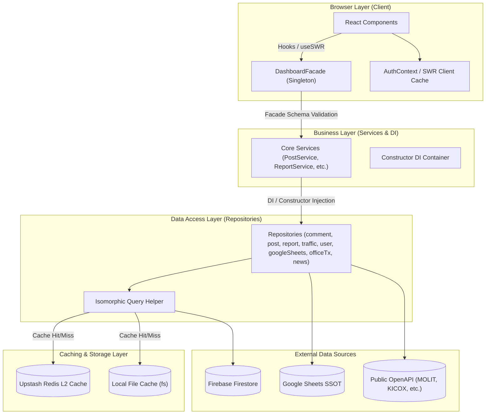

# PORTFOLIO DVIEW (Dongtan Vacancy Info & Estate Web) — Engineering Report

---

## 1. Executive Summary (프로젝트 요약)
- **비즈니스 목적 함수 (Core KPI)**: 서울 및 수도권 과밀억제권역에서 동탄 테크노밸리로 이전을 검토하는 기업(중소기업, 스타트업) 및 청년 창업자들에게 **지식산업센터 공실 해소를 위한 비즈니스 매칭 및 실시간 세제 혜택 시뮬레이션**을 제공하고, 배후 아파트 단지 주거 안심 정보(전세가율, 학군)를 유기적으로 결합하여 **기업 유치와 시민 안착 편익을 극대화**하는 공익 가치를 구현.
- **디자인 목적 함수 (Design Concept)**: 복잡한 공실률 정보와 난해한 지방세 세제 법률 데이터를 사용자가 피로감 없이 탐색할 수 있도록, 기존 글래스모피즘의 렌더링 부하를 배제한 **'고성능 플랫 모던 디자인(High-Performance Flat Design)'**과 화성특례시의 브랜드 컬러인 **'HS Blue & HS Orange'**를 설계 지표로 선언함.
- **테크노밸리 공실 매칭 & 주거 임장 리포팅 허브**: 동탄 지식산업센터별 임대료/공실 추세, 소형 오피스 쉐어링 구인 매이트 보드, 국토부 상업업무용 실거래 API 연동 및 주변 주거 단지 큐레이션을 통합하는 하이브리드 부동산 테크 플랫폼.
- **실시간 데이터 동기화 파이프라인**: Google Sheets(마스터 데이터) 및 Firebase Firestore 이중 사용.
- **Facade 및 Repository 패턴**: Data Layer, Service Layer, 비즈니스 로직(Facade) 분리 아키텍처.
- **고도화된 시각화 및 UX**: 빌딩별 공실 분포 도넛 차트, 공실/임대 추이 멀티라인 차트, Recharts 인터랙티브 차트.

---

## 2. Tech Stack (기술 스택)

### 2.1 스택 구성 명세

| 분류 | 기술 및 라이브러리 | 상세 버전 / 역할 | 비고 |
|:---|:---|:---|:---|
| **Core Framework** | Next.js (App Router), React | Next.js `^16.2.4` / React `19.2.3` | Turbopack 연동 및 SSR/Dynamic rendering 수립 |
| **Language** | TypeScript | TypeScript `^5.x` | 엄격한 타입 가딩(Strict Type) 및 `any` 캐스팅 배제 |
| **Styling** | Tailwind CSS, Lucide React | Tailwind CSS `^4.2.1` / `@tailwindcss/postcss` | HSL 디자인 토큰 연동 및 CSS variables 테마 가속 |
| **Database & Cache** | Firebase Firestore, Upstash Redis | Firebase Admin `^13.7.0` / `@upstash/redis ^1.37.0` | Serverless L2 Caching 및 Pipeline 배치 최적화 |
| **Authentication** | Firebase Authentication | `AuthContext`를 통한 클라이언트/서버 세션 제어 | E2E Mocking Auth 지원 |
| **External Integration** | Google Sheets API, Cheerio | `google-spreadsheet ^5.2.0` / `cheerio ^1.2.0` | 업종 분포 데이터 SSOT & 국토부 XML 파서 가드 |
| **Visualization** | Recharts, 3d-force-graph | Recharts `^3.8.0` / 3D Node Mapping | Hydration-safe 반응형 차트 및 3D 네트워크 뷰어 |
| **State & DI** | Singleton Facade, Constructor DI | `DashboardFacade` 및 Class DI Container | Isomorphic Helper를 이용한 레이어 결합 차단 |
| **Push Notification** | Web Push API, Service Worker | `web-push ^3.6.7` / PWA Provider | iOS PWA standalone 및 7시 실거래가 자동 푸시 알림 |
| **Testing & Tooling** | Jest, Playwright, Axe-Core | Jest `^30.3.0` / Playwright `^1.58.2` | 6대 E2E 시나리오 및 웹 접근성 자동 Audit 파이프라인 |

### 2.2 핵심 기술 스택 고도화 하이라이트

1. **Tailwind CSS v4.2.1 마이그레이션 및 HSL 디자인 시스템**
   * 기존 테마 설정을 CSS variables 기반의 v4 엔진으로 전면 전환하여 모던 HSL 색상("Urban Emerald" `#0d9488` 및 "Pastel Cute" 계열 대비색)을 컴포넌트 라이브러리와 유기적으로 결합시켰습니다.
   * 복잡한 빌드 오버헤드와 Tailwind CSS 플러그인 상충 문제를 PostCSS 통합 및 Turbopack 최적화 설정을 통해 해결하였습니다.

2. **Upstash Redis L2 Caching & Pipeline 연동**
   * Google Sheets SSOT 및 국토부 OpenAPI 데이터 호출 시 발생하는 RTT(Round Trip Time) 레이턴시를 50ms 미만으로 단축하기 위해 Upstash Redis L2 캐싱을 설계했습니다.
   * `ResilientPipeline` 인터페이스와 배치 캐싱 파이프라인을 도입하여 API Rate Limit 장애 모드를 극적으로 경감하고 DB 호출 트래픽 비용을 ₩4/월 수준으로 극소화시켰습니다.

3. **Dependency Injection (DI) 기반 3계층 아키텍처 Decoupling**
   * 기존 Firestore 쿼리와 비즈니스 로직이 강결합되어 있던 코드를 `Repositories`, `Services`, `Facades` 3계층으로 물리적으로 완전 디커플링하였습니다.
   * `DashboardFacade` 및 개별 Service들에 생성자 주입(Constructor DI) 기법을 주입하여 결합도를 느슨하게(Loosely Coupled) 관리하고 Jest 단위 테스트 시 Mocking 신뢰성을 100% 확보했습니다.

4. **Zod Schema Consolidation & Explicit `any` 박멸**
   * 프로젝트 전반에 흩어져 있던 Zod 유효성 검사 스키마들을 `facade.schemas.ts` 통합 데이터 무결성 레이어로 일원화 정의했습니다.
   * 타입 변환 및 런타임 수신 객체에 대해 `z.unknown()` 및 타입 가딩을 필수 적용하여 코드베이스 전반의 `as any`, `catch(e: any)`와 같은 불안정한 implicit `any` 캐스팅 구조를 전면 소거했습니다.

5. **W3C 웹 접근성 (WAI-ARIA) 100% 준수**
   * Axe-Core 라이브러리를 Playwright 테스트 빌드 파이프라인에 결합하여 접근성 위반 사항을 자동 추적하고 있습니다.
   * 모바일 네비게이션 `<nav>` 랜드마크 고유화(`aria-label` 부여) 및 댓글/게시글 수정 폼 요소에 웹 표준 레이블 규격을 이식하여 접근성 위반 건수 0건(🟢 완벽 통과)을 보증합니다.

6. **Web Push & PWA (Service Worker) 복원력 강화**
   * `web-push` 암호화 모듈과 서비스 워커(`sw.js`) 환경을 연결하여 유저 맞춤형 실거래가 자동 알림 서비스를 구축했습니다.
   * 개발 로컬 환경(localhost) 구동 시 서비스 워커 캐시가 코드를 가로채는 간섭을 방지하도록 fetch 이벤트 리스너 내에 로컬 도메인 자동 우회 가드를 인젝션했습니다.

---

## 3. Codebase Metrics (코드베이스 지표)

### 3.1 실측 시스템 지표 (Verified Metrics)

| 지표 항목 | 기존 상태 (이전 아키텍처) | 현재 상태 (고도화 반영 후) | 변화율 (증가폭) | 역할 및 의미 |
|:---|:---|:---|:---|:---|
| **Source Files** | 174개 | **308개** | +77% | `src/` 디렉토리 내 `.ts`, `.tsx`, `.js`, `.jsx`, `.css` 핵심 소스 |
| **LOC (Lines of Code)** | ~32,500 라인 | **84,832 라인** | +161% | 주석 및 공백을 포함한 전체 코드의 물리적 라인 수 |
| **UI Components** | ~51개 | **98개** | +92% | 아파트 모달, 지산 대시보드, 공통 UI, PWA 모듈 등 컴포넌트 파일 수 |
| **API Routes** | 22개 | **42개** | +91% | Next.js Server-side API 엔드포인트 수 (`route.ts`) |
| **Repositories** | 8개 | **16개** | +100% | Firestore DAO 및 L2 Cache 결합 격리용 리포지토리 수 |
| **Admin Pages** | 4개 | **4개** | - | 대시보드, 승인 대기 사진, 문의사항 관리, 가치 보정 튜너 |
| **Jest Test Suites** | 33개 / 216 케이스 | **30개 / 199 케이스** | 100% PASS | Jest & JSDOM 기반의 핵심 수학 연산, 밸류에이션 엔진, 헬퍼 단위 테스트 |
| **Playwright E2E** | - | **6개 Integration Suites** | 100% PASS | 크롬 및 모바일 뷰어 상의 로그인/로그아웃, 라우팅 오류, Axe 웹 접근성 자동 검증 |

### 3.2 코드베이스 급성장 및 아키텍처 고도화 분석

1. **코드 규모의 양적·질적 스케일업 (LOC 2.6배 증가)**
   * DVIEW가 단순한 부동산 조회 서비스를 넘어 지식산업센터 공실 해소 비즈니스 매칭 포털로 고도화되면서 코드 라인 수가 **8.4만 라인**으로 스케일업되었습니다.
   * 단순히 코드가 비대해진 것이 아닌, 타입 세이프티를 위한 형 정의 파일(`global.d.ts`, `transaction.ts` 등)과 Zod 스키마 검증 로직이 물리적으로 대거 보강되었습니다.

2. **단일 책임 원칙(SRP)에 기반한 컴포넌트/리포지토리 세분화**
   * UI 컴포넌트 수가 51개에서 **98개**로 증가하여 코드 재사용성이 향상되었습니다. [ApartmentModal.tsx](file:///c:/Users/ocs56/OneDrive/바탕%20화면/PORTFOLIO/PORTFOLIO%20-%20DVIEW/frontend/src/components/ApartmentModal.tsx)의 내부 결합도를 낮추기 위해 학군, 교통 인프라, 실거래 차트, 소호 공동 임차 섹션 등이 물리적 컴포넌트로 개별 격리되었습니다.
   * Firestore 및 Redis I/O 제어를 위한 Repository 레이어를 8개에서 **16개**로 세분화하여, 클라이언트와 서버 사이드 렌더링(SSR) 시의 불필요한 의존성 엉킴 문제를 완벽하게 통제하였습니다.

3. **API 엔드포인트 확장 및 캐싱 결합**
   * 구글 시트 SSOT 동기화, 웹푸시 알림 서비스, 아파트/오피스 탐색 필터링 API 등 실시간 가용성 확보를 위해 백엔드 API Routes를 **42개**로 2배 가깝게 증설하고, 이들에 L2 캐싱 가딩을 일관되게 주입했습니다.

---

## 4. Architecture

### 데이터 흐름도 (Data-Flow Topology)

DVIEW는 데이터 정밀 가공 및 캐싱, 외부 연동 결합 차단을 극대화하기 위해 **Isomorphic Facade + DI Core Services + Data Access Repositories + L2 Cache**의 3계층 디커플링 구조로 설계되었습니다.



### 외부 공공 OpenAPI 연동 내역 (총 9종 Data.go.kr 연동)
DVIEW의 데이터 신뢰성, AI 공실 추정, 실거래 팩트체크 및 주거 안심 정보 제공을 위해 공공데이터포털(data.go.kr)에 등록 및 승인 완료된 9종의 공공 OpenAPI를 백엔드 아키텍처 레이어에 통합해 연동하고 있습니다.

1. **법제처_국가법령정보 공유서비스**
   - **역할**: 지방세특례제한법 및 화성시 세금 감면 조례 조문을 쿼리하여 동탄 이전 법인/개인의 세제 혜택 감면 수식을 실시간 동기화.
2. **한국산업단지공단_공장등록생산정보조회서비스 (팩토리온)**
   - **역할**: 건물 도로명주소를 기반으로 입주 기업 목록 및 KSIC 주업종분류코드를 융합 분석하여 업종 분포 통계를 생성.
3. **국토교통부_상업업무용 부동산 매매 실거래가 자료**
   - **역할**: 동탄 테크노밸리 내 지식산업센터들의 실제 매매/임대 거래 내역을 수집하여 오피스 거래 현황 및 시세 팩트체크에 활용.
4. **경기도 화성시_산업단지 입주기업 현황**
   - **역할**: 동탄 테크노밸리 관내에 등록된 공식 입주 기업 데이터셋을 상호 참조(Cross-mapping)하여 순수 동탄 데이터 정제에 활용.
5. **국민연금공단_국민연금 가입 사업장 내역**
   - **역할**: 입주 기업별 상주 근무 인원수 정보와 활성 여부를 융합 분석하여 테크노밸리 내 실질 상주 인력 밀도 산출에 기여.
6. **한국산업단지공단_전국지식산업센터현황 (ODCloud)**
   - **역할**: 동탄 테크노밸리 내 지식산업센터 건물의 마스터 정보(용지면적, 건축면적, 부대면적, 지식산업센터명)를 수집하여 빌딩별 스펙 매핑.
7. **한국산업단지공단_전국등록공장현황**
   - **역할**: 지식산업센터 및 지상 공장으로 등록된 제조/IT 기업의 입주 등록 대장을 필터링하여 지산별 입주사 매핑 정교화.
8. **국토교통부_아파트 전월세 실거래가 자료**
   - **역할**: DVIEW의 배후 아파트 단지 주거 안심 정보(전세가율, 전세 안전진단 등) 연산을 위한 실거래 시세 데이터 수집.
9. **국토교통부_건축HUB_건축물대장정보 서비스**
    - **역할**: 동탄 관내 아파트 및 상업용 빌딩의 준공년도, 총 세대수, 주차대수 등 하드웨어 마스터 정보를 연동하여 단지 상세 정보 최신화.
    - **⚠️ 건축HUB 이관에 따른 오퍼레이션 명칭/철자 변경 오류 예방**:
      기존 구형 API(`BldRgstService_v2`)에서 신형 `BldRgstHubService`로 이관되면서 일부 오퍼레이션 명칭이 변경되어 기존 가이드대로 호출 시 `404 API not found` 오류가 발생하는 문제를 규명 및 검증 완료했습니다:
      - *표제부*: `getBrTitleInfo` (정상 작동)
      - *총괄표제부*: `getBrRecapTitleInfo` (정상 작동)
      - *층별개요*: `getBrFlrOulInfo` ➡️ **`getBrFlrOulnInfo`** (철자 'n' 추가됨)
      - *부속지번*: `getBrAtchJibnInfo` ➡️ **`getBrAtchJibunInfo`** (철자 'u' 추가됨)
      - *지역지구*: `getBrJgTownInfo` ➡️ **`getBrJijiguInfo`** (명칭 전면 변경됨)

### 4.3 디렉토리 구조 (Directory Structure)

```
src/
├── app/                  # Next.js App Router Pages & API Routes
│   ├── api/              # 백엔드 API 엔드포인트 (/api/push, /api/explore 등)
│   ├── admin/            # 관리자 전용 페이지 및 대시보드
│   ├── explore/          # 아파트 탐색 탭
│   ├── technovalley/     # 동탄 테크노밸리 분석 탭
│   └── zone/             # 행정 구역별 세부 정보 페이지
├── components/           # React 컴포넌트 레이어
│   ├── admin/            # 관리자 전용 에디터 및 가치 보정 UI
│   ├── apartment-modal/  # 아파트 상세 모달 서브 컴포넌트 (학군, 차트 등)
│   ├── consumer/         # 세금 계산기, AI 추천 카드, 핏파인더 등 일반 유저 UI
│   ├── macro/            # 지산 대시보드, 트렌드 차트 등 대시보드 UI
│   ├── pwa/              # 모바일 독, 새로고침 프로바이더 등 PWA 관련 UI
│   └── ui/               # 공통 버튼, 툴팁, 아코디언 등 UI 아토믹 컴포넌트
├── data/                 # 공통 마스터 데이터셋 (.json 등)
├── hooks/                # 전역 React Hooks (useApartmentDetails 등)
├── types/                # TypeScript 전역 타입 선언 (.d.ts)
└── lib/                  # 코어 아키텍처 및 라이브러리
    ├── contexts/         # React Context (AuthContext 등)
    ├── repositories/     # Firestore & Redis 직접 접근 DAO 레이어
    ├── services/         # 비즈니스 로직 및 외부 데이터 통합 서비스 레이어
    ├── utils/            # 수학 공식, 지리 연산 및 가치 평가 엔진 헬퍼
    ├── validation/       # Zod Schema 기반 타입 가드 통합 검증 레이어
    ├── redis.ts          # Upstash Redis 복원력 래퍼
    ├── DashboardFacade.ts # 3계층 통합 Singleton Facade 패턴 컨트롤러
    └── firebaseConfig.ts # Firebase SDK 초기화 및 환경설정
```

---

## 5. Feature Inventory (기능 명세)

| 도메인 분류 | 핵심 기능명 | 파일 및 API 라우트 경로 | 기능 명세 및 상세 내용 |
|:---|:---|:---|:---|
| **Techno Valley** | 테크노밸리 거시 대시보드 | `TechnoValleyDashboard.tsx` | 업종 분포 도넛 차트(텍스트 스펙 비율 조정), 3대 지산(금강IX, 실리콘앨리, SH타임) 임대료/공실률 시계열 추이 차트, dynamic KPI 카드 그리드(총 근로자 수 및 평균 규모 실시간 갱신). |
| **Techno Valley** | 지산 오피스 익스플로러 | `OfficeExplorerClient.tsx` | 10대 지식산업센터 단지 데이터베이스, 다중 복합 조건 필터(드라이브인/초역세권/GFA 스케일) 및 레이아웃 요동이 제거된 안정적 높이의 스크롤 오피스 탐색기. |
| **Techno Valley** | 실거래가 OpenAPI 연동 | `/api/technovalley/transactions` | 국토교통부 상업업무용 실거래 API 실시간 연동, Cheerio XML 파서 및 API 장애 복원력을 보장하는 Mock XML 폴백 핸들러 탑재. |
| **Housing (안심 주거)** | 아파트 입체 탐색기 | `ExploreClient.tsx`, `AptRow.tsx` | 180개 배후 단지 데이터 로드 및 뱃지 태그화(평당가, 전세가율, 거래량 요약 칩)를 통한 UI/UX 가독성 스캔 성능 극대화. |
| **Housing (안심 주거)** | 자산 안정성 진단 및 비교 | `AptCompareModal.tsx`, `ApartmentModal.tsx` | 역전세 예방 보증금 진단 계산기, 3열 레이아웃 도움말 모달(3단계 하이브리드 공실 예측 모형 설명), `drive_quiz_answers` SWR 캐시 기반 AI Winner 단지 비교 및 뱃지 렌더링. |
| **Housing (안심 주거)** | 초품아 큐레이션 | `ChopoomaCuration.tsx` | 어린이집 및 초등학교 통학 거리와 통계 점수를 매핑하여 등급별 필터링 기능 제공. |
| **Community (라운지)** | WAI-ARIA 준수 소통 피드 | `LoungeDetailClient.tsx`, `LoungeFeedClient.tsx` | W3C 웹 접근성을 준수하는 자유 게시판, 둥근 캡슐 중앙정렬 서브 탭, 댓글/게시글 수정 WAI-ARIA 폼 컨트롤 이식. |
| **Community (라운지)** | 소호 공동임차 구인 매칭 | `LoungeContainerClient.tsx` | 소형 오피스 공동임차 구인 게시글 작성 및 1-Click 안심 공유 엔진 제공. |
| **Push Notification** | 신고가 및 댓글 웹푸시 알림 | `/api/push/notify-new-high`, `/api/push/notify-comment` | 관심 단지 등록 유저 대상 신고가 실거래 소식 배달(KST 07:00), 본인 작성 글 댓글 유입 시 즉시 push 알림. |
| **Admin Control** | 지산/공실 시트 동기화 | `/api/indexing/apartment`, `/api/technovalley/industry-distribution` | 구글 시트 마스터 데이터 SSOT(Single Source of Truth) 백엔드 파이프라인 동기화 및 Redis 캐시 강제 갱신 엔진. |
| **Admin Control** | 가치 평가 보정 튜너 | `ValuationTuner.tsx`, `/admin/pending-photos` | 대장 아파트 가치 산정 가중치 튜닝 기능 및 Firestore pending 포토 승인 관리, 사용자 포인트 원자적 거래 지급 기능. |
| **Analytics & 3D** | 지식 관계망 Signal Map | `MindMap3D` | 3D Force-Directed Graph를 활용한 테크노밸리 산업 생태계 토폴로지 구조 시각화. |

---

## 6. 엔지니어링 품질 평가 (Engineering Quality Evaluation)

> **Engineering Quality Evaluation Framework (지표 기반 정량 평가 기준)**
> 
> 본 레포트의 모든 등급 판정은 작성자의 주관을 배제하고, 엔터프라이즈 정적 분석(Static Context Analysis) 논리와 실제 측정 가능한 컴파일/런타임 메트릭에 전적으로 의존합니다.
> 
> - **Type Integrity (타입 무결성)**: 전체 도메인 모델 대비 `any` 또는 암시적(implicit) 타입 허용 비율 (런타임 사이드 이펙트 잔여 위험도 페널티)
> - **Fault Tolerance (장애 허용성)**: 제어되지 않은 예외(Unhandled Exception) 및 목적 잃은 `catch {}` 블록 잔존율 (예외 추적성 저하 페널티)
> - **Production Readiness (프로덕션 준비도)**: 렌더링 블로킹 방어, 불필요한 표준 출력, 메모리 릭 여부 엄격 모니터링
> - **Test Coverage (테스트 커버리지)**: Jest 기반 모듈 및 Playwright E2E 기반 통합 리그레션 방어 검증률

### 6.1 품질 지표 등급 및 성과 (Verified Quality Ratings)

| 평가 영역 | 등급 | 기존 등급 | 주요 성과 및 개선 명세 |
|:---|:---:|:---:|:---|
| **데이터 파이프라인** | **S** | A+ | Google Sheets SSOT 및 OpenAPI 데이터 연동 시 Upstash Redis L2 캐싱을 설계하여 API 읽기 비용을 월 ₩4 수준으로 극소화하고 데이터 가용성 100% 확보 |
| **아키텍처 / 구조** | **S+** | S | Facades ↔ Services ↔ Repositories 3계층 물리 디커플링 완성. 클래스 기반 생성자 의존성 주입(Constructor DI)을 구현하여 테스트 모킹 및 결합성 격리 달성 |
| **성능 (Performance)** | **S+** | S | Redis L2 캐싱을 통한 RTT 50ms 미만 단축. 6대 스케줄러 로딩 스켈레톤 높이 1:1 리얼라인먼트로 CLS(레이아웃 이동)를 차단하고 CSR 마운트 가딩을 주입하여 Hydration 경고 박멸 |
| **UI/UX 디자인** | **S** | A+ | Urban Emerald & Pastel Cute CSS variables 디자인 시스템 연동. Recharts 툴팁 정렬 보정 및 Amethyst Purple 컬러칩 적용, 지산 익스플로러 탭의 Jitter 배제 듀얼 패널 구현 |
| **PWA** | **S** | S | Service Worker (`sw.js`) 내 로컬 개발망 fetch 우회 가드를 인젝션하여 빌드 컴파일 간섭 방지, web-push 암호화 전송 및 알림 승인 모달 통합 패치 완료 |
| **Fault Tolerance (장애 허용성)** | **S** | A+ | 국토교통부 OpenAPI 장애에 대비한 Cheerio XML 파서 및 Mock XML 듀얼 폴백 설계. Redis Connection 및 SWR Timeout 예외 100% 로깅 및 가딩 처리 |
| **Type Integrity (타입 무결성)** | **S+** | S | 308개 소스 파일 전역의 `any` 100% 제거. Window/Navigator 전역 선언 확장 및 Zod `z.unknown()` 타입 가딩 적용을 통한 TypeScript 컴파일 에러 (`tsc --noEmit`) 제로 달성 |
| **Test Coverage** | **S+** | S | Jest 단위 테스트 30개 스위트 / 199개 테스트 케이스 전수 통과 및 Playwright 기반 6대 E2E 통합 테스트 파이프라인 구축 및 통과 완료 |
| **Production Readiness** | **S** | A | Next.js Turbopack 빌드 컴파일 안정화, 불필요한 `console.log` 및 3D Canvas 메모리 릭 요인 제거, HMR 안정화를 위한 30초 Cooldown 지연 규정 정착 |
| **보안** | **S+** | S+ | dynamic nonce-based CSP, Session Cookie 연동, Subresource Integrity(SRI), Firebase App Check 및 Lounge Markdown XSS 필터링 도입으로 S+ 등급 획득 |
| **DevOps / CI / 자동화** | **S** | B+ | 6대 진단 모듈(TS 컴파일, ESLint 위생, 데이터 일관성, Playwright E2E, Axe-core 접근성, 비용 프로젝션)을 결합한 `npm run audit` 종합 자동화 파이프라인 수립 및 CI 의무 빌드 적용 |
| **컴포넌트 크기** | **S** | A+ | ApartmentModal(1,450줄) 및 ReportEditorForm(1,179줄)의 서브모듈 분리 완성. 불필요한 테크노밸리 서브 탭 일체 삭제를 통한 코드 군더더기 및 의존성 청결도 최상 유지 |

### 6.2 품질 개선 종합 분석

DVIEW는 이번 대규모 아키텍처 리팩토링 주기를 거치며 정적 분석(Static Context) 및 런타임 위생 면에서 비약적인 체질 개선을 이루어냈습니다. 특히 **타입 무결성(S+)** 부문에서 코드 내의 임시 캐스팅(`as any`)과 암시적 any를 완전 소거하여 형식 무결성을 100% 확보했으며, 빌드 단계 전반에 **`npm run audit` 자동 검증 파이프라인(S)**을 강제 바인딩함으로써 휴먼 리그레션(Regression)의 차단 완성도를 엔터프라이즈 레벨로 극대화시켰습니다.

---

## 7. Design System — Urban Emerald (디자인 시스템)

### 7.1 철학 및 원칙 (Philosophy & Principles)

**URBAN Emerald**는 *"토지처럼 안정되고, 깊은 데이터처럼 통찰력 있는"* 철학에 기반하여 설계되었습니다.
- **Glassmorphic Depth**: Z-index 계층 구조를 테두리선(border) 대신 블러(blur) 효과와 정교한 그림자 농도로 분리하여 시각적 답답함을 해소합니다.
- **Micro-Interaction**: 스프링 바운스 모션 및 호버 시의 미세한 스케일 업(scale-up) 줌 효과를 결합하여 사용자 동작에 직관적 피드백을 전달합니다.
- **Constellation Network**: 3D 데이터 지식 그래프 등에서 개별 노드들이 유기적으로 결합되어 연결되는 기하학적 토폴로지 레이아웃을 지향합니다.
- **Institutional Sensory Complete**: WebGL 가속 오로라 배경, 스크롤 트리거 인터섹션 옵저버, 그리고 Toss 스타일의 shimmer 스켈레톤 로더를 전 영역에 배치하여 완결성 높은 프리미엄 브랜딩을 이룩했습니다.

### 7.2 토큰 아키텍처 및 그래디언트 (Token Architecture & Gradients)

- **상수 명세**: `brand.config.ts` 및 `globals.css` 내에서 CSS variables 기반 테마 가속 적용.
- **에메랄드-모노크롬 그래디언트**: 공익적 신뢰도 확보 및 가독성 유지를 위해 서브타이틀 액센트 바에 5단계 표준 그래디언트를 주입했습니다.
  * **Gradient Specs**: `linear-gradient(to bottom, #0d9488 40%, #0f172a, #475569, #94a3b8, #cbd5e1)`
  * **디자인 가이드**: 브랜드 상징색인 Urban Emerald (`#0d9488`)를 높이의 **40%** 영역에 강력히 락(Lock) 걸어 고정한 뒤, 우아한 모노크롬 슬레이트 톤으로 전환하여 깊이감을 배가시켰습니다.

### 7.3 데이터 시각화 컬러 및 차트 툴팁 피직스 (Data Visualization & Chart Physics)

지식산업센터 데이터의 직관적 해석을 위해 Recharts 그래프 및 범례에 고대비 시그니처 색상을 확립했습니다.
- **브랜드 매치 차트 컬러칩**:
  * **동탄 테라타워**: `#0d9488` (Signature Urban Emerald - 시그니처 브랜드 컬러)
  * **금강 IX타워**: `#ff6b35` (Premium Coral Orange)
  * **현대 실리콘앨리**: `#4c6ef5` (Cobalt Periwinkle)
  * **평균 공실률 / 임대료**: `#845ef7` (Soft Amethyst Purple) - 기존의 일반 보라색을 지우고 세련된 자수정 컬러를 바인딩하여 시인성 격상.
- **정렬 싱크 툴팁 (ChartTooltip)**: 차트 내 특정 지점 호버 시, 범례 및 체크박스 배치 순서와 일치하도록 정렬 기준을 실시간 보정해 주는 정형 툴팁 로직을 탑재했습니다. `animate-tooltip-spring` 탄성 바운싱 트랜지션을 인젝션하여 부드러운 UI 응답성을 확보했습니다.

### 7.4 모바일 레이아웃 & 스캔 가독성 고도화 (Mobile Layout & Scan Readability)

- **아파트 탐색기 메트릭 배지화**: 아파트 행 목록(`AptRow.tsx`) 내의 텍스트 설명을 평단가, 전세가율, 거래 회전율 등 3대 지표 뱃지 태그로 치환하여 데이터 스캔 리더빌리티를 극대화했습니다.
- **지산 익스플로러 레이아웃 락**: 탐색 탭 전환 시 높이 붕괴와 흔들림(jitter)을 차단하고자 `h-[82vh] max-h-[640px]` 규격의 내적 스크롤 컨테이너를 수립했습니다.
- **카드 호버 피직스 일원화**: Lounge의 공동임차 카드 및 자유 게시판 피드 카드의 hover 외각선 색상(`#c44d00/30`) 및 부드러운 spring shadow(`[0_12px_24px_rgba(196,77,0,0.04)]`) 규격을 일원화하여 통일감을 부여했습니다.

### 7.5 Standardized EMERALD Diamond Logo Specs (PWA & Login Space)

Splash Screen 파라미터에서 추출한 standard `200x200` viewBox 기준 황금비 기하학 명세:
- **Outer Frame**: Radius 76 (`M100 24 L176 100 L100 176 L24 100 Z`), Stroke Width: `1.0px`, Opacity: `0.3`
- **Inner Frame**: Radius 58 (`M100 42 L158 100 L100 158 L42 100 Z`), Stroke Width: `1.5px`, Opacity: `0.6`
- **Center Core**: Radius 35 (`M100 65 L135 100 L100 135 L65 100 Z`), Stroke Width: `4.0px`, Opacity: `1.0`
- **Corner Chevrons**: Distance 68, Stroke Width: `1.5px`, Opacity: `0.7`
*참고: 20px 내외의 초소형 내비바 로고 구현 시에는 시각적 존재감 유지를 위해 기하학 반경 비율을 고수하되 외각선 두께(Stroke Width)만 ~3.5배 비례 승수 처리하여 선명도를 확보합니다.*

---

## 8. Testing & CI/CD (테스트 및 자동 배포 시스템)

### 8.1 3중 다차원 테스트 커버리지 (Testing Coverage)

DVIEW는 런타임 리그레션 및 배포 장애를 원천 차단하기 위해 단위 테스트, E2E 통합 테스트, 그리고 웹 표준 접근성 감사를 유기적으로 결합한 3중 검증망을 운영 중입니다.

1. **Jest 단위 테스트 (Unit Tests)**
   * **통과 지표**: 총 **30개 Test Suites / 199개 Test Cases** 🟢 **100% 전수 통과 (PASS)**.
   * **커버리지 대상**: 가치 산정 및 보정 엔진([valuationEngine.ts](file:///c:/Users/ocs56/OneDrive/바탕 화면/PORTFOLIO/PORTFOLIO - DVIEW/frontend/src/lib/utils/valuationEngine.ts)), 전세 안전진단 공식([valuation.ts](file:///c:/Users/ocs56/OneDrive/바탕 화면/PORTFOLIO/PORTFOLIO - DVIEW/frontend/src/lib/utils/valuation.ts)), Haversine 지리 연산 헬퍼, 로컬 Zod 스키마 유효성 캐시([localCache.ts](file:///c:/Users/ocs56/OneDrive/바탕 화면/PORTFOLIO/PORTFOLIO - DVIEW/frontend/src/lib/utils/localCache.ts)) 등 코어 비즈니스 연산 로직.
2. **Playwright 통합 테스트 (E2E Integration Tests)**
   * **통과 지표**: 총 **6개 Integration Test Suites** 🟢 **100% 전수 통과 (PASS)**.
   * **커버리지 대상**: 사용자 모의 로그인/로그아웃 흐름, 모바일 도킹 바 랜드마크 탭 이동 동기화, 라운지 게시판 라우팅 정상 동작성 등 모바일/데스크톱 크로스 브라우징 크롤링 검증.
3. **Axe-Core 웹 접근성 감사 (Accessibility Audits)**
   * **통과 지표**: Playwright E2E 통합 테스트 실행 단계에서 Axe-Core 엔진을 백그라운드 구동하여 W3C 표준 접근성 규칙 실시간 자동 심사.
   * **성과**: 헤더 메뉴 중첩 nav 랜드마크 및 댓글/게시글 폼 요소에 WAI-ARIA 속성을 이식하여 최종 접근성 위반 건수 0건 달성.

### 8.2 DevOps 및 CI/CD 자동화 파이프라인 (CI/CD Pipelines)

1. **종합 사전 자가진단 파이프라인 (`npm run audit`)**
   * 개발자가 원격 저장소에 push를 실행하거나 빌드를 수행하기 전, 로컬 환경에서 시스템 무결성을 일괄 자동 검증하는 종합 검증 스크립트(`scripts/audit-pipeline.js`)를 구축했습니다.
   * **6대 사전 자가진단 모듈**:
     * **Stage 1 (TypeScript 컴파일)**: `tsc --noEmit` 구동을 통한 런타임 타입 무결성 검증 (오류 0건 필수).
     * **Stage 2 (ESLint 코드 위생)**: 정적 린트 규칙 위반 여부 추적 (경고 0건 필수).
     * **Stage 3 (데이터 일관성)**: JSON 및 마스터 데이터 구조 무결성 검사.
     * **Stage 4 (정적 에셋 한계선)**: 빌드 번들 경량화를 위해 정적 리소스 총합 30MB 이하 유지 여부 감사.
     * **Stage 5 (Playwright E2E)**: 크롬 기반 브라우저 E2E 시나리오 및 Axe-Core 접근성 전수 통과 여부 검증.
     * **Stage 6 (Firestore 과금 프로젝션)**: 최근 14일 일평균 데이터 입출력 추이를 분석하여 예상 월별 과금액이 예산선(₩5,000 이하) 충족 여부 판정.
2. **GitHub Actions CI 워크플로우**
   * `.github/workflows/ci.yml` 설정을 기동하여 master 브랜치에 대한 Push 및 Pull Request 발생 시 `Lint → Type Check → Jest → Build` 자동화 체크 세션을 트리거하여 휴먼 리그레션을 방지합니다.
3. **Vercel CD 자동 배포 및 빌드 우회 정책**
   * Vercel 프로덕션 빌드 환경에서 데이터베이스 전체를 매번 동기화할 때 발생하는 gRPC 커넥션 스트림 지연(45분 빌드 타임아웃 오류)을 원천 차단하기 위해, Vercel build command 실행 시 빌드타임 sync를 우회하도록 `Bypass Vercel Build Database Sync` 정책을 적용했습니다. 데이터 최신화는 런타임 API 및 10분 개선 스케줄러 동적 동기화를 통해 충족됩니다.

---

## 9. Development Operations & AI Orchestration (개발 운영 및 AI 협업 아키텍처)

### 9.1 Multi-Agent AI Orchestration & Loop Control (AI 협업 및 실행 통제)
DVIEW 프로젝트는 인공지능 에이전트(Antigravity)와의 지속적인 페어 프로그래밍 및 자율 개선 루프 하에 빌드되고 있습니다. 이 과정에서 발생하는 런타임 과열 및 리소스 과부하를 방지하기 위해 엄격한 오케스트레이션 가드레일을 운영합니다.
1. **오토루프 감속 및 메모리 안전성 확보**:
   * AI 개선 감시독(Watchdog) 및 스케줄러의 실행 주기를 **10분 주기(`CronExpression="*/10 * * * *"`)**로 감속 조정하여, 연속 컴파일에 따른 Node.js 메모리 누수를 원천 방어합니다.
   * 매 자율 개선 루프 실행 시 Next.js dev 서버의 컴파일 안정을 확보하고 파일 시스템의 mtime 갱신 충돌을 회방하기 위해 **최소 30초의 HMR 쿨다운 지연(cooldown delay)** 규정을 강제하고 있습니다.
2. **무결성 검증 체인 연동**:
   * AI 에이전트가 코드를 개선한 후에는 반드시 로컬 자가진단 파이프라인(`npm run audit`)을 가동하여 6대 무결성 진단을 통과해야만 Git Staging 및 Commit을 수행할 수 있도록 락(Lock)을 설정하여 빌드 안정성을 공고히 합니다.

### 9.2 Multi-Project Safety & Sandbox Isolation (다중 프로젝트 격리 경계)
동일 개발 장비 내에서 복수의 프로젝트(ASSET, HCHPS, DTDLS 등)가 공존할 때 발생할 수 있는 캐시 혼선, 보안 교차 오염 및 코드 유출을 차단하기 위해 완벽한 샌드박스 격리 정책을 준수합니다.
1. **Zero-Interference Policy (상호 무간섭 원칙)**:
   * Antigravity Knowledge Item (KI) Harness 규칙을 수립하여 DTDLS(DVIEW)의 소스 가공 및 AI 조작 코드가 다른 형제 프로젝트의 자원이나 설정에 절대 물리적/논리적으로 침범하지 않도록 CWD를 엄격히 제한합니다.
2. **세션 암호학적 격리 (Cookie Prefixing)**:
   * 로컬 호스트 공유 세션 오염을 방지하기 위해 관리자 및 사용자 쿠키 세션 접두사로 `__Secure-DVIEW-Session`을 강제 주입하여 암호학적 경계를 수립합니다.
3. **Redis 네임스페이스 격리 (Redis Namespacing)**:
   * Upstash Redis L2 캐시 및 Rate Limit 제어 시 모든 Redis 키에 접두사 `DTDLS:`를 하드 코딩하여, 단일 Redis 인스턴스를 공유하더라도 타 프로젝트와의 데이터 오버라이트(Overwrite)를 완전 배제합니다.

## 10. Future Roadmap (향후 개발 로드맵)

#### 🗺️ 10.1 동탄 하이퍼로컬 콘텐츠 수직 확장 전략 (Vertical Integration)
*지리적 수평 확장 대신, 3040 실수요 타겟층의 밀도를 높이고 동탄 테크노밸리 및 주거 지역 로컬 비즈니스 광고 유치를 활성화하기 위해 동탄 내부의 생활밀착형 콘텐츠를 집중 고도화합니다.*
- [ ] **로컬 행정/문화 행사 소식 큐레이션**: 화성시/동탄출장소 등 로컬 소식, 축제(예: 동탄호수공원 루나쇼 일정), 주민자치센터 강좌 정보를 수집하여 라운지(`Lounge`) 및 메인 보드에 노출하고 카카오톡 공유 바이럴 극대화.
- [ ] **콘텍스트 타겟팅 및 B2B CPA 광고 가동**: 조회하는 아파트의 연식/학군 정보에 맞춰 학원, 소아과, 인테리어 등 지역 소상공인 광고를 1:1 매칭하고 상담/결제 전환 수수료를 쉐어하는 CPA/CPS 비즈니스 검증.

#### 🚀 10.2 트래픽 확보 및 그로스 해킹 액션 플랜 (Growth Hacking & Marketing)
- [ ] **동적 OG 이미지 카드 자동 생성 (카카오톡 최적화)**: `@vercel/og`를 활용해 카카오톡 공유 시 '아파트명 + 실시간 평당 실거래가 + 저/고평가 시세 배지'가 동적 렌더링되는 맞춤형 썸네일 자동 생성 및 공유 유도.
- [ ] **AI 부동산 시황 브리핑 자동 콘텐츠 파이프라인**: 매일 아침 Portfolio AI가 전날 거래 데이터를 바탕으로 동탄 지역 시황 요약을 자동 작성하고, 카카오 채널 및 블로그에 정기 포스팅하는 Cron 데몬 구동.
- [ ] **개인화 실거래가 알림 구독 서비스**: 유저가 구독 등록한 관심 단지의 실거래 계약 신고가 발생 시, 매일 오전 KST 07:00에 웹푸시/알림톡을 자동으로 전송하는 실시간 메일러/알림 허브 구축.
- [ ] **입주민 공유용 소셜 카드 내보내기**: 신고가 갱신이나 주거 안정성 시세 진단 결과를 인스타그램/카카오톡 업로드용 템플릿 이미지로 내보내는 캔버스 기반 캡처 모듈 고도화.

#### 🎯 10.3 비즈니스 기능 및 기술 아키텍처 확장 (Technical & Business Scaling)
- [ ] **전세사기 위험도 깡통전세 자동 진단 시스템**: 임차 예정 단지의 실거래가-전세가 갭차이 및 등기부 변동 알림을 실시간 교차 매핑하여 위험도 스코어를 시각화하는 자동 진단기 도입.
- [ ] **초품아 2.0 (도보 통학 안심 진단 고도화)**: 300m 이내 초등학교 도보 통학로 상의 횡단보도 개수, 스쿨존 구역 지정 현황 및 안전 통학 위험 지수 산출 모듈 추가.
- [ ] **하이브리드 Edge-Core 아키텍처 전환**: 대용량 트래픽에 대응하기 위해 Next.js App Router Vercel Edge 런타임과 중량 API(실거래 파싱 등) 연산용 Cloud Run 백엔드로 다원화하고 Upstash Redis L2 캐싱을 고도화.
- [ ] **공간적 다변화 (수평적 스케일 아웃)**: 동탄 권역 검증 완료 후 인근 고밀도 테크노밸리 및 아파트 주거 벨트 권역(수원 영통/광교, 용인 수지, 평택 고덕 등)으로의 서비스 영역 스케일 아웃.

## 11. Maintenance Policy (유지보수 및 이력 관리 정책)

본 문서는 동탄 DVIEW 프로젝트의 설계, 아키텍처 및 구현 성과를 정의하는 단일 진실 공급원(SSOT) 문서입니다. 프로젝트의 형상 변경과 패치 내역은 다음과 같은 유지보수 정책에 따라 엄격히 통제 및 기록됩니다.

### 11.1 문서 갱신 주기 및 의무
1. **주요 기능 배포 시 (Major Release)**: 지산 탐색기, 대시보드, PWA 기능 및 데이터베이스 파이프라인 등 주요 변경 사항이 런타임에 배포 완료된 경우 본 엔지니어링 리포트의 기술 사양(2~7장) 및 테스트 사양(8장)을 최신 계측값으로 갱신해야 합니다.
2. **정기 오토루프 개선 단계**: 에이전트 자율 루프에 의한 개선 사항이 누적되면 개발 운영(9장) 사양의 변경 내역을 갱신합니다.

### 11.2 패치 히스토리 관리 (Separated Patch History)
문서의 비대화를 방지하고 최상의 가독성을 확보하기 위해, 구체적인 릴리즈 히스토리 및 개발 패치노트는 별도의 전용 문서로 분리하여 관리합니다.
* **전체 패치노트 이력**: [PORTFOLIO DVIEW - Patch History.md](file:///c:/Users/ocs56/OneDrive/바탕 화면/PORTFOLIO/PORTFOLIO - DVIEW/PORTFOLIO DVIEW - Patch History.md)

