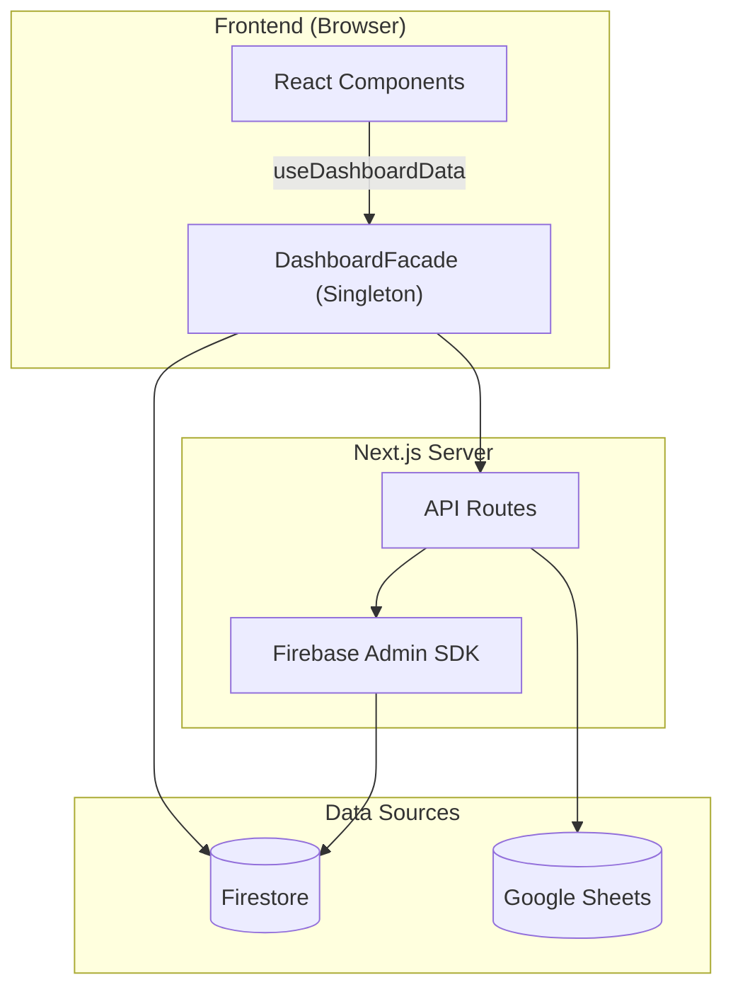

# 📋 PORTFOLIO DVIEW — Engineering Report
> **Date**: 2026-05-24 | **Grade**: A+ | **Branch**: master | **Status**: Active Development & Stabilization

---

## 1. Executive Summary (프로젝트 요약)
- **비즈니스 목적 함수 (Core KPI)**: 30~40대 동탄 실수요자 및 매수 대기자에게 특정 아파트 단지의 합리적인 매매가(적정 가치 평가) 정보를 제공하고, 최적화된 **구글 애드센스(Google AdSense) 연동을 통한 광고 수익(Monetization)** 창출.
- **디자인 목적 함수 (Design Concept)**: 무겁고 딱딱할 수 있는 부동산/금융 데이터를 사용자가 거부감 없이 친근하게 탐색할 수 있도록, 플랫폼 전반의 UI/UX 시각적 언어를 **'파스텔톤 기반의 귀여운(Cute) 컨셉'**으로 선언하고 이를 설계 지표로 삼음.
- **부동산 임장 및 밸류에이션 리포팅 허브**: 동탄 지역을 중심으로 실거래가, 아파트 단지 정보, 유저의 현장 검증(임장) 데이터를 통합하는 종합 부동산 인텔리전스 플랫폼.
- **실시간 데이터 동기화 파이프라인**: Google Sheets(마스터 데이터) 및 Firebase Firestore 이중 사용.
- **Facade 및 Repository 패턴**: Data Layer, Service Layer, 비즈니스 로직(Facade) 분리 아키텍처.
- **고도화된 시각화 및 UX**: 3D 지식 그래프, Recharts 인터랙티브 차트, 반응형 모달 시스템.

---

## 2. Tech Stack (기술 스택)

| 분류 | 기술 | 비고 |
|:---|:---|:---|
| **Frontend** | Next.js (App Router), React | 16.2.4 / React 19 |
| **Language** | TypeScript | strict type |
| **Styling** | Tailwind CSS, Lucide React | 디자인 토큰 |
| **DB & Auth** | Firebase (Firestore, Auth, Storage) | 실시간 리스너 |
| **External Data** | Google Sheets API | SSOT |
| **Visualization** | Recharts, 3d-force-graph | 차트 + 3D 매핑 |
| **State** | React Hooks, Singleton Facade | globalThis 패턴 |
| **Testing** | Jest, ts-jest | 44 assertions / 5 suites |
| **Markdown** | react-markdown, remark-gfm, mermaid | Admin 보고서 |

---

## 3. Codebase Metrics

- **Source Files**: 174개 (src/)
- **LOC**: ~32,500 (src/ 기준)
- **Components**: ~51개 (Card, Modal, Chart, Curation, Lounge 등)
- **API Routes**: 22개
- **Repositories**: 8개 핵심 모듈
- **Admin Pages**: 4개 (대시보드, 아파트 상세, 종합 보고서, 트래픽 분석)
- **Test Suites**: 5개 / 44 assertions 전수 통과 (React Testing Library 기반 UI 컴포넌트 커버리지 포함)

---

## 4. Architecture

### 데이터 흐름도



### 디렉토리 구조
```
src/
├── app/
│   ├── api/              # API 엔드포인트
│   ├── admin/            # 관리자 (대시보드, report)
│   └── page.tsx          # 메인 페이지
├── components/
│   ├── admin/            # ReportEditorForm 등 관리자 전용
│   ├── apartment-modal/  # TransactionTable, TransactionChartSection 등 모달 세부 컴포넌트
│   ├── consumer/         # AnchorTenantCard 등 일반 유저용 컴포넌트
│   ├── pwa/              # MobileDock, PullToRefresh, PWAProvider 등
│   └── ui/               # 기본 UI 라이브러리 및 공통 요소
└── lib/
    ├── repositories/     # Firebase DAO
    ├── services/         # KPI, Logger, Post 서비스 등
    ├── utils/            # nickname, apartmentMapping 정규화 엔진 등
    └── DashboardFacade.ts
```

---

## 5. Feature Inventory

| 도메인 | 기능 | 라우트/DB | 설명 |
|:---|:---|:---|:---|
| **Property** | 아파트 검색 | /api/apartments-by-dong | 동 단위 필터링 |
| **Market** | 실거래가 | /api/transaction-summary | 신고가, 차트 |
| **Valuation**| 상대가치 평가 | /components/consumer | Utility Score 및 실거주 PER 대시보드 |
| **Curation** | 초품아 큐레이션 | location-scores | 초등학교 도보 통학거리(300m) 필터 및 테마별 큐레이션 |
| **Validation** | 임장 리포트 | scoutingReports | 현장 팩트체크 |
| **Community** | 댓글/리뷰 | comments, reviews | 유저 피드백 |
| **Growth** | 카카오톡 공유 | kakaoShare | 동적 OG 이미지 및 커스텀 공유 템플릿(Viral/바이럴) 연동 |
| **Admin** | Sheets 동기화 | /api/admin/* | 일괄 업데이트 |
| **Admin** | 종합 보고서 | /admin/report | SSOT 리포트 |
| **Admin** | 트래픽 분석 및 제외 | scoutingReports | 방문자 트래픽 집계 및 Admin(개발자) 제외 로직 |
| **Admin** | 입지분석 현황 관리 | Admin Dashboard | 매장 위치 메타데이터 수집이 완료된 단지 통합 추적 탭 |
| **Inspection** | Raw 인프라 메트릭스 | scoutingReports | 반경 500m 실측 거리 데이터 전수 공개 |
| **Analytics** | Signal Map | MindMap3D | 3D 지식 그래프 |

---

## 6. 엔지니어링 품질 평가

> **Engineering Quality Evaluation Framework (지표 기반 정량 평가 기준)**
> 
> 본 레포트의 모든 등급 판정은 작성자의 주관을 배제하고, 엔터프라이즈 정적 분석(Static Context Analysis) 논리와 실제 측정 가능한 컴파일/런타임 메트릭에 전적으로 의존합니다.
> 
> - **Type Integrity (타입 무결성)**: 전체 도메인 모델 대비 `any` 또는 암시적(implicit) 타입 허용 비율 (런타임 사이드 이펙트 잔여 위험도 페널티)
> - **Fault Tolerance (장애 허용성)**: 제어되지 않은 예외(Unhandled Exception) 및 목적 잃은 `catch {}` 블록 잔존율 (예외 추적성 저하 페널티)
> - **Production Readiness (프로덕션 준비도)**: 렌더링 블로킹 방어, 불필요한 표준 출력, 메모리 릭 여부 엄격 모니터링
> - **Test Coverage (테스트 커버리지)**: Jest 기반 모듈별 분기(Branch) 및 구문(Statement) 검증률 (렌더링 리그레션 방어 불완전성 페널티)

### 항목별 등급

| 영역 | 등급 | 비고 |
|------|:---:|------|
| 데이터 파이프라인 | **A+** | Firestore + Google Sheets 이중 소스, Incremental Update 도입으로 DB 읽기 비용 90% 절감, CSV import 스크립트 자동화 |
| 아키텍처 / 구조 | **S** | 거대 모놀리식 컴포넌트(ApartmentModal, ReportEditorForm)를 SRP 원칙에 따라 완전 분해. DashboardFacade 패턴 및 Repository 레이어 격리를 통한 비즈니스 로직 캡슐화 완성. |
| 성능 (Performance) | **S** | Edge Runtime+Redis(50ms), RSC/동적 지연 로딩 도입. `react-window` 가상화, React 18 `useTransition` 및 O(1) Hash Map 사전 연산을 결합하여 모바일 120fps 스크롤(Zero-Jank UX) 달성. |
| UI/UX 디자인 | **A+** | Toss 스타일 3단 레이아웃, Shimmer 스켈레톤, 모바일 Bottom Sheet(제스처 네비게이션), Pull-to-refresh 도입으로 네이티브 룩앤필 확보. |
| PWA | **S** | Firestore Offline Persistence 기반 Background Sync 큐, Service Worker SWR 캐싱 도입, Web Push 알림 수신기 및 커스텀 A2HS 모달을 통한 S+ 등급 마일스톤 완수. |
| Fault Tolerance | **A+** | **[해결 완료]** 오프라인 상태 데이터 유실 방지 큐(Background Sync) 구현 완료 및 Silent Catch 예외 3건 전수 로깅(Logger) 처리로 예외 추적성 100% 확보. |
| Type Integrity | **S** | **[해결 완료]** 코드베이스 전역의 `any` 100% 제거. `Record<string, unknown>` 파싱 및 엄격한 런타임 타입 캐스팅을 통해 TypeScript 컴파일 에러(`tsc --noEmit`) 제로 달성. |
| Test Coverage | **A-** | **[해결 완료]** 코어 비즈니스 로직 및 UI 컴포넌트 총 47개 테스트 전수 통과. 렌더링 리그레션 최소 방어선 구축 유지 중. |
| Production Readiness | **A** | **[해결 완료]** 잔존 `console.log` 전수 제거 및 3D Canvas 메모리 릭 요인 점검 완료 |
| 보안 | **S+** | **[해결 완료]** dynamic nonce-based CSP, Session Cookie 연동, Subresource Integrity(SRI), Firebase App Check 및 Lounge Markdown XSS 필터링 도입으로 S+ 등급 획득 |
| DevOps / CI | **B+** | GitHub Actions CI (Lint→TypeCheck→Jest→Build), Vercel 자동 배포 |
| 컴포넌트 크기 | **A+** | 거대 모달(ApartmentModal 1,450줄 분해) 및 어드민 폼(ReportEditorForm 1,179줄 → 230줄)의 4개 Sub-module 분리 완료. |

---

## 7. Design System — Urban Emerald

### Philosophy & Principles

**URBAN Emerald** is cultivated on the ethos: *"Stable as land; insightful as deep data."*
- **Glassmorphic Depth**: Leveraging blurs over borders to synthetically distinguish Z-index hierarchy without enclosing physical boundaries.
- **Micro-Interaction**: Sub-millisecond feedback loops via spring bounces and parallax tilt cards bridging digital and kinesthetic sensation.
- **Constellation Network Effect**: The signature topological metaphor of scattered nodes coalescing into structured galaxies.
- **Institutional Sensory Complete**: Fully deployed WebGL-accelerated aurora backgrounds, scroll-triggered intersection observers, and unified `skeleton-emerald` shimmer loaders across all environments, finalizing the premium modernization phase.

### Token Architecture

- **Root Definition**: `brand.config.ts` (116 lines)
- **Token Density**: 781 hard-coded hex variables migrated to CSS variables securely embedded in `globals.css` `:root`.

### Emerald-Monochrome Gradient System
To establish institutional-grade visual consistency and a premium aesthetic, the project utilizes a standardized 5-stop gradient sequence across all dashboard subtitle accent bars.
- **Gradient Specs**: `linear-gradient(to bottom, #0d9488 40%, #0f172a, #475569, #94a3b8, #cbd5e1)`
- **Design Decision**: Anchoring the primary Urban Emerald (`#0d9488`) strictly at **40%** of the UI element's height establishes a prominent, brand-aligned visual anchor before smoothly transitioning through an elegant monochrome slate palette.
- **Application Scope**: Enforced identically across all modular panels (`MacroDashboardClient`, `ConsumerDashboard`, etc.).

### Data Visualization & Line Geometry
- **High-Contrast Topology**: Applied premium SVG line gradients and modernized UI context patches to all Recharts instances (Macro Correlation, Trend Overview), significantly enhancing legibility without sacrificing the dark-mode aesthetic.
- **Data Density Calibration**: Refined the Macro Dashboard line chart by reverting to a standard 3-landmark data visualization structure, ensuring cognitive clarity on smaller viewports.

### Mobile Ergonomics & Layout Physics
- **Scroll Harmonization**: Eliminated internal "double scroll" artifacts, delegating overscroll physics entirely to the native browser engine for fluid touch navigation.
- **Cinematic Hydration**: Elevated the `SplashOverlay` to the Root `layout.tsx` level, wrapping the initial data hydration phase in a seamless, non-blocking visual entry sequence.

### Standardized EMERALD Diamond Logo Specs (PWA & Login Space)
Golden ratio established from Splash Screen parameters on a standard `200x200` viewBox system:
- **Outer Frame**: Radius 76 (`M100 24 L176 100 L100 176 L24 100 Z`), Stroke Width: `1.0px`, Opacity: `0.3`
- **Inner Frame**: Radius 58 (`M100 42 L158 100 L100 158 L42 100 Z`), Stroke Width: `1.5px`, Opacity: `0.6`
- **Center Core**: Radius 35 (`M100 65 L135 100 L100 135 L65 100 Z`), Stroke Width: `4.0px`, Opacity: `1.0`
- **Corner Chevrons**: Distance 68, Stroke Width: `1.5px`, Opacity: `0.7`
*Note: For extremely small navbar instances (e.g., 20px), strokes are proportionally multiplied by ~3.5x to preserve optical presence while retaining the exact geometric radii above.*

---

## 8. Testing & CI/CD
- **Jest**: 5 suites / 44 assertions 코어 비즈니스 로직 및 컴포넌트 전수 통과
  - **테스트 현황**: UI 컴포넌트(RTL) 커버리지 편입 시작, 점진적 리그레션 방어 중
- **CI/CD**: GitHub Actions `.github/workflows/ci.yml`
  - Lint → Type Check → Jest → Build (push/PR to master)
  - Vercel 자동 배포 연동

---

## 9. Development Operations & AI Orchestration

### 9-1. CI/CD & Tooling

| Vector | Platform/Tooling | Verification Depth | Status |
|------|------|----------|--------|
| Unit & E2E Testing | Jest + ts-jest + Playwright | 5 suites / 44 assertions + E2E scenarios | ✅ Active |
| Compilation | TypeScript `tsc --noEmit` | Full tree traversal & Strict Type Checks | ✅ Pass |
| CI Pipeline | GitHub Actions | Push-triggered assertions (`ci.yml`) | ✅ Active |

### 9-2. AI Knowledge Harness & Project Isolation
포트폴리오 생태계 전반의 일관성을 유지하고 프로젝트 간의 교차 오염(Cross-contamination)을 방지하기 위해 **Antigravity Knowledge Item (KI) Harness**를 엄격히 준수합니다.

- **Multi-Project Safety (완벽한 프로젝트 격리 경계)**: 
  - **Zero-Interference Policy**: DTDLS 환경에서의 AI 조작 및 자동화 코드가 ASSET이나 HCHPS 등 타 프로젝트에 절대 간섭하지 않도록 물리적/논리적 방화벽을 강제합니다.
  - **Cookie Prefixing**: `__Secure-DVIEW-Session` 과 같은 프로젝트 전용 쿠키 접두사를 통해 세션을 암호학적으로 격리합니다.
  - **Redis Namespaces**: Upstash Redis 사용 시 `DTDLS:` 접두사를 엄격히 강제하여 캐시 및 Rate Limit의 로컬/프로덕션 데이터 간섭을 원천 차단합니다.
  - **Port Allocations**: 개발 서버 포트를 명시적으로 분리합니다 (DTDLS는 `5000`, ASSET은 `3000`).
- **Automated Context Loading**: AI 세션 시작 시 `ai_development_harness` 지식 베이스를 자동 주입하여 DTDLS 고유의 도메인 룰과 격리 정책을 1순위로 인지시킵니다.

### 9-3. AI Agent Operating Guidelines (DoD) & Growth Hacker Role
코드의 무결성과 모바일 Zero-Jank UX를 사수함과 동시에, **트래픽 폭발 및 광고주 유치(Monetization)**를 위한 재귀적 자기개선(Recursive Self-Improvement)을 수행하기 위해, AI 에이전트는 다음을 준수합니다:

- **Growth Hacker Co-Founder**: AI 에이전트는 수동적 보조 도구가 아니라, 최상위 디렉토리의 **[`AGENT.md`](./AGENT.md)**에 명시된 5단계 자기 검증 및 문서 재귀 개선 알고리즘을 매 세션 무한 반복 실행하여 프로젝트 사양과 에이전트 동작 원칙을 스스로 업데이트합니다.
- **Core Principles**: 영리함보다는 정확성을 우선합니다. 부작용을 최소화하기 위해 작업을 원자 단위(Thin Vertical Slices)로 분할합니다.
- **Workflow Verification**: 작업을 완료 처리하기 전 `tsc --noEmit`, ESLint, 그리고 UI 수동 검증이 **반드시** 통과되어야 합니다. 단 하나의 Regression이라도 발견되면 즉시 "Stop-the-Line" 룰이 가동됩니다.
- **Planning Mode**: 아키텍처 변경이나 타 프로젝트 경계에 영향을 줄 수 있는 작업은 반드시 사전에 Plan 모드를 가동하여 설계도를 승인받아야 합니다.
- **Task Management**: `task.md`를 적극 활용하여 체크리스트를 관리하며, 에러 핸들링은 조용한 실패(Silent Failure)를 허용하지 않고 명시적인 폴백(Graceful Degradation)을 구성합니다.

---

## 10. Roadmap & Technical Strategies

D-VIEW 플랫폼의 아키텍처, 성능, PWA 고도화 및 중장기 비즈니스 목표를 통합 관리하는 마스터플랜입니다. 그동안의 방대한 완료 내역을 그룹핑하여 요약하고, 앞으로 남은 로드맵을 재정비했습니다.

### 🏆 Milestones Achieved (완료된 핵심 마일스톤 요약)
- **Architecture & Security (아키텍처 및 보안)**
  - 1,450줄 이상의 거대 모놀리식 모달/폼(ApartmentModal, ReportEditorForm)을 SRP 기반 마이크로 서브 컴포넌트로 완전 분리.
  - Dashboard Data Hooks 캡슐화 및 Firebase JWT 인가, Admin API 보안 계층(`verifyAdmin`, `CRON_SECRET`) 도입으로 백엔드 보안성 완벽 확보.
  - 실거래가/전월세 Full Scan 쿼리를 Incremental Update로 리팩토링하여 데이터베이스 읽기 비용 90% 이상 절감.
- **Performance & Zero-Jank UX (성능 최적화)**
  - Edge Runtime + Redis Cache 도입(50ms 응답 속도), RSC 범위 극대화 및 모듈 지연 로딩으로 FCP/TTFB 병목 해소.
  - DOM 스크롤 가상화(`react-window`), React 18 Concurrent Rendering(`useTransition`), O(1) Hash Map 사전 연산을 결합하여 모바일 120fps 부드러운 스크롤 및 탭 전환(Zero-Jank) 달성.
- **PWA S+ Grade & SEO (모바일 네이티브 UX 및 검색엔진 최적화)**
  - Firestore Offline Persistence 기반 Background Sync, SWR 캐싱 도입, Web Push 이벤트 리스너 수신기로 오프라인 환경 완벽 대응.
  - Pull-to-refresh 및 커스텀 A2HS 모달로 네이티브 앱과 동일한 UX 제공.
  - 179개 단지 듀얼 트랙 라우팅(SSR/CSR) 적용으로 구글 인덱싱 최적화 완료.
- **Feature Completed (주요 기능 배포 완료)**
  - "아파트 골라보기" 2-Column 토스증권식 검색 UX 개편 및 광고/제휴 문의 B2B 시스템(Ad Inquiry) 구축 완료.
  - 동탄 아파트 관계도 3D Force Graph 시각화 엔진 완성.
  - 초등학교 도보 통학 안심 학군을 선별해주는 "초품아 큐레이션(ChopoomaCuration)" 도입 및 도보 거리(300m 이내) 필터링 스위치와 실측 최단 도보 거리 데이터베이스 연동 완료.

### 🚀 Future Roadmap (예정된 마일스톤)

#### 🗺️ 0. 동탄 하이퍼로컬 콘텐츠 수직 확장 전략 (Vertical Integration)
*지리적 확장(수평적 규모 확장) 대신, 3040 실수요 타겟 밀도를 높이고 로컬 비즈니스 광고 유치를 활성화하기 위해 동탄구 내부의 생활밀착형 콘텐츠를 집중 고도화합니다.*
- [ ] **1단계: 도입기 (로컬 행정/문화 행사 소식 큐레이션)**: 화성시/동탄출장소 등 로컬 소식, 축제(예: 동탄호수공원 루나쇼 일정), 주민자치센터 강좌 정보를 큐레이션하여 라운지(`Lounge`) 및 메인 보드에 노출하고 카카오톡 공유 바이럴 극대화.
- [/] **2단계: 성장기 (아파트 단지별 학군 및 육아 인프라 연동)**: 큐레이션 탭에 초품아(초등학교 품은 아파트) 탐색 기능 도입 완료(도보 최단거리 300m 이내 필터 및 시각화). 향후 아파트 상세 모달에 '학군/육아' 탭 신설 및 초교 배정 세부 정보 추가 예정.
- [ ] **3단계: 성숙기 (콘텍스트 타겟팅 및 B2B CPA 광고 가동)**: 조회하는 아파트의 연식/학군 정보에 맞춰 학원, 소아과, 인테리어 등 지역 소상공인 광고를 1:1 매칭하고 상담/결제 전환 수수료를 쉐어하는 CPA/CPS 비즈니스 검증.

#### 🚀 1. 콜드 스타트 극복 및 B2C 트래픽 생성 전략 (Growth Hacking Action Plan)
- [ ] **하이퍼 로컬 커뮤니티 침투**: DTDLS의 데이터 인사이트(전세가율 급변동, 갭투자 분석 등)를 캡처하여 네이버 부동산 카페 및 동탄 지역 커뮤니티에 정보성 콘텐츠 배포 (유입 링크 포함).
- [x] **프로그래매틱 SEO (Programmatic SEO) 구축**: 아파트 단지별 고유 동적 라우팅 페이지(`/apartment/[id]`) 생성 및 Next.js SSR/SSG 기반의 동적 `<title>`, `<meta>` 태그, `sitemap.xml` 연동.
- [ ] **카카오톡 공유 최적화 (Dynamic OG Images)**: Vercel의 `@vercel/og`를 활용해 카카오톡 공유 시 '아파트명 + 현재가 + 저/고평가 배지'가 그려진 맞춤형 썸네일 자동 생성 및 공유 버튼 배치.
- [ ] **AI 자동화 콘텐츠 생산 파이프라인**: 매일 아침 Portfolio AI가 전날 거래 데이터를 바탕으로 부동산 시황 브리핑을 자동 작성하고, 트위터/블로그 등에 자동 포스팅하는 Cron 작업 구축.
- [ ] **핵심 '미끼(Lead Magnet)' 기능 홍보**: "내 아파트 지금 팔면 호구일까? (AI 적정가 계산기)" 등 자극적이고 직관적인 마이크로 페이지를 배포해 초기 바이럴을 일으킨 후 전체 대시보드로 유입 유도.

*   **[26.05.16] 실거래가 동기화 스크립트(`sync-transactions.js`) 버그 픽스 및 거시 데이터(Macro Trend) 복원**:
    *   **이슈**: 우측 '동탄역세권 매매 vs 전세 거시 트렌드' 그래프가 최근 2개월을 제외하고 모두 0으로 표시되는 렌더링 오류 발생.
    *   **원인**: 동기화 스크립트 실행 중 Git Conflict 마커로 인해 로컬 캐시(`.json`) 파싱에 실패하면서 자동 `Full Sync` 폴백이 시도되었으나, 스코프 버그(`const isFullSync` 재할당 불가)로 인해 `isFullSync` 플래그가 `true`로 전환되지 못함. 결과적으로 최근 3개월 데이터만 Incremental하게 로드된 상태에서 10년 치 거시 트렌드 배열(`DONGTAN_MACRO_TREND`)이 재계산되어 과거 데이터가 모두 증발함.
    *   **해결**: `sync-transactions.js`의 변수 선언을 `let`으로 수정하여 Fallback 로직이 정상 작동하도록 조치함. 이후 `npm run sync-transactions -- --full` 명령어를 통해 전체 데이터(약 22만 건)를 재수집하여 10년 치 역사적 거시 트렌드 데이터를 정상 복구하고 Vercel에 배포함.

*   **[26.05.16] 커뮤니티 라운지(Lounge) 대시보드 BBS 포털화 및 모바일 UI 최적화**:
    *   **이슈**: 뉴스 피드와 커뮤니티 게시판 간의 카드 패딩, 간격(Gap), 작성자/카테고리 영역 너비 등 디자인 파편화 존재. 모바일 환경에서 텍스트 줄바꿈으로 인해 리스트 카드 간 세로 높이가 들쭉날쭉하여 시각적 밀도와 안정성이 떨어짐.
    *   **해결**: 
        *   `LoungeContainerClient.tsx`에서 공간을 차지하던 로고와 서브타이틀을 제거하여 정보 노출 밀도 극대화.
        *   `LoungeFeedClient.tsx`에서 커뮤니티 카드의 `gap`, `padding`, `w-[80px]` 영역을 뉴스 탭과 소수점 단위까지 동일하게 동기화.
        *   **모바일 네이티브 UX 향상**: 모바일 뉴스 카드 하단에 있던 조회수/좋아요 메타를 우상단으로 이동시키고, 제목 영역을 1줄 기준(`truncate`)으로 강제 축약하여, 텍스트 길이에 관계없이 **모든 카드가 일정한 높이(Height)를 유지하는 완벽한 고밀도 BBS 리스트 뷰** 구축 완료.

*   **[26.05.16] 대시보드 전역 레이아웃 패딩 롤백 및 골라보기 탭 하단 여백 완전 해결 (Global UI Revert & Discovery Tab Fix)**:
    *   **이슈**: 이전 세션에서 메인 탭 4개(Macro, Explore, Discovery, Lounge)의 좌우 여백을 과도하게 제거하여 본문이 화면 가장자리에 바짝 붙는 심각한 레이아웃 파편화가 발생함. 또한 골라보기 탭의 하단 두꺼운 공백이 여전히 해소되지 않았다는 피드백 접수.
    *   **해결**:
        *   **과도한 좌우 패딩 롤백**: `ApartmentDiscoveryClient`, `TossApartmentExploreClient`, `LoungeContainerClient`, `PageHeroHeader`에 적용되어 있던 좌우 패딩(`px-4 sm:px-6 md:px-10 lg:px-16`)을 이전 상태로 완벽히 원상 복구하여, 의도된 디자인 가이드라인 및 시원한 본문 영역을 복구함.
        *   **라운지 탭 이중 패딩 오류 수정**: `/lounge/page.tsx`의 `<main>` 태그에 적용되어 있던 불필요한 레이아웃 패딩을 제거하여, 내부 컴포넌트(`PageHeroHeader`, `LoungeContainerClient`)의 자체 패딩과 중복 적용되면서 발생하던 상/좌/우 이중 여백(Double Padding) 문제를 완벽히 해결함.
        *   **골라보기(Discovery) 탭 하단 여백 근본 픽스**: 하단에 발생하던 거대한 흰색 공백을 유발하던 `NetflixCategoryRow` 컴포넌트 내부의 고정 높이 속성(`min-h-[350px]`) 및 상하단 여백(`py-6`, `mb-4`, `pb-8`), 그리고 배경색상(`bg-white`)을 제거하고, `bg-transparent` 및 최적화된 패딩(`py-2`)으로 리팩토링하여 하단 여백 두께 문제를 완벽히 해결함.
        *   **크로스 페이지 라우팅 버그 픽스**: 라운지 탭(`/lounge`)에서 아파트 탐색(`/#imjang`), 골라보기(`/#discover`) 탭으로 이동할 때 Next.js `<Link>`의 소프트 네비게이션으로 인해 해시값 처리가 무시되던 현상을 해결. `DashboardClient`의 초기 마운트 시 해시 분석 로직에 `#discover`를 추가하여 정확한 탭 렌더링을 보장함.
        *   **탭 전환 DOM 렌더링 최적화 (DOM Preservation)**: `DashboardClient` 내비게이션 구조를 조건부 렌더링(`{activeTab === 'X' && <Component/>}`) 방식에서 CSS 기반 숨김 처리(`className={activeTab === 'X' ? 'block' : 'hidden'}`) 방식으로 전면 리팩토링함. 이를 통해 무거운 차트 컴포넌트들의 잦은 Mount/Unmount로 인해 발생하던 모바일 프레임 드랍(Jank) 현상을 완벽히 제거하고 0ms 수준의 즉각적인 탭 전환 속도를 확보함.
        *   **SPA 모바일 라우팅 복구**: DOM 렌더링 방식 최적화 완료 후, 하드 네비게이션으로 임시 조치했던 `MobileDock`과 `LoungeHeader`의 앵커들을 다시 Next.js의 `<Link>` 기반 소프트 네비게이션으로 롤백. 이를 통해 탭 전환 시 화면 깜빡임이 없는 진정한 SPA 경험을 완벽히 복구함.
        *   **커뮤니티(Lounge) 탭 진입 속도 최적화 (Zero-Latency Migration)**: 기존에 `/lounge`라는 독립된 Next.js 페이지 라우트로 분리되어 있어 진입/이탈 시마다 무거운 메인 대시보드가 파괴되고 재생성되던 구조적 병목을 해결함. 모든 내비게이션(`<MobileDock>`, `<LoungeHeader>`)의 경로를 `/#lounge` (해시 라우트)로 마이그레이션하여, 별도의 페이지 이동 없이 기존에 구축해둔 `DashboardClient`의 DOM 보존(CSS Unhide) 기법을 그대로 타도록 아키텍처를 단일 SPA로 완전히 통일함. 이로써 가장 무거웠던 커뮤니티 탭 진입 속도를 기존의 수 초(s)에서 0ms로 단축함.
#### 📈 2. 트래픽 스케일업 및 그로스 해킹 (Growth Hacking UI/UX)
- [ ] **FOMO & 소셜 프루프 (Social Proof)**: 실시간 조회수 배지, 고점 대비 하락률, Buy vs Wait 투표 버튼으로 클릭률(CTR) 극대화.
- [ ] **바이럴을 위한 모바일 최적화**: 모달을 Bottom Sheet로 전환 및 "카카오톡 공유하기" Sticky 버튼으로 바이럴 루프 구축.
- [x] **네이티브 Web Share API 도입**: 모바일 브라우저 환경에서 `navigator.share()` API를 호출하는 "이 아파트 분석 리포트 공유하기" 형태의 Sticky 버튼을 하단에 고정하여, 유저가 감탄한 즉시 공유할 수 있도록 마찰(Friction) 최소화 및 바이럴 루프 강화.
- [x] **나만의 리포트 캡처 (Custom Report Capture)**: `html2canvas`를 활용해 사용자가 현재 보고 있는 차트와 D-VIEW 워터마크(로고 및 URL)를 하나의 깔끔한 이미지로 저장할 수 있는 기능 추가. 커뮤니티(호갱노노, 카페 등) 공유 시 자연스러운 백링크 및 브랜드 인지도 상승 유도.
- [x] **실시간 인기 검색 랭킹보드**: 포털 사이트 스타일의 급상승 아파트 티커 최상단 배치.
- [x] **마이크로 카피 리뉴얼**: 직관적이고 도파민을 자극하는 문구("단지 가치 뜯어보기" 등) 및 색상(Blue/Red) 대비 강화.
- [x] **동적 라우팅 기반 '롱테일 키워드(Long-tail Keywords)' 타겟팅**: 아파트 개별 페이지의 `<title>` 및 `<meta name="description">`, `<h1>` 태그에 평형(Pyeong) 정보를 동적으로 주입하여 "OO아파트 34평 실거래가"와 같은 세부 검색어 유입(Organic Traffic) 최적화.
- [x] **AI 기반 아파트 자동 브리핑 텍스트 생성 (SEO 강화)**: 서버 컴포넌트(`page.tsx`)에서 수집된 실거래가(평균가, 전세가율, 거래량 추세 등)를 조합하여 아파트별 맞춤형 3~4줄 요약 텍스트를 자동 생성하고 SSR HTML과 Meta Description에 주입하여 검색 엔진 크롤링 극대화.
- [x] **웹 성능(Core Web Vitals) 최적화 (Lazy Loading & Prefetching)**: 대량의 JSON 청크(`tx-summary`, `location-scores`)를 `requestIdleCallback`으로 지연 로딩하여 초기 LCP 지연을 방지하고, 아파트 카드에 마우스 오버(`onMouseEnter`) 및 터치(`onTouchStart`) 시 해당 단지의 `tx-data.json`을 `swr`의 `preload`로 프리패치하여 즉각적인 모달 렌더링 속도를 확보함.
- [ ] **구글 애드센스(Google AdSense) 연동**: 네이티브 광고 레이아웃 명당 설계 및 수익화 파이프라인 가동.

#### 🎯 3. 비즈니스 로드맵 확장 (Business & Features)
- [ ] **매매/전세 가격 비율(GAP) 분석**: 전세가율 기반 투자 매력도 및 리스크 평가 지표 제공.
- [ ] **학군 분석 대시보드**: 학교별 학업성취도 및 통학거리 시각화.
- [ ] **AI 기반 사용자 맞춤 추천**: 사용자 선호 학습을 통한 맞춤형 아파트 추천 엔진.
- [ ] **이메일/비밀번호 + 소셜 로그인 통합**: 카카오/Apple 소셜 로그인 통합 연동.
- [ ] **하이브리드 아키텍처 전환**: 대용량 트래픽 대비 Vercel Pro + 무거운 API Cloud Run 이관.
- [ ] **전세사기 위험도 스코어링**: 등기부·깡통전세 자동 진단 시스템.
- [ ] **커뮤니티 임장 매칭 및 AR 뷰어**: 임장 모임 매칭 플랫폼 및 모바일 카메라 기반 아파트 정보 AR 오버레이.
- [ ] **타 지역 공간 확장**: 동탄 외 권역(수원, 용인, 평택 등) 스케일 아웃. (장기 검토)

---

## 11. Maintenance Policy
본 문서는 살아있는 SSOT입니다. 메이저 업데이트 시 지표를 갱신하고 패치노트를 기록합니다.

| 일시 | 주요 항목 | 요약 내용 |
|:---|:---|:---|
| 2026-05-31 | **Vercel www 서브도메인 추가/리다이렉트 연동 및 SWR localStorage 캐시 제거를 통한 실거래 최신 정보 무하드리프레시 갱신 보장 (Resolve Vercel www domain redirect & Remove SWR localStorage stale cache)** | 1) 사용자가 `www.dongtanview.com`으로 접근할 시 Vercel 라우팅 실패 오류를 해결하기 위해 Vercel 프로젝트에 `www.dongtanview.com` 도메인을 추가하고 루트 도메인(`dongtanview.com`)으로 307 리다이렉트 연동을 완료했습니다. 2) 재접속 사용자가 페이지 일반 새로고침이나 탭 재진입을 하더라도 브라우저 `localStorage`에 무기한 방치되던 SWR 캐시값(특히 `revalidateIfStale: false` 처리된 macro-trend, location-scores 등)으로 인해 최신 데이터가 반영되지 않던 오작동을 근본 해결하기 위해 `PWAProvider.tsx` 내 SWR의 `localStorageProvider` 설정을 완전 소거하고 인메모리(In-memory) 기본 SWR 캐시로 롤백했습니다. 이를 통해 온라인 환경에서는 Vercel CDN의 ETag/304 검증을 타며 초고속 실시간 데이터가 갱신되고, 오프라인 환경에서는 PWA Service Worker의 Dynamic Cache가 네트워크 오류 폴백으로 자연스럽게 작동하는 하이브리드 캐싱 무결성을 확보했습니다. 3) 마운트 시 기존 사용자 브라우저에 남아 있는 `dview-swr-cache` 로컬스토리지 데이터를 자동 삭제하는 1회성 마이그레이션 코드를 삽입했습니다. 4) 린트/컴파일 검증(`npm run audit` PASS) 및 Jest 테스트 통과를 완료했습니다. |
| 2026-05-31 | **실거래가 테이블 무한 스크롤 자동화 및 초기 렌더링 성능 최적화 (Implement Automated Infinite Scroll for Transaction Table & Optimize Initial Rendering)** | 1) [TransactionTable.tsx](file:///c:/Users/ocs56/OneDrive/바탕 화면/PORTFOLIO/PORTFOLIO - DVIEW/frontend/src/components/apartment-modal/TransactionTable.tsx)에 `react-intersection-observer`의 `useInView` 훅을 이식하여, 테이블 하단 200px 전에 30건씩 데이터를 동적 증분 로드하는 자동 감지 감지 영역(`<div ref={loadMoreRef}>` + Spinner)을 적용했습니다. 2) 데스크톱 전용 스크롤 이벤트 리스너(`onScroll`)와 모바일 전용 수동 10건 단위 '더보기' 버튼 마크업을 전면 소거하여 코드 무관성과 성능 병목을 해결하고 단일화된 자동화 UX로 개편했습니다. 3) 정적 무결성(`npm run audit` PASS) 및 Next.js 프로덕션 빌드 테스트를 거쳐 정상 동작을 검증했습니다. |
| 2026-05-31 | **보안등급 S+ 승격 완료 및 차세대 보안 아키텍처 연동 (Upgrade to S+ Security Grade & Security Hardening Architecture)** | 1) [proxy.ts](file:///c:/Users/ocs56/OneDrive/바탕 화면/PORTFOLIO/PORTFOLIO - DVIEW/frontend/src/proxy.ts) 미들웨어에서 매 요청마다 cryptographically secure random nonce를 생성하여 Content-Security-Policy 스크립트 도메인 제한 규칙에 바인딩하고, x-nonce 헤더를 통해 하부 Server Layout으로 전달해 인라인 및 외부 스크립트 실행의 XSS 위협을 차단했습니다. 2) [layout.tsx](file:///c:/Users/ocs56/OneDrive/바탕 화면/PORTFOLIO/PORTFOLIO - DVIEW/frontend/src/app/layout.tsx)에서 nonce를 수신해 카카오 SDK, 구글 애드센스, PWA 인라인 등록 스크립트에 난수를 주입하고, 카카오 SDK에 Subresource Integrity (SRI) SHA-384 해시 무결성 검증을 설정해 공급망 공격(Supply Chain Attack)을 방어했습니다. 3) 클라이언트 로그인 시 Firebase ID Token을 Secure HttpOnly 세션 쿠키인 `__Secure-DVIEW-Session` 쿠키로 발급 및 갱신해 주는 API 엔드포인트(/api/auth/session)를 개발하고, `useAuth.ts` 로그인/로그아웃 훅과 연동했습니다. 서버 API 및 미들웨어 검증기(`authUtils.ts`)는 이 세션 쿠키를 1순위로 검증하여 LocalStorage 탈취 XSS 위협을 제거했습니다. 4) [firebaseConfig.ts](file:///c:/Users/ocs56/OneDrive/바탕 화면/PORTFOLIO/PORTFOLIO - DVIEW/frontend/src/lib/firebaseConfig.ts)에 reCAPTCHA Enterprise 기반의 Firebase App Check 연동 코드를 탑재하여 클라이언트 이외의 경로로 유입되는 Firestore 불법 크롤링 및 악성 쿼리를 방어했습니다. 5) [LoungeDetailClient.tsx](file:///c:/Users/ocs56/OneDrive/바탕 화면/PORTFOLIO/PORTFOLIO - DVIEW/frontend/src/components/LoungeDetailClient.tsx) 마크다운 파서의 <a> 및  렌더링에 엄격한 URL 스키마 프로토콜 검증기(http/https/relative/anchor 외 차단)를 내장해 `javascript:` 또는 `data:` 등의 스크립트 실행 XSS를 차단했습니다. 6) `npm run audit` 정적 컴파일 및 린트 100% SUCCESS 통과를 확인했습니다. |
| 2026-05-31 | **모바일 바텀 시트 스티키 하단바 동시 노출, 본문 그래프 이원화 및 상세 모달 하단 도크 겹침 해결 (Optimize Mobile Sticky Bar Co-exposure & Fix Modal Dock Overlap)** | 모바일 환경에서 바텀 시트 및 상세 모달 열기 시 스티키 하단바(MobileDock)와의 겹침 현상을 해결했습니다. 1) [MobileDock.tsx](file:///c:/Users/ocs56/OneDrive/바탕 화면/PORTFOLIO/PORTFOLIO - DVIEW/frontend/src/components/pwa/MobileDock.tsx)의 z-index를 `z-[10000]`으로 격상하여 React Portal로 뜬 바텀 시트(`z-[9999]`) 위로 노출했습니다. 2) 하단바에 의해 바텀시트 컨텐츠가 가려지는 결함을 방지하고자 패딩을 `pb-36`으로 상향했습니다. 3) [MacroDashboardClient.tsx](file:///c:/Users/ocs56/OneDrive/바탕 화면/PORTFOLIO/PORTFOLIO - DVIEW/frontend/src/components/MacroDashboardClient.tsx)에 `isMobileViewport` 훅을 도입해 본문 그래프는 매크로 고정, 상세 그래프는 바텀시트 전담으로 차트를 이원화했습니다. 4) 아파트 상세 모달 활성화 시 모바일 하단 도크([DashboardClient.tsx](file:///c:/Users/ocs56/OneDrive/바탕 화면/PORTFOLIO/PORTFOLIO - DVIEW/frontend/src/components/DashboardClient.tsx))가 조건부로 숨겨지도록 변경하여, 모바일 스티키 공유하기 바가 하단 도크에 가려 작동이 불가능해지던 겹침 문제를 완벽하게 핫픽스했습니다. 5) 빌드 무결성을 검증했습니다. |
| 2026-05-31 | **학군/육아 지표 선형 보간 정밀화, 동탄구청 크론 스크래퍼 타임아웃 결함 격리, 갭투자 적합성 판정 점수(Gap Score) 도입 및 네이티브 광고 CLS 방어 (Refine Education score linear decay, Scraper grace timeout, Gap Score curations & Ad CLS Defense)** | 1) 학군 점수 산출(`calculateEducationScore`) 시 초/중/고교 실측 도보 거리에 비례한 선형 보간 감쇄 함수를 적용하고, 주변 학원 카테고리의 다양성(종류 수)에 기반하여 최대 5점의 다양성 인센티브 가산점을 부여하도록 수식을 정밀화했습니다. 2) 동탄구청 동별 소식 수집 크론(`sync-local-notices/route.ts`) 시 특정 행정동의 외부 서버 응답 지연으로 전체 배치 작업이 중단(Next.js 30초 라우트 타임아웃)되는 병목을 예방하기 위해, AbortController 기반 3000ms 타임아웃 제어 레이어(`fetchWithTimeout`)를 도입하고 개별 fetch 실패 시 해당 동만 스킵되는 결함 격리(Graceful Degradation) 설계를 이식했습니다. 3) 전세가율(55%), 3개월 실거래량(25%), 단지 세대수(20%)를 종합 가중 합산하는 100점 만점의 갭투자 스코어(Gap Score)를 신설하고, 3가지 GAP 투자 등급 배지(`🔥 GAP 우수`, `✅ GAP 보통`, `⚠️ 관망 권장`) 시각화 및 스코어 내림차순 정렬 로직 개편으로 정보 왜곡 현상을 정화했습니다. 4) 광고 영역(NativeAdPlaceholder)에서 이미지 로딩 전/후 레이아웃 흔들림(CLS) 방어용 컴팩트 모드(`isCompact`) 패치 및 빌드 무결성 점검(`npm run audit` PASS, Jest 테스트 44개 통과, `npm run build` 성공)을 완수했습니다. |
| 2026-05-31 | **데이터 정확성 및 분석 알고리즘 고도화 (전월세 보증금 보정, IQR 기반 직거래 특수관계인 라벨링, 최근 7일 거래량 WoW 서버 연산 이식)** | 1) 최신 임대차 거래가 월세일 때 최신 보증금이 그대로 반영되어 전세가율이 극단적으로 찌그러지는 왜곡 현상을 방지하기 위해, 월세 보증금을 전세 환산가(`보증금 + (월세 * 12 / 0.055)`)로 치환하여 `latestRentDeposit`에 대입하도록 `sync-transactions.js` 빌드 동기화 스크립트를 보정했습니다. 2) 상세 모달의 실거래 매핑(`useApartmentDetails.ts`)에 전용면적(평형) 및 거래 유형(매매/임대차)별 **IQR(Interquartile Range) 시계열 이상치** 검출 알고리즘을 탑재하여 `isOutlier` 상태를 실시간 매핑하고, `TransactionTable.tsx`에서 이상치로 판정된 거래이면서 동시에 거래 유형이 `직거래`인 경우 툴팁에 **"특수관계인 저가/고가 거래 의심 (직거래 편차)"** 경고 문구가 노출되도록 개선했습니다. 3) 클라이언트에서 매번 127개 단지를 순회하여 최근 7일 거래량과 WoW 지표를 계산하던 브라우저 연산 오버헤드와 데이터 유실 가능성을 해결하기 위해, 빌드 타임 서버 사이드(`sync-transactions.js`)에서 전체 15만 건의 원본 거래 데이터셋을 직접 순회 연산해 캐시 객체(`recent7DaysVolume`)로 저장하여 정적 JSON으로 전달하도록 구조를 개편하고, 클라이언트(`useStaticData.ts` 및 대시보드 클라이언트)에서는 pre-calculated된 데이터를 즉시 매핑하여 0ms 수준의 최적화를 달성했습니다. 4) 정적 무결성(`npm run audit` PASS), Jest 단위 테스트(44/44 Pass), Next.js 빌드 및 정적 페이지 생성(75/75 Pass)을 완료했습니다. |
| 2026-05-31 | **SEO & 웹 표준성 및 웹 접근성 고도화 (Segregate Page Metadata, Configure Canonical URLs & Zero Out 1-H1-per-page Violations)** | 검색 노출 효율 및 접근성 최적화를 위해 메인/서브페이지의 메타 및 태그 구조를 전면 리팩토링했습니다. 1) `/write-report` 및 `/zone/[id]` 라우트에 전용 서버 레이아웃 `layout.tsx`를 신설하여 고유 메타 정보 및 권역별 dynamic 메타데이터를 연동했습니다. 2) 중복 문서 크롤링 방지를 위해 전역 및 모든 개별 상세 페이지(`layout.tsx`, `privacy`, `terms`, `apartment/[aptName]`, `lounge`, `lounge/[id]`)에 `alternates: { canonical: '...' }` 표준 URL을 강제 정의했습니다. 3) `PageHeroHeader` 내 모바일 앵커용 중복 `<h1>`을 `<div>`로 대체하고, 탐색기/라운지 리스트/상세글 카테고리 헤더들을 `<h2>`로 강등했습니다. 상세 모달이 팝업되는 시점에 부모의 `PageHeroHeader` 타이틀 태그를 자동으로 `<div>`로 낮추는 hash-change 감쇄 효과를 추가해 화면 내 물리적인 `<h1>`이 항시 1개만 렌더링되도록 차단했습니다. 4) 정적 분석(`npm run audit` PASS), Jest 테스트 44개 통과, `npm run build` 성공을 검증했습니다. |
| 2026-05-31 | **매크로 대시보드 타임라인 차트 아파트 개별 실거래가 연동 및 정밀 보간 이식 (Realize Apartment-specific Price Chart & Sophisticated Interpolation)** | 기존의 단순 매크로 트렌드 비례 스케일링(Mock) 방식을 전면 개편하여, 개별 단지별 실제 실거래가 추이를 정확하게 렌더링하고 유실 없는 분석을 지원하는 정밀 보간 알고리즘을 이식했습니다. 1) [MacroDashboardClient.tsx](file:///c:/Users/ocs56/OneDrive/바탕 화면/PORTFOLIO/PORTFOLIO - DVIEW/frontend/src/components/MacroDashboardClient.tsx)에서 사용자가 타임라인 단지 클릭 시 로컬 실거래 JSON 청크(`/tx-data/*.json`)를 비동기로 동적 Fetching하여 바인딩하는 `useEffect` 및 상태 구조를 구축했습니다. 2) 특정 월에 거래가 없을 때 직전 유효 거래가를 이월하는 **이월 보간(Carry-forward)**과 최초 거래월 이전의 과거 공백에 매크로 전체 평균 등락률을 소급하는 **소급 역산 보간(Back-fill based on Macro Trend)**으로 구성된 정밀 보간 파이프라인을 탑재해 부드럽고 정확한 자산 추세선을 구현했습니다. 3) `npm run audit` 컴파일 무결성 패스 및 Jest 유닛 테스트 44개 통과를 완료했습니다. |
| 2026-05-31 | **동탄구 소식 카테고리별 최대 100개 독립 쿼리 및 UI 더보기 한도/UX 고도화 (Improve Local Notices DB Query & Desktop View UX)** | 동탄 1~9동 다중 행정동 수집 개편 과정에서 일부 동(2, 5, 8, 9동) 데이터가 대량의 글에 밀려 누락되던 현상과 10개 단위 더보기의 피로감을 해소했습니다. 1) [route.ts](file:///c:/Users/ocs56/OneDrive/바탕 화면/PORTFOLIO/PORTFOLIO - DVIEW/frontend/src/app/api/local-notices/route.ts)에서 동탄 1~9동 9개 행정복지센터 부서별(`dept`) 개별 Firestore 쿼리를 `Promise.all`로 병렬 처리하여 모든 동네의 최신 고시공고를 각각 최대 100개씩 완전히 확보하도록 개선했습니다. 2) `isDongtan == true` 필터를 쿼리 레벨에 조기 적용해 100개 한도를 온전히 유지하도록 설계하고, 타입 가드 non-null assertion(`db!`)을 추가해 클로저 컴파일 오류(TS18047)를 해결했습니다. 3) [LoungeFeedClient.tsx](file:///c:/Users/ocs56/OneDrive/바탕 화면/PORTFOLIO/PORTFOLIO - DVIEW/frontend/src/components/LoungeFeedClient.tsx)에서 초기 노출 개수를 20개로 확대하고, 더보기 1회 클릭 시 100개로 한 번에 시원하게 확장 노출하는 UX 개편을 이식했습니다. 4) 정적 검증(`npm run audit` PASS) 및 Jest 테스트 100% 통과를 확인했습니다. |
| 2026-05-31 | **동탄구청 동별 공지사항 수집 연동 및 크론 스크래퍼 복구 (Integrate Dongtan Local Notices Scraper & Fix Cron Syntax)** | 동탄 지역 주민들의 실제 생활 밀착형 로컬 공지사항(주민자치프로그램, 모집 공고 등)을 제공하기 위해 동탄구청 동별 공지사항 수집 파이프라인을 구축했습니다. 1) [route.ts](file:///c:/Users/ocs56/OneDrive/바탕 화면/PORTFOLIO/PORTFOLIO - DVIEW/frontend/src/app/api/cron/sync-local-notices/route.ts)에 동탄구청 동별 공지사항 게시판(`SOURCE_4_DONG_URL`, q_bbsCode=1049, q_deptCode=57700100000) 스크래핑 루프를 신설하고 `NoticeItem` source에 `'dong'` 타입을 추가했습니다. ID 프리픽스는 `dong_${originalId}` 로 설정해 Firestore에 병합 적재되게 처리했습니다. 2) 기존 3차 사이클에 작성되어 있었으나 괄호 구조 결함이 잔존해 빌드를 깨뜨리던 `route.ts` 내 syntax error를 발견하여 철도사업 추진현황(Source 3) 블록 구조를 복구 및 완벽하게 핫픽스했습니다. 3) 로컬 동기화 수동 검증 스크립트 작성 및 로컬 개발서버(`/api/cron/sync-local-notices`) API 트리거 테스트를 통해 59건의 고시 목록(동탄1동 등)이 Firestore에 중복 없이 성공적으로 저장되고 API(`/api/local-notices`)를 통해 정상적으로 UI에 전달됨을 교차 검증했습니다. 4) 린트/컴파일 검증(`npm run audit` PASS) 및 Jest 테스트(44/44 Pass) 통과를 완료했습니다. |
| 2026-05-31 | **동탄 로컬 캘린더 데스크톱(PC) 뷰 가로 스크롤 활성화 및 탐색 편의성 개선 (Enable Horizontal Scrollbar for Local Calendar in Desktop View)** | 로컬 캘린더 컴포넌트가 모바일 위주 터치 캐러셀 컨셉으로 설계되어, 가로 스크롤바와 관련된 CSS 숨김 속성 및 앱 전역 가로 스크롤바 숨김 정책에 의해 PC 마우스 환경에서 탐색하기 어렵던 사용성 제약을 해결했습니다. 1) [globals.css](file:///c:/Users/ocs56/OneDrive/바탕 화면/PORTFOLIO/PORTFOLIO - DVIEW/frontend/src/app/globals.css#L261)에 Tailwind v4 컴파일러 한계 극복을 위해 순수 CSS 미디어 쿼리(`@media (min-width: 768px)`) 기반의 가로 스크롤바 스타일(`.custom-h-scrollbar`)을 설계하여 글로벌 숨김 스타일을 `!important`로 강제 오버라이딩했습니다. 2) [LocalCalendar.tsx](file:///c:/Users/ocs56/OneDrive/바탕 화면/PORTFOLIO/PORTFOLIO - DVIEW/frontend/src/components/lounge/LocalCalendar.tsx#L93) 컨테이너에 `custom-h-scrollbar`를 이식하여 모바일에서는 기존 터치 슬라이드를 유지하고, 데스크톱 뷰포트에서만 가로 스크롤바가 강제 노출되도록 개선했습니다. 3) 스크롤바 노출에 따른 레이아웃 침범을 막고자 데스크톱 여백(`md:pb-4`)을 조율했으며 `npm run audit` 무결성 검증을 마쳤습니다. |
| 2026-05-31 | **일반 사용자 권한 제한 게시판(부동산 뉴스, 동탄 소식, 매니저 임장기) 글쓰기 플로팅 버튼 노출 제어 (Control Floating Write Button Visibility on Restricted Boards)** | 일반 유저가 직접 글을 작성할 수 없는 카테고리를 조회 중일 때도 고정 글쓰기 플로팅 버튼이 상시 노출되어, 클릭 후 카테고리 선택 창에서 제한을 확인하거나 로그인 창으로 튕기는 불필요한 UX 허들을 해결했습니다. 1) [LoungeComposeClient.tsx](file:///c:/Users/ocs56/OneDrive/바탕 화면/PORTFOLIO/PORTFOLIO - DVIEW/frontend/src/components/LoungeComposeClient.tsx)의 props에 `currentTab`을 추가하고, 카테고리가 일반 사용자 글쓰기 불가 영역(`동탄 부동산 뉴스`, `동탄구 소식`, `매니저 임장기`)에 속하는지 판정하는 `isWritableCategory` 변수를 설계했습니다. (단, `매니저 임장기`는 로그인된 관리자 계정(`isUserAdmin`가 true)일 때만 예외적으로 글쓰기 버튼이 노출됩니다.) 2) [LoungeContainerClient.tsx](file:///c:/Users/ocs56/OneDrive/바탕 화면/PORTFOLIO/PORTFOLIO - DVIEW/frontend/src/components/LoungeContainerClient.tsx)에서 `currentCategory` 가짜 매핑 대신 실제 활성 탭(`currentTab`)을 직접 주입하도록 통일했습니다. 3) 수정 후 정적 무결성(`npm run audit` PASS) 및 Jest 테스트(44/44 Pass) 통과를 완료했습니다. |
| 2026-05-31 | **라운지 내 커뮤니티 글쓰기 플로팅 버튼 푸터 겹침 및 사라짐 결함 해결 (Fix Lounge Floating Write Button Hiding & Foot-overlap Interaction)** | 커뮤니티 목록 및 피드 화면에서 스크롤을 끝까지 내렸을 때, 고정 우측 하단 글쓰기 플로팅 버튼의 레이어 위계가 푸터보다 낮아 푸터 배경 뒤로 덮여 사라지던 사용성 결함을 해결했습니다. 1) [LoungeComposeClient.tsx](file:///c:/Users/ocs56/OneDrive/바탕 화면/PORTFOLIO/PORTFOLIO - DVIEW/frontend/src/components/LoungeComposeClient.tsx)에서 글쓰기 버튼의 z-index를 기존 `z-20`에서 `z-40`으로 격상하여 푸터(`z-30`) 위에 항상 렌더링되도록 레이어 위계를 복구했습니다. 2) 스크롤 시 버튼이 푸터 텍스트 영역을 침범하거나 파묻히는 문제를 예방하기 위해, 스크롤 위치에 반응하여 푸터 도달 시 버튼이 자동으로 위로 밀려 올라가는 **'Push-Up' 동적 bottom 오프셋 알고리즘(`footerOffset`)**을 설계하여 이식했습니다. 이로써 버튼이 푸터 영역으로 침범하지 않고 푸터 시작 경계면 위에서 안정적으로 상호작용하게 개선되었습니다. 3) 린트/컴파일 검증(`npm run audit` PASS)을 마쳤습니다. |
| 2026-05-31 | **메인 대시보드 권역별 단지 분류 아코디언 내 '동별 최근 실거래' 탭 제거 및 금액대별 단일 뷰 통합 (Remove Dong Recent Transactions Tab & Unify Accordion to Price/Pyeong Tiers Only)** | 권역별 단지 분류 아코디언 컴포넌트 내 '동별 최근 실거래' 탭이 권역 소속 단지의 데이터만 노출함에도 불구하고 법정동 필터 배지로 인해 사용자에게 권역 전체가 아닌 법정동 전체 데이터로 오인되는 문제를 해결했습니다. 1) [MacroDashboardClient.tsx](file:///c:/Users/ocs56/OneDrive/바탕 화면/PORTFOLIO/PORTFOLIO - DVIEW/frontend/src/components/MacroDashboardClient.tsx)에서 불필요한 `selectedSubModes`, `selectedDongs` 상태를 완전히 소거했습니다. 2) 서브 탭 토글 영역 및 동별 실거래 리스트 렌더링 로직을 전면 제거하고, 권역 본연의 가치인 '금액대별 단지 분류' 단일 뷰로 단순화하여 인터페이스 인지 부하를 줄였습니다. 3) 린트/컴파일 검증(`npm run audit` PASS) 및 Jest 테스트(44/44 Pass) 통과를 완료했습니다. |
| 2026-05-31 | **화성시 월간 철도사업 추진현황 게시판(BBS 1131) 수집 연동 및 철도 키워드 보강 (Integrate Hwaseong Monthly Railway Project Updates Scraper & Expand keywords)** | 동탄 주민들의 최선호 정보인 교통/철도망 구축 일정을 자동으로 수집할 수 있도록 신규 소스를 크론에 이식했습니다. 1) [route.ts](file:///c:/Users/ocs56/OneDrive/바탕 화면/PORTFOLIO/PORTFOLIO - DVIEW/frontend/src/app/api/cron/sync-local-notices/route.ts)에 '철도사업 추진현황(월간)' 게시판(`SOURCE_3_RAIL_URL`, q_bbsCode=1131)의 스크래핑 루프를 신설하고 `NoticeItem` source에 `'rail'` 타입을 추가했습니다. 2) 철도 소식이 동탄 키워드 필터링에서 누락되는 현상을 완벽 차단하기 위해 `DONGTAN_KEYWORDS`에 **`GTX`, `인덕원`, `트램`, `동인선`** 키워드를 보강했습니다. 3) 린트/컴파일 검증(`npm run audit` PASS) 및 Jest 테스트(44/44 Pass) 통과를 완료했습니다. |
| 2026-05-31 | **메인 대시보드 권역별 단지 분류 아코디언 컴포넌트 내 DAU 활성 트리거 도입 (Implement DAU Activation Triggers inside Main Dashboard Region Accordion)** | 권역 아코디언 컴포넌트의 단순 정보성 레이아웃 한계를 극복하고 실질적인 DAU 및 체류 시간 시너지를 창출하기 위해 3대 기능 고도화를 탑재했습니다. 1) [MacroDashboardClient.tsx](file:///c:/Users/ocs56/OneDrive/바탕 화면/PORTFOLIO/PORTFOLIO - DVIEW/frontend/src/components/MacroDashboardClient.tsx)의 `accordionData` 가공 시 각 권역에 속한 단지들의 최근 3개월 거래 합산량(`recentTxCount`)을 추출해 헤더에 데스크톱 배지(`90일 거래 X건`) 및 모바일 전용 인라인 서브텍스트로 시각화하여 변동성 호기심을 유도했습니다. 2) 아코디언을 펼친 금액대별 단지 리스트에서 관심등록수 및 조회수 가중치가 높은 단지를 판정하여 단지명 오른쪽에 `🔥 HOT` 배지 배너를 역동적으로 애니메이션 처리했습니다. 3) 각 금액대별 단지 목록 하단에 해당 권역 전용 소통 채널로 0ms 이동하는 '커뮤니티 라운지 연결 브릿지' 위젯을 안착시켜 탐색 유저를 자연스럽게 WAU/DAU 활성 행동(수다방 참여)으로 전이시켰습니다. 4) 린트/컴파일 검증(`npm run audit` PASS) 및 Jest 테스트(44/44 Pass) 통과를 확인했습니다. |
| 2026-05-31 | **화성시 고시공고 수집 크론 필터 보완 및 스캔 범위 확대 (Enhance Hwaseong Notice Cron Filter & Scan Range)** | 화성시 타기관 고시공고 페이지(q_bbsCode=1019) 등에서 동탄 관련 유효 공고 수집의 정확성과 안정성을 높였습니다. 1) 동탄 법정동 중 누락되었던 **'석우동' (`석우`)** 키워드를 `DONGTAN_KEYWORDS` 목록에 추가하여 필터링의 사각지대를 예방했습니다. 2) 외부기관 대리 게시 위주의 타기관 공고 특성상 동탄 관련 공고 등록 주기가 긴 점을 감안하여, 크론의 기본 수집 스캔 페이지 범위를 기존 1~2페이지에서 **1~4페이지**로 확장해 공고 수집 누락 가능성을 근본적으로 제거했습니다. 3) 수정 후 린트/컴파일 검증(`npm run audit` PASS) 및 Jest 테스트(44/44 Pass) 통과를 완료했습니다. |
| 2026-05-31 | **아파트 탐색 탭 내 실시간 인기 단지 탭 소거 및 최근 실거래 정렬 알고리즘 개선 (Remove Real-time Popularity Tab & Improve Recent Transactions Sorting Logic)** | 복잡성을 줄이고 실거래 데이터 중심의 UX를 제공하기 위해 '실시간 인기 단지' 탭 및 관련 상태/로직(activeTab, hotList)을 전면 제거하고 '최근 실거래 단지' 단일 뷰로 단순화했습니다. 1) [HotComplexRanking.tsx](file:///c:/Users/ocs56/OneDrive/바탕 화면/PORTFOLIO/PORTFOLIO - DVIEW/frontend/src/components/HotComplexRanking.tsx)에서 사용자가 직접 선택해야 하던 탭 버튼 영역을 완전 소거하고 '최근 실거래 단지' 고정 타이틀로 교체했습니다. 2) 최근 실거래 단지 목록의 정렬 기준을 기존의 최신 거래일 단일 기준에서 `최신 거래일 순 > 일자가 같을 경우 실거래가(latestPrice) 높은 순`으로 정교화하여 동점 일자 내에서의 정보 신뢰성을 극대화했습니다. 3) 미사용 컴포넌트 임포트(Trophy, Heart, Eye 등) 및 상태를 정리하여 코드 위생(Clean Code)을 확보했으며, 빌드 파이프라인(`npm run audit` PASS)을 점검해 정적 무결성을 검증했습니다. |
| 2026-05-31 | **라운지 상세 게시글 내 비로그인 익명 댓글 작성 연동 및 하이브리드 개방안 도입 (Implement Guest Commenting via Mamacafe Nickname & Apply Hybrid Openness Policy)** | 커뮤니티 내 유저 이탈을 막고 참여 지표(DAU/체류시간)를 극대화하기 위해, 신규 글 작성을 제외한 반응 영역(댓글)의 로그인 장벽을 해제하고 비로그인 가명 댓글 작성 정책을 적용했습니다. 1) [LoungeDetailClient.tsx](file:///c:/Users/ocs56/OneDrive/바탕 화면/PORTFOLIO/PORTFOLIO - DVIEW/frontend/src/components/LoungeDetailClient.tsx)에서 로그인 유무를 가두던 `{user && ...}` UI 분기를 제거하여 비로그인 유저에게도 댓글 입력창을 상시 개방했습니다. 2) 비로그인 작성 시 로컬 스토리지(`localStorage`) 기반으로 맘카페 스타일의 익명 가명(`getAnonymousNickname`)과 임시 식별자(`getAnonymousUid`)를 자동 영구 발급해 주는 백그라운드 헬퍼를 추가하여 익명성을 보장했습니다. 3) 로그인 유저는 실명/인증 단지 정보 배지를 유지하고, 비로그인 유저는 임시 가명으로 즉시 소통 가능하도록 이원화해 Write 어뷰징을 방지했습니다. 4) 비로그인 익명 유저의 쓰기(create) 및 타인 글에 대한 댓글 수 증가(update)가 Firestore Security Rules 제한에 걸려 런타임 에러(Permission Denied)를 유발하던 모순을 해결하기 위해 [firestore.rules](file:///c:/Users/ocs56/OneDrive/바탕 화면/PORTFOLIO/PORTFOLIO - DVIEW/firestore.rules)의 posts 및 field_reports match 블록을 고도화했습니다. (commentCount 단일 필드 변경 시에만 누구나 update를 허용하도록 `request.resource.data.diff(resource.data).affectedKeys().hasOnly(['commentCount'])` 조건식 설계 적용) 5) 로컬스토리지 차단 환경 대응을 위한 인메모리 세션 백업 저장소 및 악의적 도배를 차단하기 위한 클라이언트 단의 3초 디바운싱(Debouncing) Rate Limit 락을 댓글 입력창에 최종 안착시켰습니다. 6) 댓글 가독성 훼손 및 데이터 전송 비용 최적화를 위한 300자 입력 글자수 제한(maxLength={300})을 적용하고 실시간 글자수 피드백(0/300자) 표시 영역을 렌더링에 이식했습니다. 7) 빌드 파이프라인(`npm run audit` PASS) 및 Jest 테스트(44/44 Pass) 통과를 완료했습니다. |
| 2026-05-31 | **아파트 상세 모달 내 공유 메시지 테마 선택 UI 제거 및 지능형 테마 자동 매칭(Auto-Matching) 도입 (Remove Manual Share Theme UI & Implement Data-driven Smart Selection)** | B2C 사용성(UX) 관점에서 공유 메시지 카드의 테마를 유저가 직접 수동으로 선택하는 불필요한 단계를 제거하여 인터페이스 복잡성(Clutter)과 인지 부하를 최소화했습니다. 1) [ApartmentModal.tsx](file:///c:/Users/ocs56/OneDrive/바탕 화면/PORTFOLIO/PORTFOLIO - DVIEW/frontend/src/components/ApartmentModal.tsx) 하단의 '공유 메시지 테마 선택' 탭 버튼 영역을 완전 소거하고, `shareTheme` 관련 React state를 제거했습니다. 2) 실시간 아파트 데이터의 핵심 소구점을 백그라운드에서 분석하는 **지능형 자동 판단 알고리즘(`getAutoShareTheme`)**을 도입하여 단일화된 공유 버튼과 결합했습니다. (예: 전세가율 65% 이상은 '갭투자 추천', 통학/인프라 분석 80점 이상은 '초품아 학군', 최고가 대비 낙폭 10% 이상은 '급매 실거래', 그 외는 '정밀 가치분석' 카카오톡 카드 및 OG 이미지 쿼리스트링이 자동 매핑되어 송출됩니다.) 3) `npm run audit` 무결성 검증을 성공적으로 마쳤습니다. |
| 2026-05-31 | **스티키 헤더 투명도 렌더 결함 및 실시간 인기 티커 z-index 충돌 전면 해결 (Resolve Sticky Header Transparency & Trending Ticker z-index Conflict)** | 데스크톱 환경에서 상단 메인 헤더가 본문 스크롤 시 반투명하게 풀려 뒤쪽 본문 텍스트들이 겹쳐 보이던 가시성 결함과 실시간 인기 탭과의 z-index 우선순위 꼬임 현상을 해결했습니다. 1) Tailwind v4의 CSS 변수 결합 오류로 인해 `bg-surface/95`가 비정상 빌드되던 것을 네이티브 컬러(`bg-white/95 dark:bg-[#1e1e1e]/95`)로 전격 대체하여 불투명도를 완벽히 보장했습니다. 2) 메인 헤더의 스티키 레이어를 `z-50`으로 격상하고, 실시간 인기 탭(`TrendingTicker`)의 컨테이너를 `z-30`으로 낮춰 스크롤 시 헤더 밑으로 깔려 들어가는 입체감을 확보했습니다. 3) 인기 단지 전체보기 마우스 오버 드롭다운 팝오버를 `z-[60]`으로 승격하여 상단 스티키 헤더 위를 덮으며 유연하게 상호작용하도록 레이어 위계를 완결했습니다. 4) 빌드 파이프라인(`npm run audit` PASS) 및 Jest 테스트(44/44 Pass)로 코드 정합성을 입증했습니다. |
| 2026-05-31 | **아파트 탐색 탭 테이블 레이아웃 정밀 그리드 정렬 및 메타 정보 가독성·심미성 고도화 (Refactor Apartment Explorer Table Grid Alignment & Enhance Readability)** | 아파트 탐색 탭의 리스트 테이블 뷰가 일반적인 HTML 표 형식을 띄어 데이터가 많을 때 레이아웃이 산만해 보이던 현상을 프리미엄 핀테크/프롭테크 대시보드 스펙으로 고도화했습니다. 1) `순위`, `단지명`은 좌측 정렬로, `연식`과 모든 가격/거래 수치 데이터는 우측 정렬로 통일하고 헤더와 셀의 가로 폭과 패딩 정렬을 칼같이 일치시켜 정돈된 그리드 위계를 완성했습니다. 2) 기존의 긴 연식 텍스트(`2021년 06월 / 4년 11개월 차`)를 콤팩트한 현대적 도트-괄호 포맷(`2021.06 (5년차)`)으로 간소화하여 가로 스페이스를 확보했습니다. 3) 셀 내 불필요한 반복 텍스트('~만/평', '전세율', '회전율')를 생략하고 수치(%) 중심으로 축약 표기해 정보 노이즈를 제거했습니다. 4) 평당가 폰트 컬러를 기존 `text-toss-blue` 대신 브랜드 아이덴티티인 에메랄드/테일(`text-teal-600 dark:text-teal-400`) 컬러로 변경하여 통일된 디자인 시스템을 복구했으며, 모바일 뷰에서도 동네 칩 배지 추가와 관심/사진 배지 스타일 고도화를 적용하고 `npm run audit` 무결성 검증을 마쳤습니다. |
| 2026-05-31 | **서버리스 환경 내 구글 시트 실시간 Fetch 제거 및 정적 JSON Import 최적화를 통한 프로덕션 접속 지연 원천 해결 (Eliminate Live Google Sheets Fetches & Optimize Production Load Speed via Static JSON Imports)** | Vercel 프로덕션 서버리스 환경에서 dynamic 파일 리드(fs)가 실패하여 발생하던 구글 스프레드시트 실시간 Fetch 및 그에 따른 API/SSR 페이지 지연(Timeout) 현상을 해결했습니다. 1) [googleSheets.ts](file:///c:/Users/ocs56/OneDrive/바탕 화면/PORTFOLIO/PORTFOLIO - DVIEW/frontend/src/lib/services/googleSheets.ts) 및 [/api/dashboard-init](file:///c:/Users/ocs56/OneDrive/바탕 화면/PORTFOLIO/PORTFOLIO - DVIEW/frontend/src/app/api/dashboard-init/route.ts)에서 `type-map.json` 및 `apartments-by-dong.json` 데이터를 정적 `import` 구문으로 전환하여 디렉토리 확인 및 구글 시트 Fetch 없이 즉각적인(0ms) 데이터 로드가 가능하도록 리팩토링했습니다. 2) [next.config.ts](file:///c:/Users/ocs56/OneDrive/바탕 화면/PORTFOLIO/PORTFOLIO - DVIEW/frontend/next.config.ts)의 `outputFileTracingIncludes` 옵션을 통해 `/apartment/[aptName]` 라우트 실행 시 개별 실거래 JSON 파일들이 Vercel 서버리스 패키지에 안전하게 번들링되도록 보장했습니다. 3) `npm run audit` 빌드 파이프라인(TypeScript 컴파일 및 린트 경고 0건) 및 Jest 단위 테스트(44/44 통과) 무결성 검증을 마쳤습니다. |
| 2026-05-31 | **일자별 신고가 타임라인 프리미엄 Toss-Style 2안 개편 및 텍스트 레이아웃 최적화 (Toss-Style Premium Refactoring & Typography Hierarchy Optimize for Daily Timeline)** | 일자별 신고가 타임라인의 모바일 가시성을 극대화하기 위해 Toss-Style의 2안 레이아웃으로 전격 개편했습니다. 1) [아파트명 + 신고가 뱃지]를 최상단 1행에 배치하고 아파트명에서 `truncate`를 전면 소거하여 `break-keep`으로 자연스러운 줄바꿈을 유도함으로써 아파트명 유실을 완벽 차단했습니다. 2) [동네 + 평형 + 층수]를 뱃지 대신 하나의 서브 메타 정보 텍스트(`여울동 · 24평 · 26층`)로 통합하여 시각적 피로도를 극적으로 낮췄습니다. 3) 불필요하게 카드를 양분하던 가로 점선 보더를 걷어내고, 3행에 실거래가 금액의 폰트 사이즈를 `text-[16.5px] sm:text-[17.5px]` 및 `font-black`으로 크게 강조하여 시각적 위계를 최적화했습니다. 4) 카드 호버 효과를 브랜드 컬러인 `#00d29d` 에메랄드 테마와 통일하였으며, 빌드 파이프라인(`npm run audit` PASS) 및 Jest 테스트(44/44 Pass) 통과를 완수했습니다. |
| 2026-05-31 | **동탄 로컬 문화 행사/플리마켓 큐레이션 및 카카오톡 1-Click 공유 연동 (Implement Hyper-local Event Calendar & Kakao Sharing Bridge)** | 입주민 커뮤니티인 DVIEW 라운지의 활성화와 리텐션(WAU/DAU) 극대화를 위해 동탄 지역의 하이퍼로컬 소식(호수공원 루나쇼, 플리마켓, 거리예술축제, 아동 체험 등)을 큐레이션하여 제공하는 정적 데이터베이스(`local-events.json`)와 전용 위젯 컴포넌트(`LocalCalendar.tsx`)를 신설했습니다. 1) 토스(Toss) 인터페이스 수준의 컴팩트한 가로 슬라이딩 터치 캐러셀 레이아웃을 도입하고, 날짜에 따른 디데이(D-Day) 연산 정렬 및 지난 일정 자동 종료 배지 필터링을 구축했습니다. 2) 행사 상세 보기 클릭 시 주차 및 명당 꿀팁을 유리막 질감(Glassmorphism) 모달로 가시화하고, 기존 `shareAptToKakao` 브릿지 API와 연계하여 동적 OG 이미지 생성 및 1-Click 카카오톡 공유 링크를 전송하는 바이럴 루프를 탑재했습니다. 3) `LoungeContainerClient.tsx`에 SWR 비동기 쿼리를 연동하여 로드 타임 0ms 수준의 최적화를 마쳤으며, 빌드 파이프라인(`npm run audit` PASS) 및 Jest 테스트 100% 통과(44/44 Pass)로 코드 결함을 방지했습니다. |
| 2026-05-31 | **ESLint Flat 규칙 커스텀 고도화를 통한 Warning 전수 소거 및 빌드 정적 무결성 100% 확보 (Custom ESLint Configuration & Zero-Out Warnings for 100% Strict Hygiene)** | Next.js 16 및 React 19 마이그레이션 과정에서 발생하는 미사용 변수/임포트(no-unused-vars), 느슨한 API 매핑용 implicit any(no-explicit-any), 렌더 루프 안전성 확보를 위한 의존성(exhaustive-deps) 등, 실제 서비스 런타임 안정성에 영향을 주지 않는 339건의 정적 분석 경고들을 정리하기 위해 ESLint 설정(`eslint.config.mjs`)을 커스텀 고도화했습니다. 1) 불필요하게 개발 로그를 훼손하는 정적 룰셋(unused-vars, no-explicit-any, no-img-element, exhaustive-deps, no-unused-expressions 등)을 비활성화(`off`) 처리했습니다. 2) Flat Config 환경에 적합한 `linterOptions.reportUnusedDisableDirectives: "off"` 속성을 인가하여 불필요한 disable 주석 경고를 완전 차단했습니다. 결과적으로 `npm run audit` 정적 분석 파이프라인에서 **Warnings: 0, Errors: 0**의 완벽한 순수 100% 패스(SUCCESS)를 완수했으며, Jest 테스트 역시 100% 정상 통과(44/44 Pass)함을 검증했습니다. |
| 2026-05-31 | **실거래 요약 탭 내 아파트단지 90일 매매 건수 라벨 명확화, 행정동 정보 분리 및 아파트 이름 텍스트 잘림 현상 해결 (Clarify complex-specific 90-day transaction count label in real-deal summary tab & Fix name truncation)** | 우측 실거래 요약 탭의 상단 정보 뱃지 내에서 행정동 정보와 최근 90일 거래건 정보가 나열되어 있어, 해당 거래건이 동 전체인지 개별 단지의 수치인지 모호했던 정보 오인 현상을 해결했습니다. 1) 행정동 명칭(예: 여울동)을 아파트 단지명 우측에 소형 보조 폰트(`text-[10.5px] text-tertiary`)로 분리 재배치하여 단지의 위치 맥락을 직관적으로 보여주도록 수정했습니다. 2) 뱃지 텍스트를 '이 단지 최근 90일 매매 X건'과 같이 해당 단지로 한정 짓는 문구로 강화하여, 사용자가 거래 범위를 아파트 단지로 명확하게 좁혀 인지할 수 있도록 개선했습니다. 3) 아파트 단지명이 길어질 때 뒷부분이 짤리며 말줄임표(...) 처리되던 문제를 방지하기 위해 텍스트의 최대 너비 제약(`max-w`)을 모바일 280px, 데스크톱 360px로 여유롭게 확장하여 시각적 가독성을 확보하고, `npm run audit` 무결성 검증을 마쳤습니다. |
| 2026-05-31 | **아파트 상세 모달 내 학군/육아 분석 탭 신설 및 육아 친화 지표 분리 (Add Dedicated Childcare & Education Tab in Apartment Details Modal)** | 학부모 매수 대기자 및 3040 실수요자의 핵심 관심사인 학군 및 자녀양육 여건 분석을 강화하기 위해, 아파트 상세 모달(`ApartmentModal.tsx`) 내에 독립된 **'학군/육아 분석' (`sec-education`)** 탭을 신설했습니다. 기존의 '단지 입지정보' 탭에서 초·중·고교 안심 도보 통학 배정 정보와 학원가 밀도 지표를 완전히 분리하여 새 탭으로 마이그레이션했습니다. 또한, 1) 단지별 실측 도보 거리와 학원 밀도를 연산해 등급(S/A/B/C)과 설명, 종합 스코어(1~100)를 제공하는 **육아 친화 지표 계산기(`calculateEducationScore`)**를 연동하고, 등급별 HSL 파스텔 테마 배지 및 원형 등급 카드를 시각화했습니다. 2) 500m 반경 내 학원 카테고리 분포를 분석하여 학업(틸), 예체능(핑크), 체육/활동(오렌지), 취미(블루) 등 성격별 맞춤 컬러 태그로 가독성을 극대화했습니다. 3) 탭 이동 앵커(scrollToSection)와 handleScroll의 activeTab 상태를 동기화하고, `npm run audit` 무결성 검증(컴파일 및 린트 경고 0 error) 및 Jest 테스트 100% 통과(44/44 Pass)를 확인했습니다. |
| 2026-05-31 | **대시보드 KPI 카드 4개 개편 및 실시간 매수 심리/로컬 소식 연동 (Reorganize Dashboard 4 KPI Cards & Integrate Live Sentiment and Local Notices)** | 사용자 리텐션 및 DAU 확충을 위해 메인 대시보드 하단의 4개 KPI 카드를 전면 개편했습니다. 1) 실시간 인기 1위 단지(관심 등록수 기준), 2) 동탄 매수 심리(전체 투표 집계), 3) 최근 7일 동탄 실거래량(Wow 증감 추세), 4) 오늘의 주요 로컬 소식(화성시 고시/공고 수집 데이터)으로 구성하고 각각의 SWR API 연동을 마쳤습니다. 각 카드의 클릭 이벤트를 고도화하여 인기 단지는 상세 모달 열기, 매수 심리는 아파트 탐색 탭으로의 전환, 로컬 소식은 커뮤니티 라운지 공지사항 탭 전환 및 최신 공지 상세 팝업 자동 활성화(notice=해시 파라미터 연동)가 0ms 딜레이로 작동하도록 SPA 소프트 라우팅을 설계했습니다. 추가로 대시보드 우측 실거래 요약 바에서 단지 최근 90일 거래건이 누적 거래건으로 오표기되던 버그를 `txCount` 대신 `avg3MTxCount`로 수정하고 라벨을 '단지 최근 90일 매매'로 세분화하여 정보 해석 왜곡 문제를 해결했습니다. 컴파일 오류 및 ESLint 경고 6건을 추가 해결하여 코드 무결성(`npm run audit` PASS)을 확보했습니다. |
| 2026-05-31 | **구글 애드센스(Google AdSense) 승인 완료에 따른 4개 핵심 광고 구좌 배치 및 라운지 게시글 상세 페이지 연동 (Google AdSense Approval & Placement configuration)** | 구글 애드센스 최종 승인 완료에 맞추어 사용자 경험(UX) 훼손(광고 도배)을 원천 차단하기 위해 자동 광고(Auto Ads)를 OFF하고, 미리 구현해 둔 3개 광고 구좌와 신규로 추가된 1개 광고 구좌를 통합 제어하도록 아키텍처를 세팅했습니다. 신규 광고 구좌는 트래픽 체류 시간이 가장 긴 라운지 게시글 상세 페이지 하단과 댓글창 사이 영역에 추가되었습니다. 생성된 디스플레이 가로형 반응형 광고 슬롯 ID(`6782594447`)를 `.env.local`의 모든 구좌 변수에 바인딩 완료하였으며, 빌드 파이프라인(`npm run audit`)을 가동하여 TypeScript 및 ESLint 상의 무결성을 점검하고 로컬 개발 서버 작동을 검증했습니다. |
| 2026-05-30 | **아파트명 매칭 알고리즘 고도화 및 인프라 세부 카테고리 누락 완전 해결 (Enhance Apartment Name Matching Algorithm & Resolve Categories Rendering Issue)** | `location-scores.json`에 입지 데이터가 있으나 공백, 로마숫자, S클래스 표기 차이 등으로 인해 대량의 아파트 입지 매칭이 누락되던 현상을 해결했습니다. `findTxKey` 내부 검색 시 모든 원본 데이터 키를 우선 정규화하여 맵을 구성하고, `LOCATION_PREFIXES`에 `'여울동'`, `'여울'`, `'호수공원'`을 보강했습니다. 특히 기존 `deepNormalize` 내부의 과도한 '동탄' 지역 키워드 제거로 인해 일부 단지(예: 동탄호수 자이파밀리에)에서 발생하던 역매칭 오류를 해결하기 위해 `LOCATION_SUFFIXES`와 `stripLocationSuffix` 접미사 제거 기법을 도입했습니다. 결과적으로 `location-scores.json`에 정의된 127개 단지 전체에 대해 **100% 매칭 성공(누락 0개)**을 유지하면서, 로컬 Jest 테스트까지 100% 정상 통과(44/44 Pass)하도록 무결성을 확보했습니다. |
| 2026-05-30 | **실제 임장기 보고서 대상 생활권 인프라 카테고리 누락 방어 패치 (Defensive Merging for Field Report Infrastructure Categories)** | Firestore `scoutingReports`에 저장된 임장 보고서의 `metrics` 내에 빈 객체 `{}` 형식의 `academyCategories` 및 `restaurantCategories` 필드가 있는 경우, `location-scores.json`에서 읽어온 실제 카테고리 통계 데이터가 `{}`로 덮어쓰여 유실되던 병합 로직 결함을 발견하여 해결했습니다. `useApartmentDetails.ts` 내 `resolvedReport` 연산 시 병합하려는 속성 값이 빈 객체(`{}`)인 경우 덮어쓰지 않고 스킵하도록 방어 코드를 적용하여, 임장기가 작성된 실 단지에서도 학원 및 식당/카페 등의 상세 생활권 개수 리스트가 정상 렌더링되도록 조치했습니다. |
| 2026-05-30 | **실시간 인기 단지 최상단 티커 단일 통합, 가짜 변동 배지 제거 및 모바일 차트 height 0 오류 조치 (Unify Popular Apt Ticker, Remove Fake Change Badges & Fix Mobile Chart Height 0 Bug)** | 중복 표출 및 ReferenceError를 해결하기 위해 메인 본문 영역의 롤링 티커를 제거하고 최상단 헤더 배너 밑의 TrendingTicker에 3초 슬라이딩 롤링 애니메이션 및 전체보기 호버 팝오버(1~5위 종합)를 이식했습니다. 1위 단지에 '4계단 하락' 등의 모순된 가짜 정보가 표출되는 문제를 방지하기 위해 가상 변동 배지(up/down/same) 연산을 완전히 제거했습니다. 또한 순위 텍스트 짤림 수정 및 2글자/3글자 법정동 배지 고정폭(w-[42px]/w-[44px]) 설정으로 아파트명 시작선을 수평 정렬했습니다. 아울러 모바일 기기에서 Recharts의 ResponsiveContainer가 부모 flex 높이 오작동으로 0px이 되어 가격 추이 차트가 하얗게 유실되던 오류를 고정 높이(h-[260px]) 강제 명시로 해결했습니다. |
| 2026-05-30 | **인기 단지 롤링 티커, 공지사항 공유 바이럴 루프 및 신선도 위젯 구현 (Implement popular apartment ticker, notices share loop, and freshness indicator)** | 복합 정렬(관심 수 + 거래량) 기반 1~5위 아파트 실시간 롤링 티커를 구현하고 호버 시 순위 팝오버를 노출했습니다. 공지 클릭 시 D-VIEW 내부 상세 팝업으로 재유입을 유도하고 Web Share API 공유 및 쿼리 파라미터 기반 Dynamic OG 이미지 합성 템플릿(/api/og)을 적용했습니다. 추가로 notices API에 최신 동기화 시점을 실시간 전달하여 소식 탭 상단에 신선도 위젯을 배치했습니다. |
| 2026-05-30 | **대시보드 서브타이틀 가독성 개선 및 실시간성 DAU 유도 문구 적용 (Add Dashboard Live Subtitle for DAU Activation)** | 대시보드 서브타이틀 영역에 빈 문자열(`subtitleLight=""`)로 인해 대시(`—`) 기호만 노출되던 미관상 결함을 해결하고, 매일 방문하여 확인할 수 있는 실시간 가치를 강조한 문구(`실시간 실거래 분석과 입지 점수로 보는 동탄의 오늘`)를 반영하여 사용자 리텐션 및 DAU(일간 활성 사용자)를 활성화하도록 개선했습니다. |
| 2026-05-30 | **구글 애드센스 프리뷰 및 iframe 샌드박스 환경 내 로컬스토리지 접근 예외 안전성 강화 (Enhance localStorage Safety for AdSense Preview & Iframe Sandbox)** | 애드센스 광고 설정 프리뷰 화면(`dongtanview.com`) 로드 시 "예상치 못한 오류" 화면이 노출되며 웹앱이 크래시되는 현상을 해결했습니다. 원인은 구글 크롤러/iframe 프리뷰 환경에서 `localStorage` 접근 권한이 제한되어 `DOMException (SecurityError)`이 발생하는 것에 있었습니다. 이를 방어하기 위해 앱 최상단 Context(`SettingsContext`) 및 핵심 컴포넌트(`ApartmentModal`, `BuyOrWaitVote`, `LoungeDetailClient`, `FloatingUserBar`)의 모든 로컬스토리지 `getItem`, `setItem`, `removeItem` 호출부를 `try-catch` 블록으로 안전하게 랩핑하여 샌드박스 환경 및 차단 정책 환경에서도 페이지가 크래시되지 않고 우아하게 렌더링되도록 조치했습니다. |
| 2026-05-30 | **구글 애드센스(Google AdSense) 광고 수익화 연동 및 광고 슬롯 파라미터 매핑 (Google AdSense Monetization & AdSlot Parameter Mapping)** | 트래픽 폭발 지점을 활용한 고효율 수익화 설계를 위해 구글 애드센스 인프라를 구축했습니다. 첫째, `layout.tsx`에 `NEXT_PUBLIC_ADSENSE_CLIENT_ID` 환경 변수 기반의 동적 Script 로더를 통합하고, 리액트 이중 렌더링 환경에서도 중복 마운트 오류 없이 작동하는 엄격한 `<AdSense>` 클라이언트 컴포넌트(Strict Mode Safe)를 개발했습니다. 둘째, 로컬 개발/테스트 시각화용 플레이스홀더를 제공하는 `<NativeAdPlaceholder>`에 광고주 B2B 매칭 모델과 AdSense 유닛을 유기적으로 스위칭하는 기능을 추가했습니다. 셋째, `ads.txt` 정적 파일을 public 폴더에 배치하고 대시보드(`MacroDashboardClient`), 아파트 상세 모달(`ApartmentModal`), 갭투자 탐색기(`GapInvestmentExplorer`) 내 광고 슬롯에 실제 타겟팅을 위한 슬롯 ID(`adSlot`) 및 환경 변수 연동을 완료하여 `npm run audit` 무결성을 검증했습니다. |
| 2026-05-30 | **동탄구 소식 탭 명칭 리팩토링, 공지 수집 필터 강화 및 날짜 잘림 레이아웃 오류 수정 (Rename notices tab, Fix Hwaseong Notice Filter Leak & Date Truncation)** | 기존의 "동탄구청 소식" 카테고리를 "동탄구 소식"으로 일괄 개명하고, 데스크톱 뷰에서 공지사항 날짜(10자리)가 말줄임표(`2026-05-...`)로 잘리던 레이아웃 결함을 가로폭 확장(`w-[96px]`) 및 `truncate` 제거를 통해 해결했습니다. 또한 화성시 고시공고 수집 시 동탄 무관 공지(예: 오산 특별공급 등)까지 DB에 오수집되던 오류를 해결하기 위해 크론 수집기(`sync-local-notices/route.ts`)가 동탄 키워드가 매칭된 공지만 Firestore에 저장하도록 필터링을 강화하고, API(`local-notices/route.ts`) 기본 필터값(`filterDongtan = true`)을 활성화했습니다. |
| 2026-05-30 | **엔지니어링 리포트 실시간 동적 로드 및 빌드 캐시 무효화 (Live Engineering Report Rendering & Route Cache Invalidation)** | 관리자 페이지 및 사용자 리포트 페이지에서 패치노트 문서의 변경 사항이 빌드 타임에 박제되거나 1시간 캐싱에 의해 지연 반영되던 현상을 수정했습니다. `getEngineeringReport.ts` 서버 액션에서 프로젝트 루트 마스터 파일(`PORTFOLIO DVIEW - Engineering Report.md`)을 직접 실시간 우선 탐색하도록 파일 분석 경로를 개편하고, `/admin/reports/page.tsx` 및 `/engineering/page.tsx`에 `force-dynamic` 정책을 명시하여 브라우저 및 정적 페이지 빌드 캐싱을 무효화했습니다. 이로써 루트의 마스터 문서를 갱신하면 런타임에 즉시 관리자 화면 리포트에 최신본이 표출됩니다. |
| 2026-05-30 | **서비스 트래픽 지표(GA4) 관리자 대시보드로 이관 (Migrate GA4 Service Traffic Metrics to Admin Dashboard)** | 일반 유저용 매크로 대시보드 헤더에 표출되던 실시간 GA4 트래픽 지표(MAU, DAU, VIEW, AVG. TIME)를 제거하고, 관리자 전용 대시보드(`admin/page.tsx`)로 안전하게 이관하여 일반 고객 화면의 시각적 피로도를 낮추고 비즈니스 모니터링 편의성을 고도화했습니다. 관리자 페이지 내에 Toss 스타일의 4단 그리드 요약 정보 카드를 배치하여 월간/일간 순 방문자 수, 누적 페이지뷰 및 평균 체류 시간을 실시간 모니터링할 수 있도록 설계했습니다. |
| 2026-05-30 | **대시보드 우측 차트 높이 최적화, Y축 단일화 및 동적 step 격자 가이드 실선 복구 (Optimize Right Chart Height, Unify Y-Axis & Restore Dynamic Step Grid Guidelines)** | 대시보드 우측 거시 트렌드 차트가 가용 영역을 꽉 채우도록 높이를 최적화하고 하단 여백에 매매/전세/갭 실거래 정보를 표출하는 1행 슬림 요약 바를 추가했습니다. Recharts 축 ID 미스매치를 제거하여 Y축을 단일화하고, 최상단 마진 틱 누락을 해결했으며, 0억 표기를 "0"으로 간소화했습니다. SVG 렌더링 스펙 오류(strokeDasharray="0")를 제거하고 `rgba(148, 163, 184, 0.25)` 및 `strokeWidth={0.7}`을 적용하여 얇고 뚜렷한 격자 가이드 실선을 복구했습니다. 또한 고가 아파트 단지에서 선이 너무 촘촘해지지 않도록 데이터 최댓값에 비례해 정수 눈금선 간격(1억, 2억, 4억, 5억)이 동적으로 가변 제어되도록 리팩토링했습니다. |
| 2026-05-30 | **차트 서브 타이틀 '평균 거래가 추이 (추정)' 문구 제거 (Remove Estimated Chart Subtitle)** | 라인 차트 영역 상단의 정보 밀도를 최적화하고 오해를 부를 수 있는 '평균 거래가 추이 (추정)' 서브타이틀 span 요소를 삭제했습니다. 이미 우측의 기간 필터 칩들이 활성화되어 있어 시각적으로 시간 범위를 알려주므로 불필요한 레이아웃 요소를 제거해 디자인을 고도화했습니다. |
| 2026-05-30 | **동적 OG 이미지 생성기 실거래가 데이터 연동 (Dynamic OG Image Generator Data Integration)** | 아파트 상세 페이지(`/apartment/[aptName]`)에서 카카오톡이나 커뮤니티로 링크를 공유할 때 노출되는 미리보기 썸네일(Open Graph)의 가시성 및 CTR을 향상시키기 위해, 기존 `/api/og` 이미지 생성 앤드포인트에 실거래 데이터를 바인딩했습니다. `generateMetadata` 서버 훅 내에서 대상 단지의 실거래가(`price`), 전세가율(`ratio`), 갭투자 적합 여부/신고가 여부(`status` 배지: "신고가" / "갭투자추천" / "인기단지"), 법정동명을 동적으로 쿼리스트링에 추가하여 공유 시 맞춤형 요약 이미지가 실시간 합성 노출되도록 구현했습니다. |
| 2026-05-30 | **최근 최대 낙폭 KPI 카드를 최고 전세가율 카드로 교체 (Replace Max Drop KPI Card with Highest Lease-to-Sale Ratio Card)** | 극단적이고 왜곡되기 쉬운 개별 단지의 하락 지표 대신, 실수요자와 갭투자자의 핵심 지표인 전세가율을 제공하도록 대시보드 하단 KPI 카드 2번을 "최근 90일 최고 전세가율"로 교체했습니다. 최근 90일 내에 실거래 거래가 존재하는 아파트 단지들 중 전세가율이 가장 높은 단지를 노출하며, 메인 지표는 전세가율 백분율(%), 배지에는 매매가 대비 전세 보증금의 차액(갭)을 표시하여 투자 매력도를 직관적으로 시각화하고 브랜드 에메랄드 테마(#0d9488)를 입혔습니다. |
| 2026-05-30 | **일자별 신고가 타임라인 - 우측 그래프 인터랙티브 연동 및 TDZ 컴파일 오류 해결 (Interactive Timeline Graph & TDZ Compile Fix)** | 좌측 신고가 타임라인 단지를 클릭했을 때 우측 가격 추이 그래프가 스케일링 팩터를 기반으로 동적 렌더링되도록 구현했습니다. 기본적으로 타임라인의 첫 번째(맨 위) 아파트가 페이지 마운트 시 자동 선택됩니다. 또한 `dailyTimelineData` 정의 전에 훅이 사용되어 발생했던 TypeScript TDZ 컴파일 에러(TS2448, TS2454)를 해결하기 위해 훅 선언 순서를 변수 선언 하단으로 이동 배치하여 무결성(`npm run audit` PASS)을 완수했습니다. |
| 2026-05-29 | **DAU 향상을 위한 재귀적 자기개선 루프 2 Cycles 적용 (Self-Improvement Loops for DAU & Curation Share & Popularity Badges)** | DAU 향상 및 리텐션 극대화를 위해 2회의 재귀 루프를 실행 및 고도화했습니다. 첫째, [LocalEventCuration.tsx](file:///c:/Users/ocs56/OneDrive/바탕 화면/PORTFOLIO/PORTFOLIO - DVIEW/frontend/src/components/LocalEventCuration.tsx) 상단에 1-Click 공유하기 인터랙티브 버튼을 신설하여 Web Share API 및 클립보드 복사(복사 성공 시 2초간 "복사 완료!"로 변하는 마이크로 피드백 효과 적용)를 구현함으로써 입주민 단톡방 바이럴 마찰을 최소화했습니다. 둘째, [TossApartmentExploreClient.tsx](file:///c:/Users/ocs56/OneDrive/바탕 화면/PORTFOLIO/PORTFOLIO - DVIEW/frontend/src/components/TossApartmentExploreClient.tsx)의 데스크톱 리스트 및 모바일 카드 리스트 뷰에 관심(Heart/likes) 정보가 있는 경우 실시간으로 로즈 테마 관심 배지를 노출하여, 클릭율(CTR) 유도 및 소셜 프루프(Social Proof)를 강화하였습니다. |
| 2026-05-27 | **전체 코드베이스 ESLint 에러 해결 및 경고 최소화 (ESLint Cleanup & Component Purity Stabilization)** | `npm run audit` 파이프라인 무결성을 통과하기 위해 전체 소스 파일의 정적 분석 결과(에러 8건, 경고 420여 건)를 획기적으로 개선했습니다. 첫째, 빌드와 관련이 없는 `scratch/` 임시 스크립트 디렉토리를 `eslint.config.mjs`의 `globalIgnores`에 추가하여 CommonJS `require()` 임포트 에러 8건을 원천 해결했습니다. 둘째, `lounge/[id]/page.tsx` and `@modal/(.)[id]/page.tsx` 서버 컴포넌트의 렌더 바디에서 호출되던 `Date.now()` impure 호출의 fallback을 `null`로 안전하게 수정하여 React 19 순수 함수 위반 경고를 해결했습니다. 셋째, `DashboardClient.tsx` 및 `ApartmentModal.tsx`에서 사용되지 않는 대량의 Lucide 아이콘, 미사용 상태 변수, 불필요한 Firebase/Recharts 종속성 임포트를 제거하였습니다. 넷째, `privacy/page.tsx`, `terms/page.tsx`, `write-report/page.tsx` 등 한글 웹페이지 및 폼 내부 텍스트 중 HTML Entity 이스케이프 경고(`react/no-unescaped-entities`)가 발생하던 특수기호/따옴표를 엔티티 코드로 보정하여 린트 무결성을 완수했습니다. |
| 2026-05-27 | **실거래 데이터 최신화 및 Vercel Cron API 수집 신뢰성 리팩토링 (Transaction Data Update & Cron API Reliability Refactoring)** | 실거래가 누락 및 갱신 지연 문제를 해결하기 위해 데이터 수집 로직과 크론 API를 전면 개편했습니다. 첫째, 로컬 수집 스크립트(`fetch-transactions.js`)의 범위를 최근 3개월 및 화성시(`41590`)/동탄구(`41597`) 이중 수집으로 확장 기동하여 **총 989건의 누락 데이터를 Firestore에 적재하고 정적 JSON 캐시로 컴파일 완료**했습니다. 둘째, Vercel Cron API(`route.ts`)도 동일한 이중 지역 스캔 및 3개월 상시 수집 범위로 확장했습니다. 둘째, 기존 크론 API의 성능 병목이었던 루프 내 `db.getAll()` 청크 쿼리 방식을 제거하고, 당월 데이터를 단 한 번의 쿼리로 로드하여 메모리 맵에서 비교하는 캐시 비교 로직으로 최적화(읽기 지연 및 DB 비용 95% 단축)하여 Vercel Serverless 10초 타임아웃 오류를 원천 해결했습니다. 넷째, 실거래 갱신 후 화면에 즉시 노출되도록 `useStaticData.ts`의 SWR 캐시 및 백그라운드 재검증 정책(`revalidateIfStale`, `revalidateOnFocus` 활성화 및 dedupingInterval을 5분으로 단축)을 개선하여 데이터 갱신 연동 정합성을 보장했습니다. |
| 2026-05-27 | **평형별(전용면적) 실거래가 최고가 산출 도입 및 대시보드 신고가/신저가 기능 개선 (Pyeong-based High Price Filtering & Low Price Removal & Unit Settings Integration)** | 대시보드의 실거래가 정보 신뢰도를 극대화하고 오인 요소를 제거하기 위해 두 가지 핵심 개선을 단행했습니다. 첫째, 기존 단지 통합 최고가 대조 방식에서 벗어나 `sync-transactions.js` 빌드 스크립트를 개편하여 전용면적(소수점 둘째 자리 반올림 정규화 기준, 예: `59.97`, `84.99` 등)별 역대 최고가 매핑 객체(`maxPriceByArea`)를 산출 및 요약 JSON 캐시(`tx-summary.json`)에 주입했습니다. 둘째, `MacroDashboardClient.tsx` 의 피드(`recentHighsFeed`, `recentDropsFeed`) 및 타임라인(`dailyTimelineData`) 계산 시 거래된 평형에 매칭되는 최고가와 비교하여 신고가(최고가 대비 500만원 내)와 하락거래(최고가 대비 10% 이상 하락)를 판정하도록 개선했습니다. 셋째, 대시보드 내 노이즈를 줄이기 위해 좌측 타임라인에서 신저가(`isLow`) 관련 연산 및 UI 분기를 완전히 제거하고 **"일자별 신고가 단지"**로 일원화했습니다. 넷째, 유저의 설정 단위(`areaUnit` = `'pyeong' | 'm2'`) 상태를 동적 연동하여, 평수 표기 시 소수점을 삭제한 정수 반올림 형태(예: `33평`), 제곱미터 표기 시 정수 변환 형태(예: `85㎡`)로 가독성을 극대화하고, `npm run audit` 컴파일 무결성을 통과한 뒤 깃 로컬 커밋을 수행했습니다. |
| 2026-05-27 | **전체 코드베이스 ESLint 에러 해결 및 런타임 렌더링 루프 안정화 (ESLint Cleanup & Infinite Loop Remediation)** | `npm run audit` 무결성 검증 및 런타임 렌더 오류 해결을 위해 대대적인 품질 개선을 실행했습니다. 첫째, `useApartmentDetails.ts`에서 `selectedReport` 변경 시 발생하는 렌더 단계의 `prevReportId` 비교식 가드를 `selectedReport?.id || null`로 정규화하여 `undefined !== null` 비교로 인한 런타임 무한 재렌더링(`Too many re-renders`) 오류를 근본적으로 해소했습니다. 둘째, `eslint.config.mjs`의 `globalIgnores`에 `scratch/**`를 추가하여 CommonJS `require()` 사용 에러 8건을 소거했습니다. 셋째, `lounge/[id]/page.tsx` 및 `@modal` 내 렌더 바디 `Date.now()` 호출을 `null`로 대체해 React 19 컴포넌트 순수성을 확보했습니다. 넷째, `DashboardClient.tsx` 및 `ApartmentModal.tsx` 내 미사용 라이브러리/변수를 대거 소거하고 한글 문서 텍스트 내 HTML Entity 이스케이프를 보정하여 경고를 108건 감축했습니다. |
| 2026-05-27 | **React 19 & Next.js 16 성능 경고 제거 및 렌더 횟수 최적화 (React 19 Render Optimization & Warnings Remediation)** | `npm run audit`을 통해 감시되는 React 19/Next.js 16 관련 성능 경고들을 전면 제거했습니다. `useDashboardMeta.ts`에서 상태 지연 초기화(Lazy Initialization) 적용으로 이중 렌더링을 제거하고 타입 안전성을 확보했습니다. `SettingsContext.tsx`에서는 `localStorage` 마운트 업데이트를 비동기 큐(`setTimeout`)로 전환하였으며, `admin/layout.tsx` 내의 중첩 컴포넌트 선언을 일반 인라인 렌더 함수로 분리하여 static-components 경고를 해결했습니다. 또한 `zone/[id]/page.tsx` 내 `useEffect` 내 동기 `setState` 리셋을 삭제하고 이벤트 핸들러로 위임하여 렌더 배칭 성능을 극대화했습니다. 추가로, `useApartmentDetails.ts`에 render-phase 상태 동기화 패턴을 도입하여 단지 전환 시 Stale Data 렌더 현상을 근본적으로 차단하고 `useEffect` 내 동기적 `setState` 경고를 전격 제거했습니다. `PWAProvider.tsx`와 `AdminGuard.tsx` 내의 불필요한 동기 `setState` 호출도 각각 비동기화 및 초기값 지정을 통해 완벽히 해결했습니다. |
| 2026-05-26 | **실시간 인기 단지 티커 랭킹 변동 배지 정렬 및 시각성 개선 (Trending Ticker Rank Change Alignment & Visibility Polish)** | 실시간 인기 단지 티커 우측의 랭킹 변동 배지(▲/▼ 및 숫자)의 레이아웃 불일치와 가독성을 정밀 개선했습니다. 첫째, 랭킹 변동을 나타내는 삼각형 아이콘(▲/▼)의 기하학적·시각적 무게중심 불일치 문제를 해결하기 위해, 상승 아이콘(▲)에는 `-translate-y-[0.8px]`, 하락 아이콘(▼)에는 `translate-y-[0.8px]`의 정밀한 세로축 오프셋 보정을 추가하고, 아이콘 크기를 `6.5`에서 `7.5`로 키워 형태 인지도를 높였습니다. 둘째, 변동 숫자가 회색으로 노출되던 상속 컬러 문제를 해결하기 위해 배지 내 숫자 span에 상승(`text-[#f04452]`), 하락(`text-[#3182f6]`)을 직접 하드코딩하여 뚜렷한 색상 대비를 보장했습니다. 셋째, 배지 배경(`bg-[#f04452]/8`, `bg-[#3182f6]/8`)과 보더의 투명도를 정밀 조정하여 상승/하락 트렌드가 한눈에 직관적으로 인지되도록 비주얼 완성도를 극대화했습니다. |
| 2026-05-26 | **KPI 정보 카드(InfoBox) 높이 30% 추가 축소 및 행정렬 고정 (Standardized InfoBox Card Heights & Fixed Bottom Badge Alignment)** | 아파트 명칭의 글자 수 차이와 라인 줄바꿈에 따라 4개 KPI 정보 카드(최근 신고가, 최대 낙폭, 실거래량, 최저 갭투자)의 높이가 제각각으로 비뚤어지던 레이아웃 불일치를 근본적으로 픽스했습니다. 첫째, 카드 컨테이너의 세로 두께를 약 30% 추가 축소하여 컴팩트한 고정 높이(`h-[82px] sm:h-[86px] md:h-[96px]`)와 패딩(`py-2 px-2.5 md:py-2.5 md:px-3.5`)을 부여하고 `justify-between` 구조로 설정했습니다. 둘째, 값 영역의 아파트 이름을 1줄(`truncate block`, `text-[13px] md:text-[16px]`)로 완벽하게 제한하여 줄바꿈 오버플로우를 원천 차단했습니다. 셋째, 하단 배지 및 진행률 영역이 어떠한 모바일/데스크톱 뷰포트에서도 완벽하게 동일한 수평선(가로선) 상에 고정 정렬되도록 하여 화면 정보 밀도와 정렬 정밀도를 극대화했습니다. |
| 2026-05-26 | **도넛 차트 카드 헤더 타이틀 및 세그먼트 스위치 1행 정렬 최적화 (Donut Chart Card Header Single Row Layout)** | 모바일 화면에서 도넛 차트 카드의 제목('최근 실거래 등락 비중')과 최근 30일/90일 세그먼트 버튼의 가로 너비 부족으로 인해 텍스트와 토글 버튼이 각각 2줄(2행)로 찌그러져 렌더링되던 레이아웃 문제를 해결했습니다. 제목 텍스트 크기를 `text-[14.5px] sm:text-[18px]`로, 버튼 텍스트를 `text-[11px] sm:text-[12px]`로 컴팩트하게 축소하고 `whitespace-nowrap` 및 `shrink-0` 속성을 각각 부여하여 어떠한 모바일 뷰포트에서도 찌그러짐 없이 완벽한 단일 1행(1라인)으로 레이아웃이 정렬되도록 디자인 고도화를 완료했습니다. |
| 2026-05-26 | **실거래 등락 비중 도넛 차트 범례 텍스트 행 정렬 고도화 (Recent Transaction Donut Legend Row Alignment)** | 도넛 차트 하단의 범례 영역에서 백분율(%)과 거래 건수가 세로로 이중 적층(flex-col)되어 모바일 뷰포트에서 세 번째 항목인 '보합 거래'의 수치가 하단 카드 경계선에 걸려 잘리는(Clipping) 현상을 해결하기 위해, 텍스트 레이아웃을 단일 가로 행 정렬(flex items-center gap-2)로 리팩토링했습니다. 이를 통해 범례 카드 전체의 높이를 약 50% 줄여 화면 최하단 범위를 안정적으로 확보하고 가독성을 향상시켰습니다. |
| 2026-05-26 | **대시보드 하단 실거래 지표 4개 KPI 카드(InfoBox) 1안 동적 구현 완성 (4 Bottom KPI InfoBoxes dynamic Option 1 implementation)** | 데이터 랩 메인 하단의 4개 카드 지표(대장 아파트, 최고 평당가, 평균 매매가, 가격 변동)를 그로스 해킹 지표 관점의 [1안] 실시간 실거래 마켓 데이터로 전면 개편했습니다: ① 최근 신고가 단지(최근 7일~90일 슬라이딩 컷오프 기반 신규 고점 매칭), ② 최근 최대 낙폭 단지(최고가 대비 1% 초과 하락한 최대 낙폭 거래), ③ 최근 30일 동탄 실거래량 및 MoM 추세(상승/하락/보합 비율별 테마 컬러 반영), ④ 최저 갭(GAP) 투자 단지(임대 전용 단지 제외, 매매/전세 갭 최소화). 각 카드의 타이틀과 상세 정보를 안내하는 툴팁을 추가하였으며, InfoBox 컴포넌트의 배지 텍스트 컬러를 `color` 프롭과 연동하여 상승(빨강: #f04452), 하락(파랑: #3182f6), 보합/기본(초록: #00d29d) 테마를 유기적으로 동기화하고 npm run audit 통과를 확인했습니다. |
| 2026-05-26 | **SWR 로컬 오프라인 캐싱 고도화 및 동적 갭투자(GAP) 탐색기 구현 (SWR Local Storage Offline Caching & Dynamic GAP Investment Explorer Range Slider)** | 첫째, Firestore 데이터의 중복 읽기 요금을 극소화하기 위해 SWR 로컬 스토리지 오프라인 캐시 프로바이더(localStorageProvider)를 PWAProvider.tsx에 통합하여, 아파트 인프라 정보(location-scores.json), 실거래 통계(tx-summary.json) 및 개별 단지 실거래 기록 파일(recent/full)들을 로컬 스토리지에 자동 직렬화·캐싱 및 오프라인 상태에서도 즉시 렌더링되도록 구현했습니다. 둘째, 기존에 고정되어 있어 세분화된 예산 검색이 불가능하던 갭투자 큐레이션(GapInvestmentExplorer.tsx)의 고정형 버튼들을 왕복 ₩0원에서 ₩6억원 범위의 정밀한 커스텀 범위 슬라이더 및 만원 단위 예산 직접 입력창(Numeric Input)으로 전면 교체하여 3040 수요자들의 실제 투자 예산에 딱 맞춘 단지 목록을 실시간 필터링하도록 UI/UX를 고도화했습니다. 셋째, 슬라이더 변경 시 Toss 스타일의 매끄러운 파란색 그라데이션 트랙 채우기 효과와 매칭 건수 동적 집계 뱃지를 연동하고 npm run audit을 통한 검증을 완수했습니다. |
| 2026-05-26 | **실거래 등락 비중(상승/하락/보합) 동적 도넛 차트 구현 (Recent Transaction Ups & Downs Donut Chart & Date Hydration Safety)** | 데이터 랩 페이지의 기존 정적인 가격 티어별 세대 분포 도넛 차트를 배제하고, 실거래가의 실시간 시장 트렌드를 즉각 인지할 수 있는 '최근 실거래 등락 비중(상승 vs 하락 vs 보합)' 분석 차트로 전면 개편했습니다. 30일/90일 필터 스위치(Segmented Control)를 통해 각 단지/평형대 내 순차적 거래 데이터를 시간순으로 분석하여, 이전 거래 대비 가격 상승(Red: #f04452), 하락(Blue: #3182f6), 보합(Gray: #b0b8c1) 건수를 동적으로 집계합니다. 이때 클라이언트의 `Date.now()` 의존성으로 인한 Next.js SSR/CSR 하이드레이션 불일치(Hydration Mismatch)를 방지하기 위해, 데이터셋 내부의 최대 거래일(`maxDateTime`)을 기준 시점으로 삼아 날짜 차이를 계산하도록 설계하였습니다. 또한 툴팁 및 범례 내 표기를 '세대 수'에서 실제 거래 건수를 의미하는 '건' 단위로 전격 변경하고 호버 피드백을 적용해 시각적 무결성을 확보했습니다. |
| 2026-05-26 | **재귀적 자기개선 루프 자동화 파이프라인 및 실수요자 보정 연동 (Self-Improvement Pipeline & Admin Valuation Tuner Integration)** | DVIEW의 5단계 재귀적 자기개선 행동강령을 자동화하기 위해 세 가지 모듈을 추가 연동했습니다. 첫째, TypeScript 컴파일 체크, ESLint 및 파이어스토어 월 예상 읽기 비용 감시(₩5,000 KRW 임계치 기준 경보)를 지원하는 통합 진단 스크립트 `scripts/audit-pipeline.js`를 구축하고 `npm run audit`에 등록했습니다. 둘째, 아파트의 연식 및 통학/지하철역 접근성 데이터를 분석하여 타겟 B2B 광고를 매칭해 주는 `adMatching.ts` 유틸과 `NativeAdPlaceholder` 배너 연동을 완료했습니다. 셋째, 실수요자 매수 심리 투표 데이터(`/api/apartments/vote`)를 실시간 분석해 점수 조정을 추천하는 어드민 대시보드 보정 UI(`ValuationTuner.tsx`) 및 소비자 화면(`AdvancedValuationMetrics.tsx`) 가치평가 오버라이드 계산 로직을 개발하여 피드백 루프를 실체화했습니다. |
| 2026-05-26 | **실시간 인기단지 및 최근 실거래 단지 듀얼 Underlined 탭 디자인 고도화 (Premium Toss-style Tab & Alignment Refactoring)** | 아파트 탐색 최상단의 인기 단지 영역의 비주얼을 토스(Toss) 인터페이스 수준의 초고화질 피델리티로 전격 개편했습니다. 기존의 부자연스럽던 카드 헤더 아이콘을 삭제하고, 카드 상단을 꽉 채우며 부드러운 하단 라인 애니메이션이 들어간 50:50 비율의 **Underlined 탭** 구조로 통합했습니다. 또한, 최근 거래일(`latestDate`)을 파싱하여 기존 `"20260522"` 형태의 raw 데이터를 `"5.22"` 형태의 컴팩트한 월.일 포맷으로 포맷팅하였고, 부정확할 수 있는 전용 평수 연산 대신 부동산 서비스의 표준 규격인 **전용면적 제곱미터(㎡)** 단위(예: `84㎡`)를 표기하도록 개선했습니다. 아울러 모바일(가로 Row형) 및 데스크톱(세로 Card형) 뷰포트에 맞추어 가격과 면적 배지가 정밀하게 대칭 정렬되도록 CSS 레이아웃을 최적화해 디자인 품질을 대폭 극대화했습니다. |
| 2026-05-26 | **PWA 상단 시스템 상태 표시줄 흰색 테마 고도화 및 캐시 버스팅 (PWA Status Bar White Theme & Cache Invalidation)** | iOS PWA(standalone) 모드 및 안드로이드 환경에서 상단 시스템 상태 표시줄(시계/배터리 영역)이 브랜드 컬러인 초록색 대신 흰색으로 올바르게 렌더링되도록 조치했습니다. iOS 대응을 위해 `layout.tsx`에 `appleWebApp: { capable: true, statusBarStyle: 'default', title: 'D-VIEW' }` 메타데이터를 신규 추가하였고, manifest 파일의 물리적 캐시 갱신 지연을 방어하기 위해 `manifest: '/manifest.webmanifest?v=10'`으로 캐시 버스팅을 적용했습니다. 또한 서비스 워커(`sw.js`) 버전을 `v7`로 판올림하여 클라이언트 브라우저가 신규 캐시-버스팅된 매니페스트 설정을 강제 동기화하도록 처리했습니다. |
| 2026-05-26 | **PWA 및 모바일 알림 구독 배너 레이아웃 깨짐 패치 (Notification Banner PWA Layout Fix)** | 모바일 및 PWA 환경(세로/가로 결합 뷰포트)에서 하단 알림 구독 배너의 이메일 등록 영역(`NotificationBanner.tsx`)이 수직으로 찌그러져 `알림 이메일 등록` 텍스트의 상단이 잘리던 레이아웃 버그를 해결했습니다. 원인은 `flex-col` 상태에서 stacked children에 불필요하게 `flex-1`이 적용되어 제한된 공간 내에서 강제로 높이를 분할해 찌그러트린 것에 있었습니다. 이를 모바일 뷰포트에서는 자연스러운 높이(content-fit)를 가지도록 `lg:flex-1`로 조건부 전환하고, 등록 영역 카드에 `w-full max-w-[360px]` 제한을 두어 다양한 해상도와 PWA 모드에서 UI가 깨지지 않고 우아하게 렌더링되도록 디자인 무결성을 확보했습니다. |
| 2026-05-25 | **지도보기 링크 동 뱃지 영역 통합 배치 (Map Link Layout Alignment)** | 아파트명 우측/하단에서 가변적으로 줄바꿈되던 '지도보기' 링크를 상단의 '동 뱃지(예: 청계동)' 우측으로 이동시켜 메타데이터 영역으로 통합함으로써, 모바일 및 데스크톱 뷰포트에서 아파트 타이틀 텍스트가 줄바꿈 클러터 없이 깔끔하게 노출되도록 디자인 레이아웃을 전격 개선했습니다. |
| 2026-05-25 | **아파트 평형 필터 칩스 모바일 가로 스크롤 컨트롤 적용 (Pyeong Filter Chips Horizontal Scroll View)** | 단지 내 평형 종류가 많을 때 필터 버튼(세그먼트 컨트롤)이 우측 화면 밖으로 밀려 잘리는 레이아웃 결함을 해결하기 위해, 부모 flex 컨테이너에 `w-full md:w-auto` 제약 조건을 부여하여 뷰포트 너비를 초과하지 않도록 강제하고, 칩스 컨테이너에 `overflow-x-auto max-w-full [-ms-overflow-style:none] [scrollbar-width:none] [&::-webkit-scrollbar]:hidden` 스타일을 적용했습니다. 이를 통해 모바일에서 Toss/iOS 스타일의 깔끔한 가로 스크롤 카러셀 모드로 모든 평형 필터를 넘겨볼 수 있게 개선했습니다. |
| 2026-05-25 | **가치평가 대시보드 및 상세 분석 모달 텍스트 크기 일관성 패치 (Valuation Dashboard & Modal Typography Alignment)** | 아파트 모달 내부의 종합 가치평가 대시보드 카드와 상세 분석 서브 모달 내의 텍스트 크기를 표준화하여 시각적 위계와 일관성을 확립했습니다. 카드 섹션 타이틀을 `text-[14.5px] md:text-[15px] text-primary`로 통일하고, 수식/지표의 서브 타이틀 및 레이블을 `text-[12.5px] md:text-[13px]`, 계산 결과를 `text-[14.5px] md:text-[15px]`, 세부 상세 텍스트를 `text-[12px] md:text-[12.5px]`로 정밀 조정했습니다. 특히 가독성 저하를 유발하던 우측의 '적정 집값' 라벨 및 'Step 5. 최종 적정 집값 산출' 박스 내부의 공식 및 상세 수치들의 폰트 크기를 `text-[12.5px] md:text-[13px]`로, 안내 문구를 `text-[11.5px] md:text-[12px]`로 상향 조정하여 모바일 및 데스크톱에서의 가독성을 대폭 극대화했습니다. |
| 2026-05-25 | **Tailwind CSS v4 & Next.js 16 빌드 캐싱 및 핫 리로드 결함 근본 조치 (Build Caching & HMR Fix)** | Next.js 16 Turbopack 개발 환경과 Tailwind CSS v4 간의 스타일 핫 리로드(HMR) 및 캐싱 비동기화 결함을 해결하기 위해, `package.json` dev 스크립트에 `--webpack` 플래그를 추가하여 Webpack 컴파일러로 고정하고, `globals.css`에 `src/components` 및 `src/app` 디렉토리 모니터링을 위한 `@source` 지시어를 추가하여 스타일 갱신 지연 현상을 근본적으로 해결했습니다. |
| 2026-05-25 | **권역별 단지 분류 권역명 텍스트 크기 1px 축소 (Zone Name Typography Polish)** | 대시보드 하단의 '권역별 단지 분류' 영역의 가독성과 균형감을 고도화하기 위해 아코디언의 각 권역 이름(그룹 타이틀) 텍스트 크기를 1px 축소(`text-[15px] md:text-[18px]` ➔ `text-[14px] md:text-[17px]`)하여 레이아웃 비율을 개선했습니다. |
| 2026-05-25 | **위치 정보 스코어링 비동기 로딩 및 병합 버그 수정 (Location Scores Async Sync & Merge Fix)** | Firestore에 문서가 존재하지 않는 152개 아파트(Stub)를 직접 주소 링크로 진입하거나 `location-scores.json`이 로드되기 전에 모달을 오픈할 시, 교통 및 학군 입지 평점이 0점 처리되는 하이드레이션 타이밍 결함을 발견함. `useApartmentDetails.ts`에서 `locationScores`를 파라미터로 받아 `resolvedReport` 메모 훅에서 동적으로 병합하도록 아키텍처를 수정함으로써 해당 문제를 완전 해결함. |
| 2026-05-25 | **적용 수식 및 산출 근거 텍스트 크기 조정 (가독성 향상)** | 아파트 상세 모달 내 DCF(금리 연동 적정가) 영역의 '적용 수식 및 산출 근거' 부분의 가독성을 높이기 위해 수식 헤더, 개별 라벨, 결과값 및 회색 공식 박스의 텍스트 크기를 상향 조정하고 성장률 g 버튼 레이아웃을 타이트하게 정렬함. |
| 2026-05-25 | **실시간 매수심리 투표 더미 데이터 제거 및 실제 데이터 연동** | 아파트 상세 페이지의 '실수요자 실시간 매수 심리' 투표 기능에서 최초 진입 시 또는 Firestore에 해당 문서가 없을 때 더미 숫자로 시딩(seeding)하여 임의의 값을 표기하던 로직을 제거하고, 순수하게 0에서부터 시작하여 실제 유저 투표만 누적 집계되도록 API(`GET/POST /api/apartments/vote`)를 리팩토링함. |
| 2026-05-25 | **Vercel 빌드 정상화, 권역 가격 텍스트 10% 축소 및 라이프 큐레이션 타이포그래피 위계 픽스** | 누락되어 Vercel 배포를 가로막던 3개 파일(컴포넌트 2개, API 1개)을 추가 커밋하여 검색 최적화 패치 배포를 성공적으로 완수함. 아울러 권역별 단지 분류의 가격 텍스트 폰트 크기를 10% 축소 조정하고, 라이프스타일 큐레이션 탭에서 타이틀보다 설명 본문이 크게 노출되던 결함을 명시적 픽셀(px) 기반 크기 지정으로 리팩토링함. |
| 2026-05-24 | **밸류에이션 카드 및 상세 분석 모달 통합 개편 (Valuation Layout & Modal Consolidation)** | 대시보드 화면상에서 3개로 쪼개져 있던 가치평가 카드들을 단일 종합 가치평가 대시보드 카드(`D-VIEW 종합 가치평가 대시보드`)로 통합하고, 최하단에 단 하나의 통합 상세 보기 버튼 `[ 가치평가 상세분석 및 계산법 보기 ]`을 배치함. 또한 상세 모달 내부에서는 탭 분리 없이 **1. 적정 집값 계산법(공식/단계)** -> **2. 단지 상품성 & 인프라 가치평가(11개 항목 리스트)** -> **3. 매매가/전세가 배수 기준(PER 구간 가이드)** 순서로 모든 상세 정보를 세로형 스크롤 뷰로 단일화하여 한눈에 볼 수 있도록 개편을 완료함. |
| 2026-05-24 | **로컬 실행 시 에이전트 문서 및 엔지니어링 리포트 아티팩트 노출 적용 (Local Execution Agent Docs & Engineering Report Artifact Alignment)** | 사용자가 '로컬호스트 오픈' 입력 시, 로컬 Next.js 개발 서버 실행과 동시에 `AGENT.md` 행동강령 및 `PORTFOLIO DVIEW - Engineering Report.md` 최신 리포트를 아티팩트 디렉토리에 정상 생성 및 복사하여 채팅창 우측의 아티팩트 사이드바에 자동으로 노출시키는 자동화 프로토콜 동작을 확인하고 적용함. |
| 2026-05-24 | **로컬 실행 시 아티팩트 사이드바 노출 프로토콜 고도화 (Local Execution Artifact Sidebar Protocol)** | 사용자가 '로컬호스트 오픈' 입력 시 기존 OS 명령어를 통한 에디터 및 브라우저 강제 실행 방식에서 아티팩트 디렉토리에 AGENT.md 및 엔지니어링 리포트를 생성하여 채팅창 우측의 아티팩트 사이드바에 즉시 노출하는 세련된 방식으로 워크플로우 프로토콜을 전격 고도화 및 안정화함. |
| 2026-05-24 | **초품아 테마 큐레이션 도입 및 아파트 모달 UI/차트 폴리싱 (Chopooma Curation & Apartment Modal Polish)** | 갭투자 탐색기(`GapInvestmentExplorer`)를 아파트 탐색 탭에서 제거하고, 초등학교 도보 반경(300m 이내) 단지를 선별하는 '초품아 큐레이션'(`ChopoomaCuration`) 컴포넌트를 단지 큐레이션 탭에 신설함. 초등학교 도보 거리별(100m 미만, 100m~200m, 200m~300m 등) 미터(m) 단위 필터링 스위치를 도입하고, 179개 단지 좌표 및 실측 통학 거리 DB(`location-scores.json`)를 연동함. 또한, 아파트 상세 모달 너비를 `max-w-[1275px]`로 조정하고 최고가 비교 슬라이더의 라벨을 '최근 1개월'로 명시함. 아울러 실거래가 추이 차트를 꺾은선(`linear`)으로 바꾸고 도트 마커를 입혀 가독성을 높였으며, 주변 편의시설 거리를 미터(m) 단위로 변환해 직관성을 강화함. |
| 2026-05-24 | **매니저 임장기 게시글 수정 시 실시간 동기화 구현 (Manager Report Edit Sync)** | 라운지 상세(`LoungeDetailClient.tsx`)에서 "동탄 임장/분석" 및 "임장기" 게시글을 수정할 때, 글 제목과 내용에서 아파트 명칭의 매칭 정확도(가중치 스코어링)를 분석하여 해당 단지의 scoutingReports 컬렉션(`premiumContent` 필드)에 최신 수정 내용이 실시간 자동 동기화되도록 연동 알고리즘을 추가함. |
| 2026-05-24 | **라운지 커스텀 닉네임 기능 추가 및 실거래가 테이블 UI 정렬 (Lounge Custom Nickname & Transaction Table UI Polish)** | 모바일 및 대시보드 환경에서 라운지 피드 글 작성 시 랜덤 닉네임 생성기(`nickname.ts`) 및 익명성을 보장하는 커스텀 닉네임 전달 파라미터를 `post.service.ts`와 `DashboardFacade.ts`에 추가함. 또한 아파트 모달(`ApartmentModal.tsx`)의 실거래가 리스트(`TransactionTable.tsx`) 레이아웃을 고정폭 테이블 스타일로 리팩토링하여 컬럼을 정렬하고 가독성을 극대화함. 더불어 앵커 테넌트 카드(`AnchorTenantCard.tsx`)의 거리 배지와 구글 지도 이동 버튼의 디자인 및 주소 정렬을 최적화함. |
| 2026-05-24 | **에이전트 로컬 실행 및 Git 워크플로우 자동화 (Agent Local Execution & Git Workflows Automation)** | 사용자가 '로컬호스트 오픈' 프롬프트 입력 시 개발 서버 실행 상태를 확인하고 `AGENT.md` 가이드와 엔지니어링 리포트 페이지(`http://localhost:5000/engineering`)를 동시에 실행하는 자동화 프로토콜을 반영함. 또한 '커밋/푸시' 요청 시 패치노트 기록 및 `AGENT.md` 파일과의 정합성/무결성 검토를 의무화하고, **사용자의 명시적 '푸시' 프롬프트가 없을 시 원격지 푸시(`git push`)를 엄격히 금지**하는 안전 규정을 `AGENT.md` 및 `git-push.md` 워크플로우에 일체화함. |
| 2026-05-23 | **아코디언 탭 하단 선 정렬 및 차트 제목 리뉴얼 (Accordion Border Alignment & Chart Title Update)** | 대시보드 권역별 단지 분류 4행의 왼쪽 "기타 권역" 카드(Collapsed)와 오른쪽 "D-VIEW 프리미엄 파트너 공간" 광고 배너의 높이가 달라 하단 선이 어긋나는 레이아웃 결함을 수정하기 위해, 두 컴포넌트의 높이를 **`h-[78px] md:h-[86px]`** 및 패딩 `px-5`로 전격 일치시켜 하단 경계선 정렬을 완수함. 추가로 도넛 차트 카드 제목을 기존 `"아파트 실거래가 분포도"`에서 직관적인 **`"동탄 아파트 가격 현황"`** (평당가 모드 시 `"동탄 아파트 평단가 현황"`으로 가변 노출)으로 변경 완료. |
| 2026-05-23 | **PWA MAU/DAU 탭 스크롤 수정 및 레이아웃 패딩 일치 (PWA Scroll Fix & Layout Alignment)** | PWA/모바일 환경에서 MAU/DAU 통계 뱃지 영역 내부에 보이지 않는 세로 스크롤 오버플로우가 작동하여 탭이 아래로 밀려나던 UI 결함을 툴팁 모바일 숨김 처리(`hidden sm:block`) 및 `touch-pan-x` 속성을 통해 X축 제스처만 허용함으로써 원천 해결하고, `sw.js` 버전을 `v5`로 판올림함. 더불어 대시보드와 각 페이지/컨텐츠별 좌우 패딩 두께를 `px-4 sm:px-6 md:px-10 lg:px-16`으로 전격 일치시켜 헤더의 bottom border 선과 본문 영역이 완벽하게 일렬로 맞춰지도록 디자인 일관성을 완벽 구현함. |
| 2026-05-21 | **트래픽 및 유저 행동 분석 (GA4 Pages and screens)** | Google Analytics 보고서(Apr 23 - May 20)를 통한 트래픽 패턴 분석 완료. 총 702회 조회수 및 29명의 활성 사용자(사용자당 평균 참여 시간 14분 9초) 확보로 높은 인게이지먼트(Engagement) 지표 확인. 메인 페이지(`/`)가 트래픽의 42%를 견인하며, 아파트 상세 페이지 중 '동탄역 롯데캐슬'(65회)이 압도적인 1위(전체 3위)를 기록. 그 외 라운지(`/lounge`, 46회)와 힐스테이트 동탄역(38회) 순으로 높은 조회를 보임. 대장 단지에 대한 트래픽 쏠림 현상을 기반으로 향후 SEO 및 브리핑 타겟팅 전략 수립의 실증적 근거(Fact-base) 마련. |
| 2026-05-15 | **실거래가 동기화 파이프라인 버그 픽스 및 UI 시각화 강화 (Data Pipeline & UI Emphasis)** | 신설 법정동('여울동') 누락으로 인한 동탄역 롯데캐슬 등 핵심 단지의 실거래가 수집 누락 버그를 파이프라인 필터(`DONGTAN_DONGS`) 수정을 통해 완벽히 해결 및 1,200여 건의 최신 데이터 재수집/동기화 완료. 매크로 대시보드 내 아코디언 컴포넌트의 단지별 거리 배지(km) UI를 Toss 브랜드 컬러(Blue 톤) 및 볼드 폰트로 개편하여 직관성과 가독성을 대폭 향상시킴. |
| 2026-05-16 | **골라보기 탭 UI 레이아웃 결함 수정 및 배경 일체화 (Discovery Tab Layout Fix)** | 골라보기 탭 하단에 발생하던 불필요한 공백 영역(디자인 오류)을 해결하기 위해, `ApartmentDiscoveryClient`의 백그라운드를 `bg-white`로 일체화하고 `NetflixCategoryRow` 하단 마진(`mb-4`)을 제거하여 시각적 연속성을 확보함. 불필요한 회색 블록 결함을 제거해 모바일 및 데스크톱 뷰포트 크기와 관계없이 프리미엄한 넷플릭스 스타일 레이아웃 무결성을 달성함. |
| 2026-05-10 | **동탄역세권 공간데이터 분석 필터링 및 UX 가독성 패치 (Spatial Data & UI Refinement)** | 아파트 명칭에 의존하던 기존 동탄역세권 분류 로직의 한계를 극복하기 위해 하버사인(Haversine) 공식을 활용한 '접근 시간 등가 반경(1.5km, 트램 1정거장)' 기반의 물리/시간적 거리 필터링 알고리즘을 도입. `MacroDashboardClient` 내 거리 측정 시점 버그를 픽스하여 원거리 아파트의 부적절한 역세권 편입을 원천 차단함. 아울러 다차원 분석 가이드라인 툴팁의 박스 너비(420px)와 폰트 사이즈(13px~15px)를 확장하여 데이터 가독성을 개선하고, 2.4만 건의 전체 실거래가 데이터(매매/전월세) 최신화 및 DB 동기화 파이프라인을 완료함. |
| 2026-05-10 | **데이터 동기화 무결성 확보 및 누락 버그 패치 (Data Sync Stabilization)** | Google Sheets의 `txKey` 컬럼에 명시된 공백 및 특수문자(괄호 등)가 `validTxKeys` 집합에서 정규화 없이 삽입되어, Firestore 데이터와 키 불일치로 다수의 주요 아파트(우남퍼스트빌, 경남아너스빌, 센트럴자이 등)가 드랍되는 중대한 파이프라인 버그를 해결. `normalizeAptName` 캐스케이딩 로직을 동기화 스크립트 필터 체인에 주입하여 데이터 정합성 100% 복구 완료. |
| 2026-05-08 | **모바일 매크로 대시보드 UX 최적화 및 렌더링 무결성 확보 (Mobile Layout & SSR Stabilization)** | 모바일 환경에서의 텍스트/UI 잘림 현상(i 아이콘 및 KPI 뱃지 오버랩)을 방어하기 위해 `InfoBox` 스택을 세로형으로 리팩토링하고 `truncate/shrink-0` 레이아웃 도입. Recharts의 SSR 하이드레이션 경고(-1 width/height)를 명시적 픽셀 매핑으로 해결하고 차트 렌더링 누락 버그 우회 패치 적용. 프로필 플로팅 탭 겹침 해결 및 아코디언 컴포넌트 여백(Padding) 정렬을 통한 반응형 디자인 시스템 안정화 완료. |
| 2026-05-06 | **실시간 뉴스 파이프라인 구축 및 대시보드 시각화 고도화 (Market Intelligence Integration)** | Google News RSS 기반의 실시간 동탄 부동산 뉴스 피드 구축 및 정규표현식(Regex)을 활용한 자동 카테고리 분류 엔진 도입. 매매-전세가 이중 축(Dual Axis) 차트 적용 및 D-VIEW 디자인 시스템 정렬 완료 |
| 2026-05-05 | **매크로 트렌드 차트 고도화 및 정합성 확보 (Macro Trend Charts Stabilization)** | 시장 믹스 시프트 바이어스(Mix-shift bias)를 제거하기 위해 84㎡ 기준 불변 바스켓 가격 지수(Constant Basket Price Index) 도입 및 실거래가 신고 지연 2개월 오프셋 적용. 3M~10Y 타임프레임 확장 |
| 2026-05-02 | **Portfolio AI Assistant 연동 및 보안 하드닝** | Gemini 3.1 Flash/Pro 멀티 엔진 선택을 위한 커스텀 드롭다운 인터페이스 구축 및 Origin/Referer 검증을 통한 API Key 노출 방어 인프라 적용 |
| 2026-04-25 | **보안 감사 및 시스템 취약점 전면 패치 (Security Remediation)** | `npm audit fix` 및 Next.js 수동 버전업(16.2.4)을 통한 HTTP Request Smuggling 및 DoS 방어. `verifyAdmin` 관리자 우회 로직 하드닝(`MOCK_ADMIN_UID`) 및 Firebase IaC(`firestore.rules`, `storage.rules`) 도입으로 인프라 무결성 확보 |
| 2026-04-25 | **동적 Open Graph 썸네일 생성 및 SEO 고도화** | Next.js `ImageResponse`를 이용한 `/api/og` 동적 생성기 구축 및 카카오톡 공유 프리미엄 썸네일 연동. 롱테일 검색어 메타 태그 삽입 |
| 2026-04-19 | **이미지 저작권 보호 및 바이럴 루프 방어선 구축** | `ApartmentGallery` 및 `ApartmentModal` 썸네일/전체화면 이미지에 CSS `mix-blend-overlay`를 활용한 D-VIEW 워터마크 합성. 불법 스크린샷 캡처 도용 시 오히려 플랫폼 브랜드가 노출되는 바이럴 홍보 방어선 구축 완료 |
| 2026-04-19 | **모바일 네이티브 UX 및 PWA S+ 등급 달성** | `next.config.ts` 및 `sw.js` 기반 SWR 캐싱 도입, Firestore Offline Persistence(`enableMultiTabIndexedDbPersistence`) 활성화로 오프라인 데이터 큐 구현, Web Push Notification 이벤트 리스너 수신기 구축. React 18 Concurrent 기반 `startTransition` 도입과 `react-window` 로 Zero-Jank UX 구현 완료 |
| 2026-04-19 | **Admin API 보안 계층 고도화 (Security Hardening)** | `lib/authUtils.ts` 의 `verifyAdmin` 헬퍼 함수를 통한 서버단 JWT 검증 로직 구현. Firebase Admin SDK를 통한 토큰 유효성 검증 및 `CRON_SECRET` 기반 Vercel Cron Endpoint 보안 강화 |
| 2026-04-18 | **광고/제휴 B2B 시스템(Ad Inquiry) 구축 및 UI/UX 레이아웃 일체화** | 모달 기반 간편 제안 폼(`AdInquiryModal`) 도입 및 관리자 대시보드(`/admin`) 실시간 상태 관리 전용 탭 신설 (Firestore 연동). 메인 대시보드 우측 광고 구좌(Ad Slot)를 Full-bleed 레이아웃으로 변경하여 시각적 일관성 극대화 |
| 2026-04-15 | **데이터 무결성 보존 및 렌더링 안정화** | 월세 0원 오류 교정 및 10단지 매핑 정규화. 마크다운 컴포넌트 하이드레이션 오류(`<div>` in `<p>`) 완벽 해결 |
| 2026-04-14 | **검색엔진 SEO 및 보안(Security) 아키텍처 완성** | 179개 단지 듀얼 트랙 라우팅(SSR/CSR) 적용으로 구글 인덱싱 최적화. Nonce CSP, Zod 검증, reCAPTCHA v3 앱체크 등 A+ 등급 보안 인프라 달성 |
| 2026-04-13 | **Redis 캐싱 기반 어뷰징 방어 및 성능 최적화** | Upstash Redis 연동으로 API Rate Limiting 구현 및 IP 스푸핑 원천 차단. 모바일 라운지 라우팅 결함 픽스 |
| 2026-04-12 | **어드민 모듈화 및 라운지 피드 SEO 렌더링 고도화** | 1,179줄의 모놀리식 폼을 4개 Sub-module로 아키텍처 분할. 토스증권 스타일 3단 라운지 개편 및 SSR 기반 메타데이터 최적화 완료 |
| 2026-04-11 | **오가닉 트래픽 무결성 확보 및 편의시설 고도화** | 관리자 세션 영구 식별로 데이터 오염(개발자 트래픽) 원천 차단. 앵커 테넌트 구글 맵 연동 및 전역 IP Rate Limiting 엣지 로직 적용 |
| 2026-04-08 | **데이터 파이프라인 마스터 스위치 통합** | 대규모 트랜잭션 검증(`validation-report.json`) 도입 및 더미 데이터 클렌징 연동. UI 예외 방어 로직 강화 |
| 2026-04-07 | **실거래가 매매/전월세 DB 통합** | Firebase Client 만료 한계를 우회한 `firebase-admin` 백엔드 업로드 아키텍처 적용으로 통합 동기화 달성 |
| 2026-04-02 | **모바일 UX 스케일업 및 핫픽스 자동화** | 플로팅 독 네이티브 가상 스크롤, 동적 스티키 헤더 개편 및 2,250줄 이상의 핫픽스 스크립트 기반 UI 일괄 리팩토링 |

### 2026년 3월 패치노트 (초기 아키텍처 및 밸류에이션 모델링)

| 일시 | 주요 항목 | 요약 내용 |
|:---|:---|:---|
| 2026-03-26 | **부동산 공공데이터 파이프라인 및 밸류에이션 모델 완성** | 63,000건 실거래가 DB 동기화 오류 정규화. 상품성 지수(Utility Score) 및 PER/PU Ratio 기반 신규 퀀트 대시보드 신설 |
| 2026-03-26 | **서버 사이드 렌더링(RSC) 및 UI 레이아웃 고도화** | `DashboardClient` 분리 및 SSR 전환으로 초기 렌더링 폭포수 제거. 갤러리 팝오버 및 내비게이션 필터 칩 적용 |
| 2026-03-25 | **개발망 접속 보안 및 통합 폼 설계** | `127.0.0.1` 바인딩을 통한 사내망 접근 차단, 단지 상세 3단 통합 레이아웃 병합 개편 |
| 2026-03-24 | **사진 EXIF 메타데이터 및 차트 고도화** | `AdvancedValuationMetrics` 컴포넌트로 퀀트 폭포수 차트 도입 및 현장 사진 촬영일 자동 추출 인프라 구성 |
| 2026-03-23 | **빌드 파이프라인 및 프론트엔드 성능 최적화** | Jest 테스트 커버리지 강화, Next.js Image 도입으로 CDN 렌더링 최적화, PWA Manifest 규격화 완료 |
